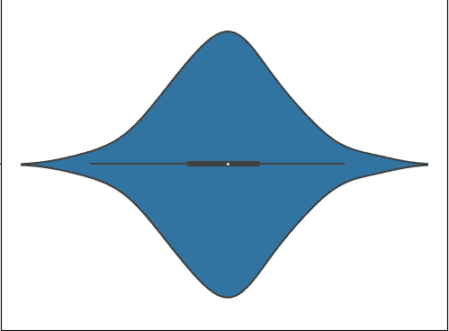
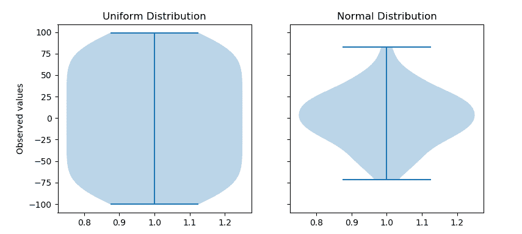
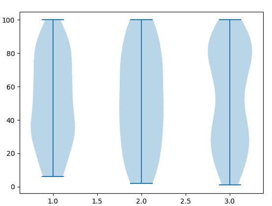

# 使用 Matplotlib

用 Python 制作小提琴剧情

> 原文:[https://www . geesforgeks . org/make-a-violin-plot-in-python-use-matplotlib/](https://www.geeksforgeeks.org/make-a-violin-plot-in-python-using-matplotlib/)

**Matplotlib** 是一个绘图库，用于在 Python 中创建静态、动画和交互式可视化。Matplotlib 可用于 Python 脚本、Python 和 IPython 外壳、web 应用服务器以及各种图形用户界面工具包，如 Tkinter、awxPython 等。

**注:**更多信息请参考[Python Matplotlib–概述](http://geeksforgeeks.org/python-matplotlib-an-overview/)

## 小提琴的情节意味着什么？

*小提琴图是方块图和直方图的组合*。它描绘了数据的分布、中位数、四分位数范围。所以我们看到 iqr 和中值是由箱线图提供的统计信息，而分布是由直方图提供的。

*小提琴剧情*


*   白点指的是中位数。
*   粗线的端点代表 iqr1 和 iqr3。
*   细线的端点代表最小值和最大值，类似于方框图。
*   高于 1.5 倍四分位数(细线的最小、最大端点)的分布表示存在异常值。

> **语法:** violinplot(数据集，位置=无，垂直=真，宽度=0.5，显示平均值=假，显示极值=真，显示中间值=假，分位数=无，点数=100，
> bw _ method =无，*数据=无)
> 
> **参数:**
> **数据集:**数组或向量序列。
> 输入数据。
> 
> **位置:**类似数组，默认= [1，2，…，n]。
> 设置小提琴的位置。刻度和限制被自动设置以匹配位置。
> 
> **垂直:**布尔，默认值=真。
> 如果是真的，就创造了一个竖琴的情节。否则，创建水平小提琴情节。
> 
> **宽度:**类似数组，默认值= 0.5
> 标量或向量，设置每个小提琴的最大宽度。默认值为 0.5，使用大约一半的可用水平空间。
> 
> **显示手段:** bool，默认值= False
> 如果为真，将切换手段的渲染。
> 
> **显示极值:** bool，默认值=真
> 如果为真，将切换极值的渲染。
> 
> **显示中间值:** bool，默认值= False
> 如果为真，将切换中间值的渲染。
> 
> **分位数:**类似数组，默认值=无
> 如果不是无，为每个小提琴设置一个区间[0，1]的浮动列表，代表将为该小提琴渲染的分位数。
> 
> **点:**标量，默认值= 100
> 定义评估每个高斯核密度估计的点数。
> 
> **bw_method:** str，标量或可调用，可选
> 用于计算估计器带宽的方法。这可以是“scott”、“silverman”、标量常数或可调用的。如果是标量，这将被直接用作 kde.factor。如果是可调用的，它应该把一个 GaussianKDE 实例作为它唯一的参数并返回一个标量。如果无(默认值)，则使用“scott”。

**例 1:**

```py
import numpy as np
import matplotlib.pyplot as plt

# creating a list of 
# uniformly distributed values
uniform = np.arange(-100, 100)

# creating a list of normally
# distributed values
normal = np.random.normal(size = 100)*30

# creating figure and axes to
# plot the image
fig, (ax1, ax2) = plt.subplots(nrows = 1, 
                               ncols = 2,
                               figsize =(9, 4),
                               sharey = True)

# plotting violin plot for
# uniform distribution
ax1.set_title('Uniform Distribution')
ax1.set_ylabel('Observed values')
ax1.violinplot(uniform)

# plotting violin plot for 
# normal distribution
ax2.set_title('Normal Distribution')
ax2.violinplot(normal)

# Function to show the plot
plt.show()
```

**输出:**



**例 2:** 多个小提琴图

```py
import numpy as np
import matplotlib.pyplot as plt
from random import randint

# Creating 3 empty lists
l1 = []
l2 =[]
l3 =[]

# Filling the lists with random value
for i in range(100):
    n = randint(1, 100)
    l1.append(n)

for i in range(100):
    n = randint(1, 100)
    l2.append(n)

for i in range(100):
    n = randint(1, 100)
    l3.append(n)

random_collection = [l1, l2, l3]

# Create a figure instance
fig = plt.figure()

# Create an axes instance
ax = fig.gca()

# Create the violinplot
violinplot = ax.violinplot(random_collection)
plt.show()
```

**输出:**
