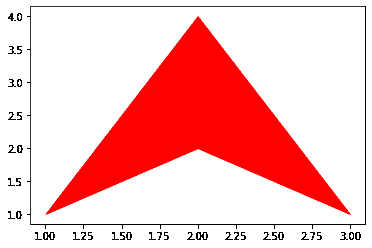
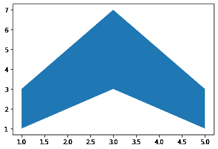

# 使用 Matplotlib

在 Python 中的两条水平曲线之间制作填充多边形

> 原文:[https://www . geesforgeks . org/make-filled-多边形-两条水平曲线之间-python-use-matplotlib/](https://www.geeksforgeeks.org/make-filled-polygons-between-two-horizontal-curves-in-python-using-matplotlib/)

**Matplotlib** 是 Python 中一个惊人的可视化库，用于数组的 2D 图。Matplotlib 绘图库是一个基于 NumPy 阵列的多平台数据可视化库，旨在与更广泛的 SciPy 堆栈协同工作。

要在两条曲线之间创建填充多边形，需要在 y1 和 y2 之间创建一个多边形集合填充。

**上述任务的参数:**

*   **x:** 是长度 N 的数组，保存 x 的数据。
*   **y1:** 它是一个长度为 N 的数组或标量，保存 y 的数据。
*   **y2:** 它是一个长度为 N 的数组或标量，保存 y 的数据。

下面是实现。

```
import matplotlib.pyplot as plt

x_inp= input("Enter values of X array:  ").split()
x= [int(i) for i in x_inp]

y1_inp= input("Enter values of Y1 array:  ").split()
y1= [int(i) for i in y1_inp]

y2_inp= input("Enter values of Y2 array:  ").split()
y2= [int(i) for i in y2_inp]

color=input("Enter color:  ")

plt.fill_between(x, y1, y2, color = color)
plt.show()
```

**输入:**

```
Enter values of X array:  1 2 3
Enter values of Y1 array:  1 2 1
Enter values of Y2 array:  1 4 1
Enter color:  red

```

**输出:**


**输入:**

```
Enter values of X array:  1 2 3 4 5
Enter values of Y1 array:  1 2 3 2 1
Enter values of Y2 array:  3 5 7 5 3
Enter color:  blue

```

**输出:**
