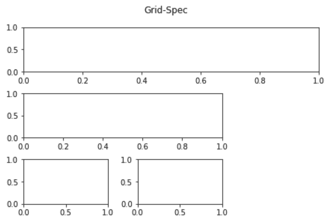
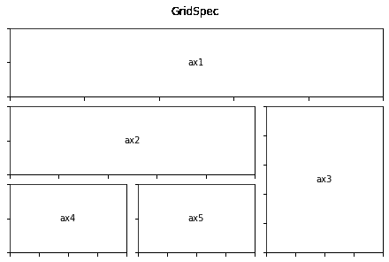
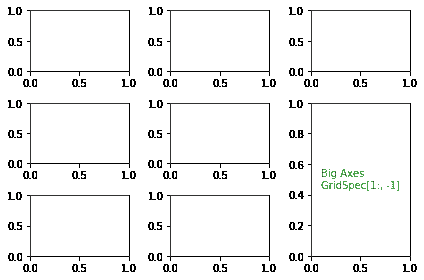
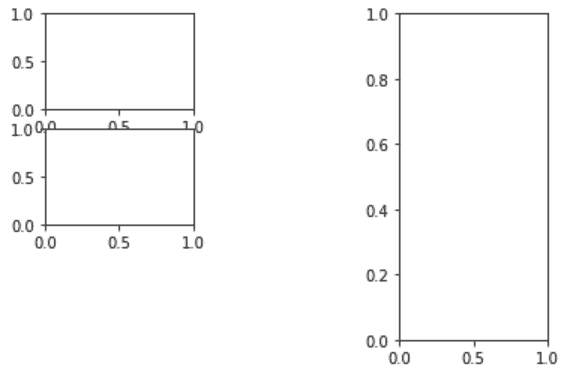
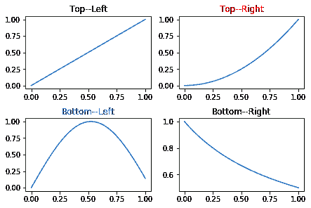

# 在 Matplotlib

中让子剧情跨越多个网格行和列

> 原文:[https://www . geesforgeks . org/make-subplotes-span-multi-grid-row-and-columns-in-matplotlib/](https://www.geeksforgeeks.org/make-subplots-span-multiple-grid-rows-and-columns-in-matplotlib/)

在本文中，我们将讨论如何使用 *matplotlib* 模块来制作横跨多个网格行和列的子图。

对于 Python 中的表示，matplotlib 库已经成为主力很久了。即使像 *seaborn、plotly、bokeh* 等拥有更简单代码界面和能力的更敏捷的对手出现在现场，它也保持了自己的优势。尽管事实上 *Matplotlib* 可能达不到嫩脚的直觉能力，但它在探索性信息分析(EDA)中对我们的信息调查工作进行了超越想象的应用。

在电子设计自动化过程中，人们可能会遇到这样的情况:我们需要展示一系列相关的情节，作为更大图景的一部分，以便将我们的知识转化为现实。 *matplotlib* 的支线剧情容量为我们照顾工作。尽管如此，在特定的情况下，我们可能需要加入一些支线剧情，并且需要为每个支线剧情有独特的角度比例。

首先导入 *matplotlib* 模块的 *gridspec* 子模块。

## 蟒蛇 3

```py
# import modules
import matplotlib.pyplot as plt
from matplotlib.gridspec import GridSpec

# create objects
fig = plt.figure()
gs = GridSpec(4, 4, figure=fig)
```

我们首先需要制作一个 *GridSpec* 的对象，它允许我们在图形对象旁边的普通图形中指示直线和线段的绝对数量作为争论。

我们将 *GridSpec* 对象存储在一个名为 *gs* 的变量中，并指示我们需要在总图中有 4 条线和 4 个线段。

**下面是一些让子剧情跨越多个网格行和列的程序:**

**例 1:**

## 蟒蛇 3

```py
# explictit function to hide index
# of subplots in the figure
def formatAxes(fig):
    for i, ax in enumerate(fig.axes):
        ax.text(0.5, 0.5, "ax%d" % (i+1), va="center", ha="center")
        ax.tick_params(labelbottom=False, labelleft=False)

# import required modules
import matplotlib.pyplot as plt
from matplotlib.gridspec import GridSpec

# create objects
fig = plt.figure(constrained_layout=True)
gs = GridSpec(3, 3, figure=fig)

# create sub plots as grid
ax1 = fig.add_subplot(gs[0, :])
ax2 = fig.add_subplot(gs[1, :-1])
ax3 = fig.add_subplot(gs[1, : -1])
ax4 = fig.add_subplot(gs[-1, 0])
ax5 = fig.add_subplot(gs[-1, -2])

# depict illustration
fig.suptitle("Grid-Spec")
formatAxes(fig)
plt.show()
```

**输出:**



目前，我们需要确定每一个子情节将如何穿越总图中的线和段的微妙之处。在纸上画一个关于你需要如何展开支线剧情的草图是有价值的，这样它们就不会覆盖。完成后，我们通过我们制作的 *GridSpec* 对象传递这些数据。线/段长度信息在类似的列表文档中传递，我们使用这些列表文档对展品/数据帧进行子集设置，线和段列表编号从零开始，并使用“*:”*表示范围。带有文件的 *GridSpec* 对象被传递到图形对象的 *add_subplot* capacity。

我们为该图添加了一个通用标题，并消除了勾号，以便更好地设想格式，因为这里的目标是展示我们如何完成分布在不同线/段上的子情节。当您实现这一点时，很明显，您将需要从数据框中添加轴记号、名称等，并更改分割线和图形大小以满足这些绘图组件的要求。

**例 2:**

这里，我们创建了一个显式函数来格式化图形的轴，即隐藏子图的索引值。

## 蟒蛇 3

```py
# explictit function to hide index
# of sub plots in the figure
def formatAxes(fig):
    for i, ax in enumerate(fig.axes):
        ax.text(0.5, 0.5, "ax%d" % (i+1), va="center", ha="center")
        ax.tick_params(labelbottom=False, labelleft=False)

# import required modules
import matplotlib.pyplot as plt
from matplotlib.gridspec import GridSpec

# create objects
fig = plt.figure(constrained_layout=True)
gs = GridSpec(3, 3, figure=fig)

# create sub plots as grid
ax1 = fig.add_subplot(gs[0, :])
ax2 = fig.add_subplot(gs[1, :-1])
ax3 = fig.add_subplot(gs[1:, -1])
ax4 = fig.add_subplot(gs[-1, 0])
ax5 = fig.add_subplot(gs[-1, -2])

# depict illustration
fig.suptitle("GridSpec")
formatAxes(fig)
plt.show()
```

**输出:**



这在多变量时间安排图中可能是有用的，在多变量时间安排图中，我们可能需要显示时间安排图延伸到顶部列的部分，以及下面其他子图中的其他单变量、多变量感知。你可以调整你的拼图看起来像什么，通过在总图中指出你的线/部分和你的单个支线剧情的范围。

**例 3:**

利用支线剧情和 *GridSpec* 合并两个支线剧情，这里我们需要将两个支线剧情合并成战斧格式。我们可以从战斧手那里得到 GridSpec，然后淘汰被覆盖的战斧，用另一个更大的战斧来填补这个漏洞。这里我们制作了一个格式，最后一节的最后两把战斧连接在一起。

请参见利用网格点和不同容量修改图形格式。

## 蟒蛇 3

```py
# import required modules
import matplotlib.pyplot as plt
from matplotlib.gridspec import GridSpec

# create objects
fig, axes = plt.subplots(ncols=3, nrows=3,)
gs = axes[1, 2].get_gridspec()

# create sub plots as grid
for ax in axes[1:, -1]:
    ax.remove()
axsbig = fig.add_subplot(gs[1:, -1])
axsbig.annotate('Big Axes \nGridSpec[1:, -1]',
                (0.1, 0.5),
                xycoords='axes fraction',
                va='center', color="g")

# depict illustration
fig.tight_layout()
plt.show()
```

**输出:**



**例 4:**

在本例中，我们将添加一个横跨两行的子图。

## 蟒蛇 3

```py
# import required modules
import matplotlib.pyplot as plt
from matplotlib.gridspec import GridSpec

# create objects
fig = plt.figure()
gridspan = fig.add_gridspec(2, 2)

# create sub plots as grid
ax1 = fig.add_subplot(gs[0, 0])
ax2 = fig.add_subplot(gs[1, 0])
ax3 = fig.add_subplot(gs[:, -1])

# depict illustration
plt.show()
```

**输出:**



**例 5:**

在这里，我们通过在图示的不同网格中描绘各种图形来说明子情节的应用。

## 蟒蛇 3

```py
# Import libraries
import numpy as np
import matplotlib.pyplot as plt

# Create a 2x2 grid of plots
fig, axes = plt.subplots(2, 2, constrained_layout=True)
a = np.linspace(0, 1)

# Modify top-left plot
axes[0,0].set_title("Top--Left", color="g")
axes[0,0].plot(x, x)

# Modify top-right plot
axes[0,1].set_title("Top--Right", color="r")
axes[0,1].plot(x, x**2)

# Modify bottom-left plot
axes[1,0].set_title("Bottom--Left", color="b")
axes[1,0].plot(x, np.sin(3*x))

# Modify bottom-right plot
axes[1,1].set_title("Bottom--Right")
axes[1,1].plot(x, 1/(1+x))

# Depict illustration
plt.show()
```

**输出:**

