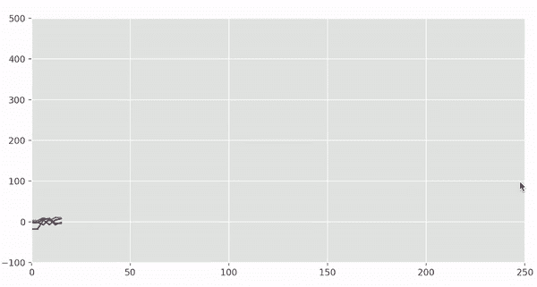
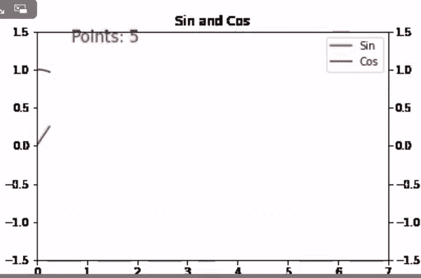

# Matplotlib–动画多条线

> 原文:[https://www . geesforgeks . org/matplotlib-animate-multi-line/](https://www.geeksforgeeks.org/matplotlib-animate-multiple-lines/)

在本文中，我们将学习如何使用 [matplotlib](https://www.geeksforgeeks.org/python-introduction-matplotlib/) 制作多条线的动画图表。制作图表动画可以使事情更有吸引力，也有助于其他人更恰当地可视化数据，而不是静态图表。当我们处理描述时间序列数据的项目(股票市场、心电图异常检测、互联网流量预测)时，动画甚至更有意义。

[**matplotlib . animation . FuncTion**](https://www.geeksforgeeks.org/matplotlib-animation-funcanimation-class-in-python/)类用于递归调用动画。您必须将创建的动画存储在一个变量中，只要动画运行，该变量就会存在。否则，动画对象将被垃圾收集，动画停止。

> ***语法:**class matplotlib . animation . funcinoma(fig，func，frames=None，init_func=None，fargs=None，save_count=None，* cache _ frame _ data = True，**kwargs)*

**例 1:**

对于 matplotlib，我们主要需要两个重要的模块: [pyplot](https://www.geeksforgeeks.org/pyplot-in-matplotlib/) 和[动画(fun 动漫)](https://www.geeksforgeeks.org/matplotlib-animation-funcanimation-class-in-python/)。下面是如何在 matplotlib 中制作线条动画的分步方法。我们将制作第一个例子，用 4 个手动构建的图，使用特定范围内的随机数。

*   导入创建图表和动画所需的所有库。

## 蟒蛇 3

```py
# importing all necessary libraries
import random
import matplotlib
from matplotlib import animation
import matplotlib.pyplot as plt
from matplotlib.animation import FuncAnimation
%matplotlib qt
```

*   现在制作 4 组不同的 y，即 y1、y2、y3、y4，它们将共享相同的 x 轴值。在取随机值的时候，我们要把每个随机值分开，因为这将帮助我们得到不同的指数线。

## 蟒蛇 3

```py
# add random points for each line
l1 = [random.randint(-20, 4)+(points**1.88)/(random.randint(13, 14))
      for points in range(0, 160, 2)]
l2 = [random.randint(0, 9)+(points**1.9)/(random.randint(9, 11))
      for points in range(0, 160, 2)]
l3 = [random.randint(-10, 10)-(points**1.4)/(random.randint(9, 12))
      for points in range(0, 160, 2)]
l4 = [random.randint(-5, 10)-(points**1.1)/(random.randint(7, 12))
      for points in range(0, 160, 2)]
```

*   现在使用 itertools 进行迭代。这个模块工作得很快，它是一个内存高效的工具，可以单独使用，也可以组合使用来形成迭代器代数。您也可以使用 for 循环进行迭代，只创建一个列表，并开始存储 y w . r . t . x 的变量。

## 蟒蛇 3

```py
from itertools import count
myvar = count(0, 3)
```

*   当我们包括 x1 和 y1 时，为新行(y2、y3 和 y4)创建 3 个额外的空列表，总共 5 个空列表。在动画函数中，我们将在每个迭代步骤填充这些容器。在每次迭代中，单帧创建动画。另外，为 4 条不同的线添加颜色。

## 蟒蛇 3

```py
# subplots() function you can draw
# multiple plots in one figure
fig, axes = plt.subplots(nrows=1, ncols=1, figsize=(10, 5))

# set limit for x and y axis
axes.set_ylim(-100, 500)
axes.set_xlim(0, 250)

# style for plotting line
plt.style.use("ggplot")

# create 5 list to get store element
# after every iteration
x1, y1, y2, y3, y4 = [], [], [], [], []
myvar = count(0, 3)

def animate(i):
    x1.append(next(myvar))
    y1.append((l1[i]))
    y2.append((l2[i]))
    y3.append((l3[i]))
    y4.append((l4[i]))

    axes.plot(x1, y1, color="red")
    axes.plot(x1, y2, color="gray")
    axes.plot(x1, y3, color="blue")
    axes.plot(x1, y4, color="green")

# set ani variable to call the
# function recursively
anim = FuncAnimation(fig, animate, interval=30)
```

**下面是完整的程序:**

## 蟒蛇 3

```py
# importing all necessary libraries
from itertools import count
import random
import matplotlib
from matplotlib import animation
import matplotlib.pyplot as plt
from matplotlib.animation import FuncAnimation
%matplotlib qt

# add random points for each line
l1 = [random.randint(-20, 4)+(points**1.88)/(random.randint(13, 14))
      for points in range(0, 160, 2)]
l2 = [random.randint(0, 9)+(points**1.9)/(random.randint(9, 11))
      for points in range(0, 160, 2)]
l3 = [random.randint(-10, 10)-(points**1.4)/(random.randint(9, 12))
      for points in range(0, 160, 2)]
l4 = [random.randint(-5, 10)-(points**1.1)/(random.randint(7, 12))
      for points in range(0, 160, 2)]

myvar = count(0, 3)

# subplots() function you can draw
# multiple plots in one figure
fig, axes = plt.subplots(nrows=1, ncols=1, figsize=(10, 5))

# set limit for x and y axis
axes.set_ylim(-100, 500)
axes.set_xlim(0, 250)

# style for plotting line
plt.style.use("ggplot")

# create 5 list to get store element
# after every iteration
x1, y1, y2, y3, y4 = [], [], [], [], []
myvar = count(0, 3)

def animate(i):
    x1.append(next(myvar))
    y1.append((l1[i]))
    y2.append((l2[i]))
    y3.append((l3[i]))
    y4.append((l4[i]))

    axes.plot(x1, y1, color="red")
    axes.plot(x1, y2, color="gray")
    axes.plot(x1, y3, color="blue")
    axes.plot(x1, y4, color="green")

# set ani variable to call the
# function recursively
anim = FuncAnimation(fig, animate, interval=30)
```

**输出:**



**例 2:**

下面是另一个在 matplotlib 中制作多行动画的例子。

*   导入所有必要的库。

## 蟒蛇 3

```py
# import modules
import numpy as np
import matplotlib
import matplotlib.pyplot as plt
import matplotlib.animation as animation
```

*   创建一个函数更新行，为每次迭代获取一个新值。

## 蟒蛇 3

```py
def updateline(num, data, line1, data2, line2):
    line1.set_data(data[..., :num])
    line2.set_data(data2[..., :num])

    time_text.set_text("Points: %.0f" % int(num))

    return line1, line2

# generating data of 100 elements
# each for line 1
x = np.linspace(0, 2*np.pi, 100)
y = np.sin(x)
data = np.array([x, y])

# generating data of 100 elements
# each for line 2
x2 = np.linspace(0, 2*np.pi, 100)
y2 = np.cos(x2)
data2 = np.array([x2, y2])

# setup the formating for moving files
Writer = animation.writers['ffmpeg']
Writer = Writer(fps=10, metadata=dict(artist="Me"), bitrate=-1)

fig = plt.figure()
ax = fig.add_subplot(111)
l, = ax.plot([], [], 'r-', label="Sin")
ax2 = ax.twinx()
k = ax2.plot([], [], 'b-', label="Cos")[0]

ax.legend([l, k], [l.get_label(), k.get_label()], loc=0)

ax.set_xlabel("X")

# axis 1
ax.set_ylim(-1.5, 1.5)
ax.set_xlim(0, 7)

# axis 2
ax2.set_ylim(-1.5, 1.5)
ax2.set_xlim(0, 7)

plt.title('Sin and Cos')
time_text = ax.text(0.1, 0.95, "", transform=ax.transAxes,
                    fontsize=15, color='red')
```

*   保存 mp4 文件[默认情况下，文件保存在当前目录中]。

## 蟒蛇 3

```py
# set line_animation variable to call
# the function recursively
line_animation = animation.FuncAnimation(
    fig, updateline, frames=100, fargs=(data, l, data2, k))

line_animation.save("lines.mp4", writer=Writer)
```

**下面是完整的程序:**

## 蟒蛇 3

```py
# import required modules
import numpy as np
import matplotlib
import matplotlib.pyplot as plt
import matplotlib.animation as animation

def updateline(num, data, line1, data2, line2):
    line1.set_data(data[..., :num])
    line2.set_data(data2[..., :num])

    time_text.set_text("Points: %.0f" % int(num))

    return line1, line2

# generating data of 100 elements
# each for line 1
x = np.linspace(0, 2*np.pi, 100)
y = np.sin(x)
data = np.array([x, y])

# generating data of 100 elements
# each for line 2
x2 = np.linspace(0, 2*np.pi, 100)
y2 = np.cos(x2)
data2 = np.array([x2, y2])

# setup the formating for moving files
Writer = animation.writers['ffmpeg']
Writer = Writer(fps=10, metadata=dict(artist="Me"), bitrate=-1)

fig = plt.figure()
ax = fig.add_subplot(111)
l, = ax.plot([], [], 'r-', label="Sin")
ax2 = ax.twinx()
k = ax2.plot([], [], 'b-', label="Cos")[0]

ax.legend([l, k], [l.get_label(), k.get_label()], loc=0)

ax.set_xlabel("X")

# axis 1
ax.set_ylim(-1.5, 1.5)
ax.set_xlim(0, 7)

# axis 2
ax2.set_ylim(-1.5, 1.5)
ax2.set_xlim(0, 7)

plt.title('Sin and Cos')
time_text = ax.text(0.1, 0.95, "", transform=ax.transAxes,
                    fontsize=15, color='red')

# set line_animation variable to call
# the function recursively
line_animation = animation.FuncAnimation(
    fig, updateline, frames=100, fargs=(data, l, data2, k))
line_animation.save("lines.mp4", writer=Writer)
```

**输出:**

