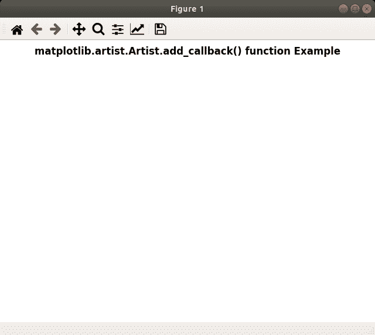

# Python 中的 matplotlib . artist . artist . add _ callback()

> 原文:[https://www . geesforgeks . org/matplotlib-artist-artist-add _ callback-in-python/](https://www.geeksforgeeks.org/matplotlib-artist-artist-add_callback-in-python/)

**[Matplotlib](https://www.geeksforgeeks.org/python-introduction-matplotlib/)** 是 Python 中的一个库，是 NumPy 库的数值-数学扩展。**艺术家类**包含抽象基类，用于渲染到图形画布中的对象。图形中所有可见的元素都是艺术家的子类。

## matplotlib . artist . artist . add _ callback()方法

matplotlib 库的 artist 模块中的 **add_callback()方法**用于添加一个回调函数，每当 Artist 的某个属性发生变化时就会调用该函数。

> **语法:** Artist.add_callback(self，func)
> 
> **参数:**该方法接受以下参数。
> 
> *   **功能:**该参数为回调函数。
> 
> **返回:**这个方法返回与回调相关联的观察者 id。

下面的例子说明了 matplotlib 中的 matplotlib . artist . artist . add _ callback()函数:

**例 1:**

```
# Implementation of matplotlib function
import matplotlib.pyplot as plt
import numpy as np
import time

def update():
    plt.get_current_fig_manager().canvas.figure.patch.set_facecolor(str(np.random.random()))
    plt.draw()
    print("Draw at time :", time.time())

def start_animation():

    timer = fig.canvas.new_timer(interval = 50)
    timer.add_callback(update)
    timer.start()

fig = plt.figure()
start_animation()

fig.suptitle('matplotlib.artist.Artist.add_callback() \
function Example', fontweight ="bold") 

plt.show()
```

**输出:**



**例 2:**

```
# Implementation of matplotlib function  
from random import randint, choice 
import time 
import matplotlib.pyplot as plt 
import matplotlib.patches as mpatches 

back_color = "black"
colors = ['red', 'green', 'blue', 'purple'] 
width, height = 4, 4

fig = plt.figure() 
plt.xlim([0, width])
plt.ylim([0, height]) 

fig.canvas.draw() 

def update(): 
    x = randint(0, width - 1) 
    y = randint(0, height - 1) 

    arti = mpatches.Rectangle( 
        (x, y), 1, 1, 
        facecolor = choice(colors), 
        edgecolor = back_color 
    ) 
    fig.add_artist(arti)
    fig.draw_artist(arti)
    fig.canvas.blit(fig.bbox) 
    print("Draw at time :", time.time()) 

timer = fig.canvas.new_timer(interval = 1) 
timer.add_callback(update) 
timer.start() 

fig.suptitle('matplotlib.artist.Artist.add_callback() \
function Example', fontweight ="bold") 

plt.show()
```

**输出:**

<video class="wp-video-shortcode" id="video-407163-1" width="665" height="374" preload="metadata" controls=""><source type="video/webm" src="https://media.geeksforgeeks.org/wp-content/uploads/20200504221206/python-matplotlib-call-back.webm?_=1">[https://media.geeksforgeeks.org/wp-content/uploads/20200504221206/python-matplotlib-call-back.webm](https://media.geeksforgeeks.org/wp-content/uploads/20200504221206/python-matplotlib-call-back.webm)</video>