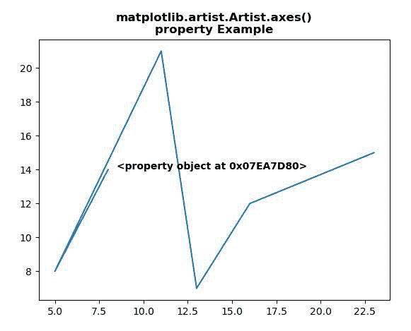
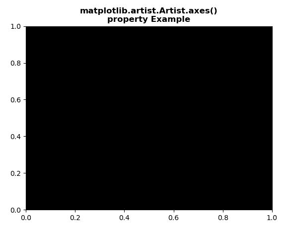

# Python 中的 matplotlib . artist . artist . axes

> 原文:[https://www . geesforgeks . org/matplotlib-artist-artist-axes-in-python/](https://www.geeksforgeeks.org/matplotlib-artist-artist-axes-in-python/)

[**【Matplotlib】**](https://www.geeksforgeeks.org/python-introduction-matplotlib/)是 Python 中的一个库，它是 NumPy 库的数字-数学扩展。 **艺术家类** 包含将渲染到图形画布中的对象的抽象基类。图形中所有可见的元素都是艺术家的子类。

## Matplotlib.artist.Artist.axes()属性

matplotlib 库的艺术家模块中的 **axes()属性**是艺术家所在的 Axes 实例，或者 *None*

> **属性:** 艺术家.斧头

以下示例说明 matplotlib 中的 matplotlib.artist.Artist.axes()属性:

**例 1:**

```
# Implementation of matplotlib function
from matplotlib.artist import Artist 
import matplotlib.pyplot as plt  

# providing values to x and y  
x = [8, 5, 11, 13, 16, 23] 
y = [14, 8, 21, 7, 12, 15] 

# to plot x and y 
plt.plot(x, y) 

# use of axes() property
axs = Artist.axes
plt.text(8.5, 14, str(axs), fontweight="bold")

plt.title("""matplotlib.artist.Artist.axes()
property Example""", fontweight="bold")

plt.show()
```

**输出:**



**例 2:**

```
# Implementation of matplotlib function
from matplotlib.artist import Artist 
import matplotlib.pyplot as plt  

# providing values to x and y  
x = [8, 5, 11, 13, 16, 23] 
y = [14, 8, 21, 7, 12, 15] 

# to plot x and y 
plt.plot(x, y) 
plt.axes(facecolor = 'black')

axs = Artist.axes
print(str(axs))

plt.title("""matplotlib.artist.Artist.axes()
property Example""", fontweight="bold")

plt.show()
```

**输出:**

