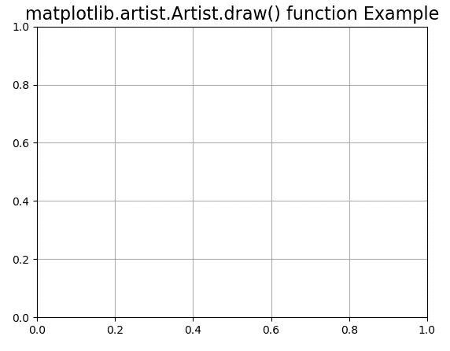

# Python 中的 Matplotlib.artist.Artist.draw()

> 原文:[https://www . geeksforgeeks . org/matplotlib-artist-artist-draw-in-python/](https://www.geeksforgeeks.org/matplotlib-artist-artist-draw-in-python/)

**[Matplotlib](https://www.geeksforgeeks.org/python-introduction-matplotlib/)** 是 Python 中的一个库，是 NumPy 库的数值-数学扩展。**艺术家类**包含抽象基类，用于渲染到图形画布中的对象。图形中所有可见的元素都是艺术家的子类。

## matplotlib.artist.Artist.draw()方法

matplotlib 库的 artist 模块中的 **draw()方法**用于使用给定的渲染器绘制 Artist。

> **语法:** Artist.draw(self，渲染器，*args，*\*kwargs)
> 
> **参数:**该方法接受以下参数。
> 
> *   **渲染器:**这个参数是 RendererBase 子类。
> 
> **返回:**该方法不返回值。

以下示例说明 matplotlib 中的 matplotlib.artist.Artist.draw()函数:

**例 1:**

```
# Implementation of matplotlib function
from matplotlib.artist import Artist
from mpl_toolkits.mplot3d import axes3d  
import matplotlib.pyplot as plt  

fig, ax = plt.subplots()  

def tellme(s):  
    ax.set_title(s, fontsize = 16)  
    fig.canvas.draw() 
    renderer = fig.canvas.renderer 
    Artist.draw(ax, renderer) 

tellme('matplotlib.artist.Artist.draw() function Example') 
ax.grid() 

plt.show()
```

**输出:**


**例 2:**

```
# Implementation of matplotlib function
from matplotlib.artist import Artist
from mpl_toolkits.mplot3d import axes3d  
import matplotlib.pyplot as plt  

fig = plt.figure()  
ax = fig.add_subplot(111, projection ='3d')  

X, Y, Z = axes3d.get_test_data(0.1)  
ax.plot_wireframe(X, Y, Z, rstride = 5,   
                  cstride = 5)  

for angle in range(0, 90):  
    ax.view_init(30, angle) 
    fig.canvas.draw() 
    renderer = fig.canvas.renderer 
    Artist.draw(ax, renderer)  
    plt.pause(.001) 

    fig.suptitle('matplotlib.artist.Artist.draw() function Example') 
ax.grid() 

plt.show()
```

**输出:**

<video class="wp-video-shortcode" id="video-408343-1" width="665" height="374" preload="metadata" controls=""><source type="video/webm" src="https://media.geeksforgeeks.org/wp-content/uploads/20200506165218/python-matplotlib-draw-axis.webm?_=1">[https://media.geeksforgeeks.org/wp-content/uploads/20200506165218/python-matplotlib-draw-axis.webm](https://media.geeksforgeeks.org/wp-content/uploads/20200506165218/python-matplotlib-draw-axis.webm)</video>