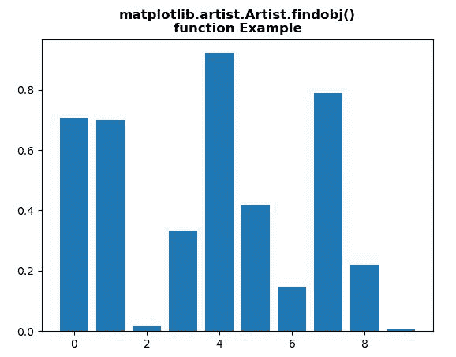
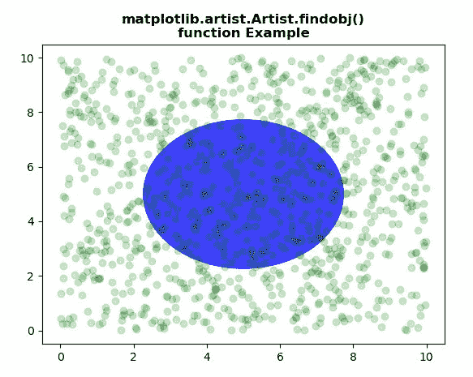

# Python 中的 matplotlib . artist . artist . find obj()

> 原文:[https://www . geesforgeks . org/matplotlib-artist-artist-find obj-in-python/](https://www.geeksforgeeks.org/matplotlib-artist-artist-findobj-in-python/)

[**【Matplotlib】**](https://www.geeksforgeeks.org/python-introduction-matplotlib/)是 Python 中的一个库，它是 NumPy 库的数字-数学扩展。 **艺术家类** 包含将渲染到图形画布中的对象的抽象基类。图形中所有可见的元素都是艺术家的子类。

## matplotlib . artist . artist . find obj()方法

matplotlib 库的艺术家模块中的 findobj **()方法**用于返回 find 艺术家对象。

> ***句法:*** 艺术家。 *findobj(self，match=None，include_self=True)*
> 
> ***参数:**该方法接受以下参数。*
> 
> *   ***匹配:**该参数是匹配的过滤标准。默认值为无。*
> *   ***include_self :** 该参数在待查列表中包含 self 进行匹配。*
> 
> ***返回:**此法返回**艺人**(艺人列表)。*

以下示例说明了 matplotlib . artist . artist .find obj()在 matplotlib 中的功能:

**例 1:**

```py
# Implementation of matplotlib function
from matplotlib.artist import Artist 
import matplotlib.pyplot as plt 
from matplotlib.lines import Line2D 
import numpy as np 
from numpy.random import rand 

fig, ax2 = plt.subplots() 

ax2.bar(range(10), rand(10), picker = True) 

print("Value return : \n", 
      *list(Artist.findobj(ax2)), sep ="\n")

plt.title("""matplotlib.artist.Artist.findobj()
function Example""", fontweight="bold")

plt.show()
```

**输出:**



```py
Value return : 

Rectangle(xy=(-0.4, 0), width=0.8, height=0.705031, angle=0)
Rectangle(xy=(0.6, 0), width=0.8, height=0.698788, angle=0)
Rectangle(xy=(1.6, 0), width=0.8, height=0.0159568, angle=0)
Rectangle(xy=(2.6, 0), width=0.8, height=0.332931, angle=0)
Rectangle(xy=(3.6, 0), width=0.8, height=0.921611, angle=0)
Rectangle(xy=(4.6, 0), width=0.8, height=0.4171, angle=0)
Rectangle(xy=(5.6, 0), width=0.8, height=0.148145, angle=0)
Rectangle(xy=(6.6, 0), width=0.8, height=0.78801, angle=0)
Rectangle(xy=(7.6, 0), width=0.8, height=0.221423, angle=0)
Rectangle(xy=(8.6, 0), width=0.8, height=0.00829394, angle=0)
Spine
Spine
Spine
Spine
Text(0.5, 0, '')
Text(1, 0, '')
Line2D()
Line2D()
Line2D((0,0),(0,1))
Text(0, 0, '')
Text(0, 1, '')
<matplotlib.axis.XTick object at 0x07BE51D0>
Line2D()
Line2D()
Line2D((0,0),(0,1))
Text(0, 0, '')
Text(0, 1, '')
<matplotlib.axis.XTick object at 0x07BE51B0>
Line2D()
Line2D()
Line2D((0,0),(0,1))
Text(0, 0, '')
Text(0, 1, '')
<matplotlib.axis.XTick object at 0x0A589750>
Line2D()
Line2D()
Line2D((0,0),(0,1))
Text(0, 0, '')
Text(0, 1, '')
<matplotlib.axis.XTick object at 0x0A5A1C50>
Line2D()
Line2D()
Line2D((0,0),(0,1))
Text(0, 0, '')
Text(0, 1, '')
<matplotlib.axis.XTick object at 0x0A5A1B70>
Line2D()
Line2D()
Line2D((0,0),(0,1))
Text(0, 0, '')
Text(0, 1, '')
<matplotlib.axis.XTick object at 0x0A5B4170>
Line2D()
Line2D()
Line2D((0,0),(0,1))
Text(0, 0, '')
Text(0, 1, '')
<matplotlib.axis.XTick object at 0x0A5B4430>
XAxis(80.0,52.8)
Text(0, 0.5, '')
Text(0, 0.5, '')
Line2D()
Line2D()
Line2D((0,0),(1,0))
Text(0, 0, '')
Text(1, 0, '')
<matplotlib.axis.YTick object at 0x07BE58F0>
Line2D()
Line2D()
Line2D((0,0),(1,0))
Text(0, 0, '')
Text(1, 0, '')
<matplotlib.axis.YTick object at 0x07BE5570>
Line2D()
Line2D()
Line2D((0,0),(1,0))
Text(0, 0, '')
Text(1, 0, '')
<matplotlib.axis.YTick object at 0x0A5B4670>
Line2D()
Line2D()
Line2D((0,0),(1,0))
Text(0, 0, '')
Text(1, 0, '')
<matplotlib.axis.YTick object at 0x0A5B4AB0>
Line2D()
Line2D()
Line2D((0,0),(1,0))
Text(0, 0, '')
Text(1, 0, '')
<matplotlib.axis.YTick object at 0x0A5B4D90>
Line2D()
Line2D()
Line2D((0,0),(1,0))
Text(0, 0, '')
Text(1, 0, '')
<matplotlib.axis.YTick object at 0x0A5BE0F0>
YAxis(80.0,52.8)
Text(0.5, 1.0, '')
Text(0.0, 1.0, '')
Text(1.0, 1.0, '')
Rectangle(xy=(0, 0), width=1, height=1, angle=0)
AxesSubplot(0.125,0.11;0.775x0.77)

```

**例 2:**

```py
# Implementation of matplotlib function
from matplotlib.artist import Artist 
import numpy as np 
import matplotlib.pyplot as plt 
import matplotlib.patches as mpatches 

fig, ax = plt.subplots() 
x, y = 10 * np.random.rand(2, 1000) 
ax.plot(x, y, 'go', alpha = 0.2) 

circ = mpatches.Circle((0.5, 0.5), 0.25, 
                       transform = ax.transAxes, 
                       facecolor ='blue',  
                       alpha = 0.75) 
ax.add_patch(circ) 

print("Value return : \n", 
      *list(Artist.findobj(ax)), sep ="\n")

plt.title("""matplotlib.artist.Artist.findobj()
function Example""", fontweight="bold")

plt.show()
```

**输出:**



```py
Value return : 

Circle(xy=(0.5, 0.5), radius=0.25)
Line2D(_line0)
Spine
Spine
Spine
Spine
Text(0.5, 0, '')
Text(1, 0, '')
Line2D()
Line2D()
Line2D((0,0),(0,1))
Text(0, 0, '')
Text(0, 1, '')
<matplotlib.axis.XTick object at 0x085071F0>
Line2D()
Line2D()
Line2D((0,0),(0,1))
Text(0, 0, '')
Text(0, 1, '')
<matplotlib.axis.XTick object at 0x085071D0>
Line2D()
Line2D()
Line2D((0,0),(0,1))
Text(0, 0, '')
Text(0, 1, '')
<matplotlib.axis.XTick object at 0x0AE7ABF0>
Line2D()
Line2D()
Line2D((0,0),(0,1))
Text(0, 0, '')
Text(0, 1, '')
<matplotlib.axis.XTick object at 0x0AE7AD70>
Line2D()
Line2D()
Line2D((0,0),(0,1))
Text(0, 0, '')
Text(0, 1, '')
<matplotlib.axis.XTick object at 0x0AE920F0>
Line2D()
Line2D()
Line2D((0,0),(0,1))
Text(0, 0, '')
Text(0, 1, '')
<matplotlib.axis.XTick object at 0x0AE92390>
Line2D()
Line2D()
Line2D((0,0),(0,1))
Text(0, 0, '')
Text(0, 1, '')
<matplotlib.axis.XTick object at 0x0AE92650>
Line2D()
Line2D()
Line2D((0,0),(0,1))
Text(0, 0, '')
Text(0, 1, '')
<matplotlib.axis.XTick object at 0x0AE928F0>
XAxis(80.0,52.8)
Text(0, 0.5, '')
Text(0, 0.5, '')
Line2D()
Line2D()
Line2D((0,0),(1,0))
Text(0, 0, '')
Text(1, 0, '')
<matplotlib.axis.YTick object at 0x08507910>
Line2D()
Line2D()
Line2D((0,0),(1,0))
Text(0, 0, '')
Text(1, 0, '')
<matplotlib.axis.YTick object at 0x08507590>
Line2D()
Line2D()
Line2D((0,0),(1,0))
Text(0, 0, '')
Text(1, 0, '')
<matplotlib.axis.YTick object at 0x0AE92A90>
Line2D()
Line2D()
Line2D((0,0),(1,0))
Text(0, 0, '')
Text(1, 0, '')
<matplotlib.axis.YTick object at 0x0AE92DB0>
Line2D()
Line2D()
Line2D((0,0),(1,0))
Text(0, 0, '')
Text(1, 0, '')
<matplotlib.axis.YTick object at 0x0AE92FF0>
Line2D()
Line2D()
Line2D((0,0),(1,0))
Text(0, 0, '')
Text(1, 0, '')
<matplotlib.axis.YTick object at 0x0AE92B10>
Line2D()
Line2D()
Line2D((0,0),(1,0))
Text(0, 0, '')
Text(1, 0, '')
<matplotlib.axis.YTick object at 0x0AE7AC50>
Line2D()
Line2D()
Line2D((0,0),(1,0))
Text(0, 0, '')
Text(1, 0, '')
<matplotlib.axis.YTick object at 0x0AEA00F0>
YAxis(80.0,52.8)
Text(0.5, 1.0, '')
Text(0.0, 1.0, '')
Text(1.0, 1.0, '')
Rectangle(xy=(0, 0), width=1, height=1, angle=0)
AxesSubplot(0.125,0.11;0.775x0.77)

```