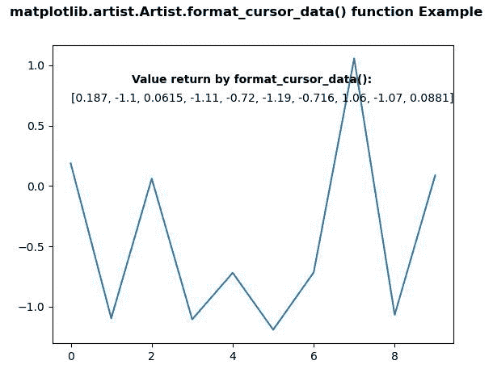
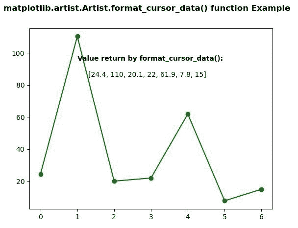

# Python 中的 matplotlib . artist . artist . format _ cursor _ data()

> 原文:[https://www . geesforgeks . org/matplotlib-artist-artist-format _ cursor _ data-in-python/](https://www.geeksforgeeks.org/matplotlib-artist-artist-format_cursor_data-in-python/)

**[Matplotlib](https://www.geeksforgeeks.org/python-introduction-matplotlib/)** 是 Python 中的一个库，是 NumPy 库的数值-数学扩展。**艺术家类**包含抽象基类，用于渲染到图形画布中的对象。图形中所有可见的元素都是艺术家的子类。

## matplotlib . artist . artist . format _ cursor _ data()方法

matplotlib 库的 artist 模块中的 **format_cursor_data()方法**用于获取数据的字符串表示。

> **语法:** Artist.remove_callback(self，data)
> 
> **参数:**该方法接受以下参数。
> 
> *   **数据:**该参数是曾经使用过的数据。
> 
> **返回:**该方法返回数据的字符串表示形式。

下面的例子说明了 matplotlib 中的 matplotlib . artist . artist . format _ cursor _ data()函数:

**例 1:**

```py
# Implementation of matplotlib function
import numpy as np
import matplotlib.pyplot as plt
from matplotlib.artist import Artist

np.random.seed(10**7)
geeksx = np.random.randn(10)

fig, ax = plt.subplots()
ax.plot(geeksx)

ax.text(1.5, 0.85, 
        "Value return by format_cursor_data():", 
        fontweight ="bold")

ax.text(0, 0.7,
        Artist.format_cursor_data(ax, data = geeksx))

fig.suptitle('matplotlib.artist.Artist.format_cursor_data()\
function Example', fontweight ="bold") 

plt.show()
```

**输出:**


**例 2:**

```py
# Implementation of matplotlib function
import numpy as np
import matplotlib.pyplot as plt
from matplotlib.artist import Artist

geeksx = np.array([24.40, 110.25, 20.05,
                   22.00, 61.90, 7.80,
                   15.00])

fig, ax = plt.subplots()
ax.plot(geeksx, 'go-')

ax.text(1, 95,
        "Value return by format_cursor_data():",
        fontweight ="bold")

ax.text(1.3, 85,
        Artist.format_cursor_data(ax,
                                  data = geeksx))

fig.suptitle('matplotlib.artist.Artist.format_cursor_data()\
function Example', fontweight ="bold") 

plt.show()
```

**输出:**
