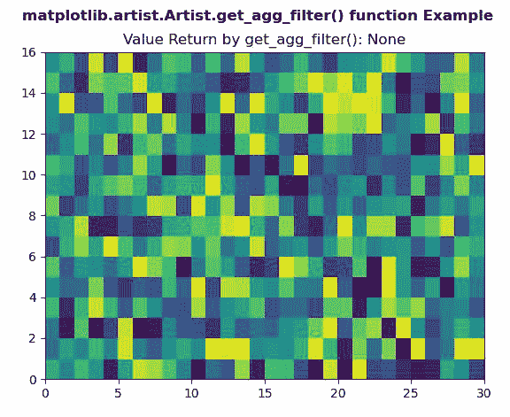
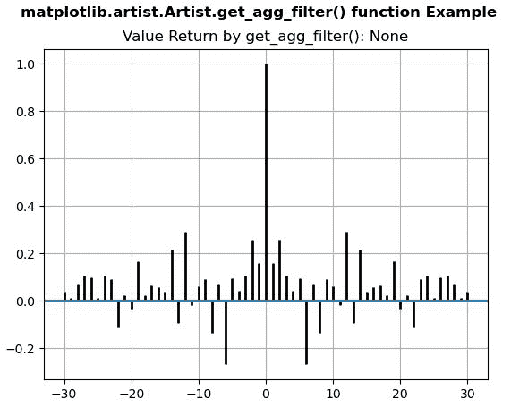

# Python 中的 matplotlib . artist . artist . get _ agg _ filter()

> 原文:[https://www . geesforgeks . org/matplotlib-artist-artist-get _ agg _ filter-in-python/](https://www.geeksforgeeks.org/matplotlib-artist-artist-get_agg_filter-in-python/)

[**【Matplotlib】**](https://www.geeksforgeeks.org/python-introduction-matplotlib/)是 Python 中的一个库，它是 NumPy 库的数字-数学扩展。 **艺术家类** 包含将渲染到图形画布中的对象的抽象基类。图形中所有可见的元素都是艺术家的子类。

## matplotlib . artist . artist . get _ agg _ filter()方法

matplotlib 库的 artist 模块中的 **get_agg_filter()方法**用于获取用于 agg 滤镜的滤镜函数。

> ***句法:**艺术家。**get _ agg _ filter**(self)*
> 
> ***参数:**此方法不接受任何参数。*
> 
> ***返回:*** *此方法返回要用于 agg 过滤的过滤函数。*

下面的例子说明了 matplotlib . artist . artist .get _ agg _ filter()函数在 matplotlib 中的作用:

**例 1:**

```
# Implementation of matplotlib function
import numpy as np
import matplotlib.pyplot as plt
from matplotlib.artist import Artist 

xx = np.random.rand(16, 30)

fig, axs = plt.subplots()

m = axs.pcolor(xx)
m.set_zorder(-20)

# use of get_agg_filter() method
val = Artist.get_agg_filter(axs)
axs.set_title("Value Return by get_agg_filter(): "
              + str(val))

fig.suptitle('matplotlib.artist.Artist.get_agg_filter() \
function Example', fontweight="bold")

plt.show()
```

**输出:**



**例 2:**

```
# Implementation of matplotlib function
import numpy as np
import matplotlib.pyplot as plt
from matplotlib.artist import Artist 

np.random.seed(10**7)
geeks = np.random.randn(40)

fig, axs = plt.subplots()
axs.acorr(geeks, usevlines=True, normed=True,
          maxlags=30, lw=2)

axs.grid(True)

# use of get_agg_filter() method
val = Artist.get_agg_filter(axs)
axs.set_title("Value Return by get_agg_filter(): " 
              + str(val))

fig.suptitle('matplotlib.artist.Artist.get_agg_filter() \
function Example', fontweight="bold")

plt.show()
```

**输出:**

