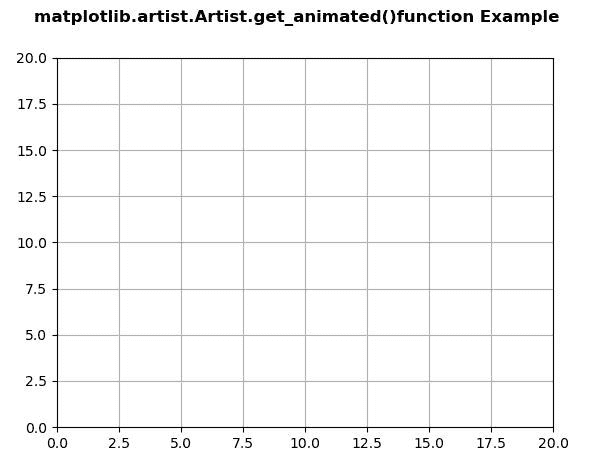
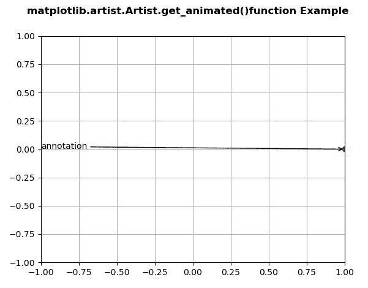

# Python 中的 matplotlib . artist . artist . get _ animated()

> 原文:[https://www . geesforgeks . org/matplotlib-artist-artist-get _ animated-in-python/](https://www.geeksforgeeks.org/matplotlib-artist-artist-get_animated-in-python/)

**[Matplotlib](https://www.geeksforgeeks.org/python-introduction-matplotlib/)** 是 Python 中的一个库，是 NumPy 库的数值-数学扩展。**艺术家类**包含抽象基类，用于渲染到图形画布中的对象。图形中所有可见的元素都是艺术家的子类。

## matplotlib . artist . artist . get _ animated()方法

matplotlib 库的 artist 模块中的 **get_animated()方法**用于获取动画状态。

> **语法:** Artist.get_animated(self)
> 
> **参数:**该方法不接受任何参数。
> 
> **返回:**该方法返回动画状态。

下面的例子说明了 matplotlib 中的 matplotlib . artist . artist . get _ animated()函数:

**例 1:**

```
# Implementation of matplotlib function
from matplotlib.artist import Artist  
import numpy as np 
import matplotlib.pyplot as plt 
import matplotlib.animation as animation 

data = np.array([[1, 2, 3, 4, 5],  
                [7, 4, 9, 2, 3]]) 

fig = plt.figure() 
ax = plt.axes(xlim =(0, 20), ylim =(0, 20)) 

line, = ax.plot([], [], 'r-') 
annotation = ax.annotate('', xy =(data[0][0],  
                         data[1][0])) 

Artist.set_animated(annotation, True) 
w = Artist.get_animated(annotation) 

print(str(w)) 

fig.suptitle('matplotlib.artist.Artist.get_animated()\
function Example', fontweight ="bold") 

ax.grid()

plt.show()
```

**输出:**


```
True
```

**例 2:**

```
# Implementation of matplotlib function
from matplotlib.artist import Artist  
import numpy as np 
import matplotlib.pyplot as plt 
import matplotlib.animation as animation 

fig, ax = plt.subplots() 

ax.set_xlim([-1, 1]) 
ax.set_ylim([-1, 1]) 

L = 50
theta = np.linspace(0, 2 * np.pi, L) 
r = np.ones_like(theta) 

x = r * np.cos(theta) 
y = r * np.sin(theta) 

line, = ax.plot(1, 0, 'ro') 

annotation = ax.annotate( 
    'annotation', xy =(1, 0), xytext =(-1, 0), 
    arrowprops = {'arrowstyle': "->"} 
) 
Artist.set_animated(annotation, False) 
w = Artist.get_animated(annotation) 

print(str(w)) 

fig.suptitle('matplotlib.artist.Artist.get_animated()\
function Example', fontweight ="bold") 

ax.grid()

plt.show()
```

**输出:**


```
False
```