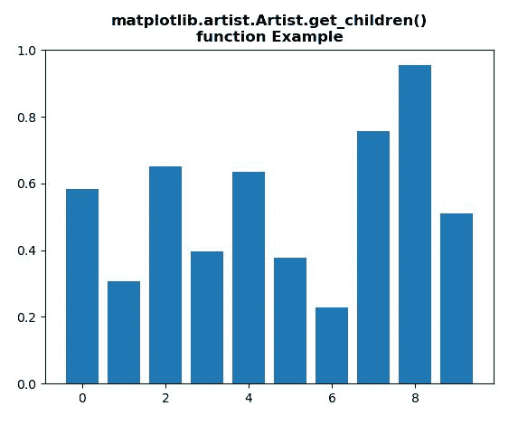
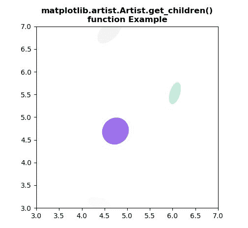

# Python 中的 matplotlib . artist . artist . get _ children()

> 原文:[https://www . geesforgeks . org/matplotlib-艺术家-艺术家-get_children-in-python/](https://www.geeksforgeeks.org/matplotlib-artist-artist-get_children-in-python/)

[**【Matplotlib】**](https://www.geeksforgeeks.org/python-introduction-matplotlib/)是 Python 中的一个库，它是 NumPy 库的数字-数学扩展。 **艺术家类** 包含将渲染到图形画布中的对象的抽象基类。图形中所有可见的元素都是艺术家的子类。

## matplotlib . artist . artist . get _ children()方法

matplotlib 库的艺术家模块中的 **get_children** **()方法**用于返回该艺术家的子艺术家列表。

> ***句法:*** 艺术家。*get _ children(self)*
> 
> ***参数:**此方法不接受任何参数。*
> 
> ***返回:**该方法返回该艺术家的子艺术家列表。*

下面的例子说明了 matplotlib . artist . artist .get _ children()函数在 matplotlib 中的作用:

**例 1:**

```py
# Implementation of matplotlib function
from matplotlib.artist import Artist 
import matplotlib.pyplot as plt 
from matplotlib.lines import Line2D 
import numpy as np 
from numpy.random import rand 

fig, ax2 = plt.subplots() 

art = ax2.bar(range(10), rand(10), picker = True) 

print("List of the child Artists of this Artist \n", 
      *list(art.get_children()), sep ="\n")

plt.title("""matplotlib.artist.Artist.get_children()
function Example""", fontweight="bold")

plt.show()
```

**输出:**



```py
List of the child Artists of this Artist 

Rectangle(xy=(-0.4, 0), width=0.8, height=0.58236, angle=0)
Rectangle(xy=(0.6, 0), width=0.8, height=0.305497, angle=0)
Rectangle(xy=(1.6, 0), width=0.8, height=0.650615, angle=0)
Rectangle(xy=(2.6, 0), width=0.8, height=0.397435, angle=0)
Rectangle(xy=(3.6, 0), width=0.8, height=0.634406, angle=0)
Rectangle(xy=(4.6, 0), width=0.8, height=0.377936, angle=0)
Rectangle(xy=(5.6, 0), width=0.8, height=0.229145, angle=0)
Rectangle(xy=(6.6, 0), width=0.8, height=0.755452, angle=0)
Rectangle(xy=(7.6, 0), width=0.8, height=0.954083, angle=0)
Rectangle(xy=(8.6, 0), width=0.8, height=0.509706, angle=0)

```

**例 2:**

```py
# Implementation of matplotlib function
from matplotlib.artist import Artist 
import matplotlib.pyplot as plt 
import numpy as np 
from matplotlib.patches import Ellipse 

NUM = 20

ells = [Ellipse(xy = np.random.rand(2) * 10, 
                width = np.random.rand(), 
                height = np.random.rand(), 
                angle = np.random.rand() * 360) 
        for i in range(NUM)] 

fig, ax = plt.subplots(subplot_kw ={'aspect': 'equal'}) 

print("List of the child Artists of this Artist \n")
for e in ells: 
    ax.add_artist(e) 
    e.set_clip_box(ax.bbox) 
    e.set_alpha(np.random.rand()) 
    e.set_facecolor(np.random.rand(4))

print(*list(ax.get_children()), sep = "\n")

ax.set_xlim(3, 7) 
ax.set_ylim(3, 7) 

plt.title("""matplotlib.artist.Artist.get_children()
function Example""", fontweight="bold")

plt.show()
```

**输出:**



> 该艺术家的子艺术家列表
> 
> 椭圆(xy=(4.326855439698613，2.7591364805447203)，宽度=0.3769330255888693，高度=0.09156791653641638，角度=214.69480533893034)
> 椭圆(xy =(6.39084444414 高度=0.3251963397808111，角度=131.180626549346)
> 椭圆(xy=(6.719146468170946，3.636051606867032)，宽度= 0.75019420338975