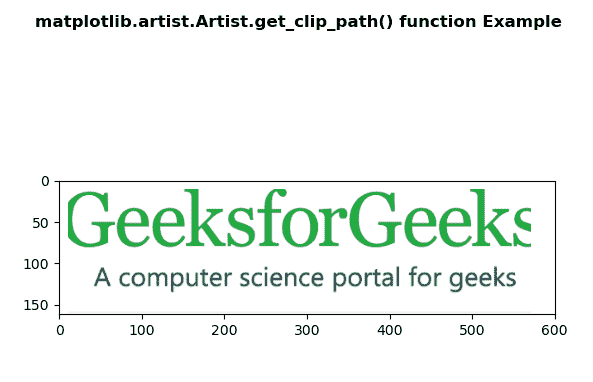
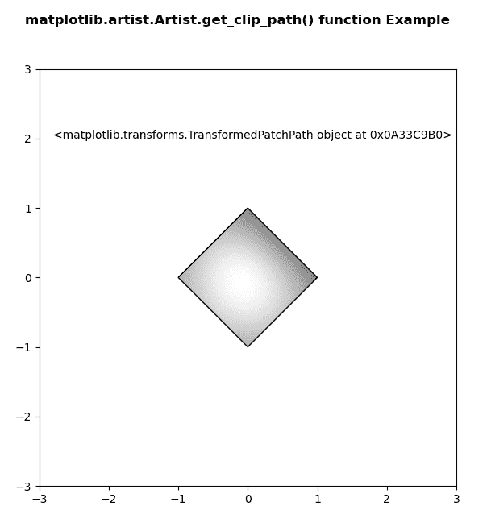

# Python 中的 matplotlib . artist . artist . get _ clip _ path()

> 原文:[https://www . geesforgeks . org/matplotlib-artist-artist-get _ clip _ path-in-python/](https://www.geeksforgeeks.org/matplotlib-artist-artist-get_clip_path-in-python/)

**[Matplotlib](https://www.geeksforgeeks.org/python-introduction-matplotlib/)** 是 Python 中的一个库，是 NumPy 库的数值-数学扩展。**艺术家类**包含抽象基类，用于渲染到图形画布中的对象。图形中所有可见的元素都是艺术家的子类。

## matplotlib . artist . artist . get _ clip _ path()方法

matplotlib 库的 artist 模块中的 **get_clip_path()方法**用于获取剪辑路径。

> **语法:** Artist.get_clip_path(self)
> 
> **参数:**该方法不接受任何参数。
> 
> **返回:**此方法返回剪辑路径。

以下示例说明了 matplotlib 中的 matplotlib . artist . artist . get _ clip _ path()函数:

**示例 1:**
**输入图像:**


```
# Implementation of matplotlib function
from matplotlib.artist import Artist
import matplotlib.pyplot as plt 
import matplotlib.patches as patches 
import matplotlib.cbook as cbook 

with cbook.get_sample_data('loggf.PNG') as image_file: 
    image = plt.imread(image_file) 

fig, ax = plt.subplots() 
im = ax.imshow(image) 
patch = patches.Rectangle((10, 10), 
                          560, 
                          500,  
                          transform = ax.transData)  

if Artist.get_clip_path(im) is None: 
    Artist.set_clip_path(im, patch)

fig.suptitle('matplotlib.artist.Artist.get_clip_path() \
function Example', fontweight ="bold") 

plt.show()
```

**输出:**


**例 2:**

```
# Implementation of matplotlib function
from matplotlib.artist import Artist
import numpy as np 
import matplotlib.cm as cm 
import matplotlib.pyplot as plt 
from matplotlib.path import Path 
from matplotlib.patches import PathPatch 

delta = 0.025

x = y = np.arange(-3.0, 3.0, delta) 
X, Y = np.meshgrid(x, y) 

Z1 = np.exp(-X**2 - Y**2) 
Z2 = np.exp(-(X - 1)**2 - (Y - 1)**2) 
Z = (Z1 - Z2) * 2

path = Path([[0, 1], [1, 0], [0, -1], 
            [-1, 0], [0, 1]]) 
patch = PathPatch(path, facecolor ='none') 

fig, ax = plt.subplots() 
ax.add_patch(patch) 

im = ax.imshow(Z, 
               interpolation ='bilinear',  
               cmap = cm.gray, 
               origin ='lower',  
               extent =[-3, 3, -3, 3], 
               clip_path = patch,  
               clip_on = True) 
ax.text(-2.8, 2, str(Artist.get_clip_path(im)))

fig.suptitle('matplotlib.artist.Artist.get_clip_path() \
function Example', fontweight ="bold") 

plt.show()
```

**输出:**
