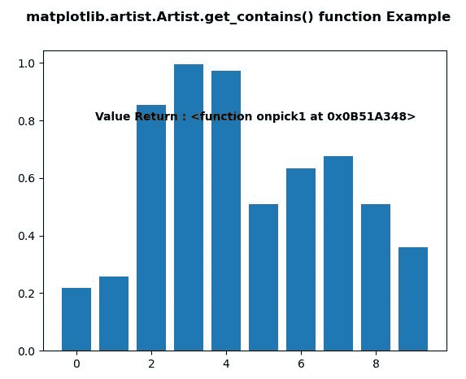
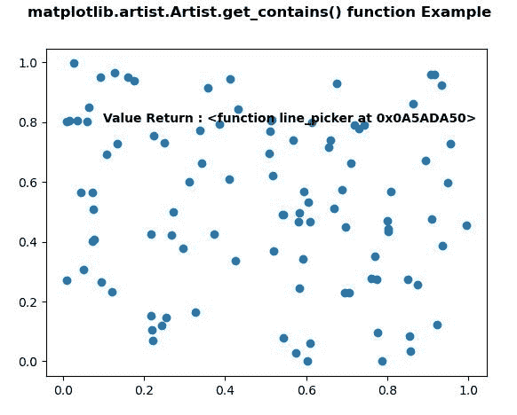

# Python 中的 matplotlib . artist . artist . get _ contains()

> 原文:[https://www . geesforgeks . org/matplotlib-artist-artist-get _ contains-in-python/](https://www.geeksforgeeks.org/matplotlib-artist-artist-get_contains-in-python/)

**[Matplotlib](https://www.geeksforgeeks.org/python-introduction-matplotlib/)** 是 Python 中的一个库，是 NumPy 库的数值-数学扩展。**艺术家类**包含抽象基类，用于渲染到图形画布中的对象。图形中所有可见的元素都是艺术家的子类。

## matplotlib . artist . artist . get _ contains()方法

matplotlib 库的 artist 模块中的 **get_contains()方法**用于返回 artist 的自定义 contains 函数。

> **语法:** Artist.get_contains(self)
> 
> **参数:**此方法不接受任何参数。
> 
> **返回:**此方法返回艺术家的自定义包含函数。

下面的例子说明了 matplotlib . artist . artist . get _ contains()函数:

**例 1:**

```py
# Implementation of matplotlib function
from matplotlib.artist import Artist
import matplotlib.pyplot as plt 
from matplotlib.lines import Line2D 
import numpy as np 
from numpy.random import rand 

fig, ax2 = plt.subplots() 

ax2.bar(range(10), rand(10), picker = True) 

for label in ax2.get_xticklabels():  
    label.set_picker(True) 

def onpick1(event): 

    if isinstance(event.artist, Line2D): 
        thisline = event.artist 
        xdata = thisline.get_xdata() 
        ydata = thisline.get_ydata() 
        ind = event.ind 
        print('onpick1 line:', 
               np.column_stack([xdata[ind],  
                               ydata[ind]])) 

    elif isinstance(event.artist, Rectangle): 
        patch = event.artist 
        print('onpick1 patch:', patch.get_path()) 

    elif isinstance(event.artist, Text): 
        text = event.artist 
        print('onpick1 text:', text.get_text())

Artist.set_contains(ax2, picker = onpick1)

ax2.text(0.5, 0.8, 
         "Value Return : "
         + str(Artist.get_contains(ax2)),  
         fontweight ="bold", fontsize = 10) 

fig.suptitle('matplotlib.artist.Artist.get_contains() \
function Example', fontweight ="bold") 

plt.show()
```

**输出:**


**例 2:**

```py
# Implementation of matplotlib function
from matplotlib.artist import Artist
# Implementation of matplotlib function 
import matplotlib.pyplot as plt 
from matplotlib.lines import Line2D 
import numpy as np 
from numpy.random import rand 

fig, ax = plt.subplots() 
ax.plot(rand(100), rand(100), 'o') 

def line_picker(line, mouseevent): 

    if mouseevent.xdata is None: 
        return False, dict() 

    xdata = line.get_xdata() 
    ydata = line.get_ydata() 
    maxd = 0.05
    d = np.sqrt( 
        (xdata - mouseevent.xdata)**2 + (ydata - mouseevent.ydata)**2) 

    ind, = np.nonzero(d <= maxd) 

    if len(ind): 

        pickx = xdata[ind] 
        picky = ydata[ind] 
        props = dict(ind = ind, pickx = pickx, picky = picky) 
        return True, props 

    else: 
        return False, dict() 

Artist.set_contains(ax, picker = line_picker)

ax.text(0.1, 0.8, 
         "Value Return : "
         + str(Artist.get_contains(ax)),  
         fontweight ="bold", fontsize = 10) 

fig.suptitle('matplotlib.artist.Artist.get_contains() \
function Example', fontweight ="bold") 

plt.show()
```

**输出:**
