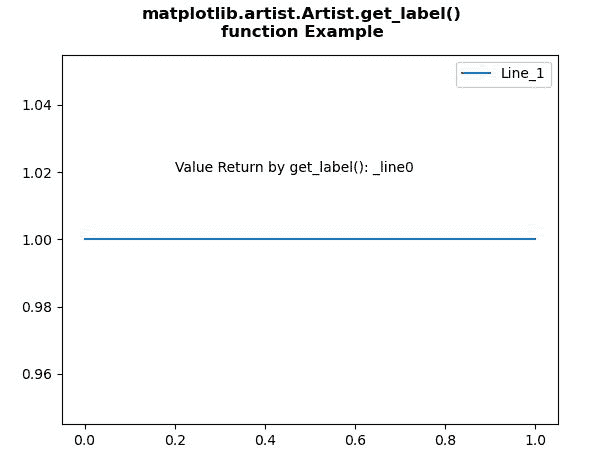
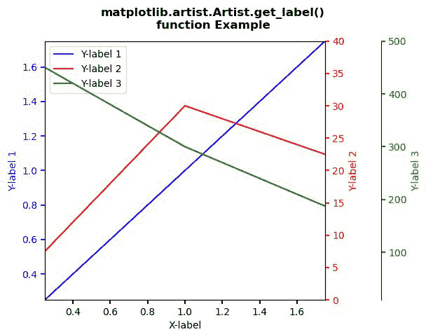

# Python 中的 matplotlib . artist . artist . get _ label()

> 原文:[https://www . geesforgeks . org/matplotlib-artist-艺术家-get_label-in-python/](https://www.geeksforgeeks.org/matplotlib-artist-artist-get_label-in-python/)

[**【Matplotlib】**](https://www.geeksforgeeks.org/python-introduction-matplotlib/)是 Python 中的一个库，它是 NumPy 库的数字-数学扩展。 **艺术家类** 包含将渲染到图形画布中的对象的抽象基类。图形中所有可见的元素都是艺术家的子类。

## matplotlib . artist . artist . get _ label()方法

matplotlib 库的艺术家模块中的 **set_label()方法**用于设置将在图例中显示的标签。

> ***语法:*** 艺术家 g *et_label(self)*
> 
> ***参数:**此方法不接受任何参数。*
> 
> ***返回:**该方法返回传说中该艺术家使用的标签。*

下面的例子说明了 matplotlib 中的 matplotlib . artist . get _ label()函数:

**例 1:**

```py
# Implementation of matplotlib function
from matplotlib.artist import Artist 
import matplotlib.pyplot as plt 

fig, ax = plt.subplots() 

x = [0, 1] 
y = [1, 1] 
line, = ax.plot(x, y) 

ax.legend(("Line_1", )) 

ax.text(0.2, 1.02, "Value Return by get_label()\
: " + str(Artist.get_label(line)))  

fig.suptitle("""matplotlib.artist.Artist.get_label()
function Example""", fontweight="bold")

plt.show()
```

**输出:**



**例 2:**

```py
# Implementation of matplotlib function
from matplotlib.artist import Artist 
import matplotlib.pyplot as plt 

def make_patch_spines_invisible(ax): 
    ax.set_frame_on(True) 
    ax.patch.set_visible(False) 
    for sp in ax.spines.values(): 
        sp.set_visible(False) 

fig, host = plt.subplots() 
fig.subplots_adjust(right = 0.75) 

par1 = host.twinx() 
par2 = host.twinx() 

par2.spines["right"].set_position(("axes", 1.2)) 

make_patch_spines_invisible(par2) 

par2.spines["right"].set_visible(True) 

p1, = host.plot([0, 1, 2], [0, 1, 2], 
                "b-", label ="Y-label 1") 
p2, = par1.plot([0, 1, 2], [0, 30, 20], 
                "r-", label ="Y-label 2") 
p3, = par2.plot([0, 1, 2], [500, 300, 150],  
                "g-", label ="Y-label 3") 

host.set_xlim(0.25, 1.75) 
host.set_ylim(0.25, 1.75) 
par1.set_ylim(0, 40) 
par2.set_ylim(10, 500) 

host.set_xlabel("X-label") 
host.set_ylabel("Y-label 1") 
par1.set_ylabel("Y-label 2") 
par2.set_ylabel("Y-label 3") 

host.yaxis.label.set_color(p1.get_color()) 
par1.yaxis.label.set_color(p2.get_color()) 
par2.yaxis.label.set_color(p3.get_color()) 

tkw = dict(size = 4, width = 1.5) 
host.tick_params(axis ='y',  
                 colors = p1.get_color(),  
                 **tkw) 
par1.tick_params(axis ='y',  
                 colors = p2.get_color(), 
                 **tkw) 
par2.tick_params(axis ='y', 
                 colors = p3.get_color(), 
                 **tkw) 
host.tick_params(axis ='x', 
                 **tkw) 

lines = [p1, p2, p3] 

host.legend(lines, [Artist.get_label(l) for l in lines])  

fig.suptitle("""matplotlib.artist.Artist.get_label()
function Example""", fontweight="bold")

plt.show()
```

**输出:**

