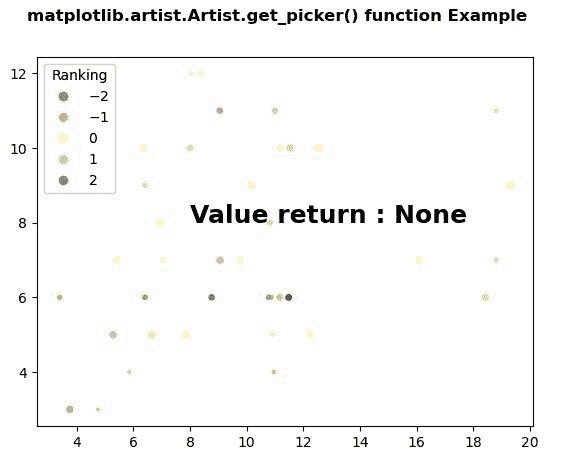
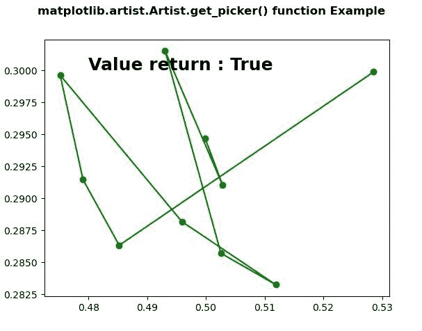

# Python 中的 matplotlib . artist . artist . get _ picker()

> 原文:[https://www . geesforgeks . org/matplotlib-artist-artist-get _ picker-in-python/](https://www.geeksforgeeks.org/matplotlib-artist-artist-get_picker-in-python/)

**[Matplotlib](https://www.geeksforgeeks.org/python-introduction-matplotlib/)** 是 Python 中的一个库，是 NumPy 库的数值-数学扩展。**艺术家类**包含抽象基类，用于渲染到图形画布中的对象。图形中所有可见的元素都是艺术家的子类。

## matplotlib . artist . artist . get _ picker()方法

matplotlib 库的 artist 模块中的 **get_picker()方法**用于定义艺术家的拾取行为。

> **语法:** Artist.get_picker(self)
> 
> **参数:**此方法不接受任何参数。
> 
> **返回:**此方法返回艺术家的采摘行为。

以下示例说明了 matplotlib 中的 matplotlib . artist . artist . get _ picker()函数:

**例 1:**

```py
# Implementation of matplotlib function
from matplotlib.artist import Artist
import numpy as np 
import matplotlib.pyplot as plt 

np.random.seed(19680801) 

volume = np.random.rayleigh(7, size = 40) 
amount = np.random.poisson(7, size = 40) 
ranking = np.random.normal(size = 40) 
price = np.random.uniform(1, 7, size = 40) 

fig, ax = plt.subplots() 

scatter = ax.scatter(volume, 
                     amount, 
                     c = ranking, 
                     s = price * 3, 
                     vmin = -3,  
                     vmax = 3, 
                     cmap = "Spectral") 

legend1 = ax.legend(*scatter.legend_elements(num = 5), 
                    loc = "upper left", 
                    title = "Ranking") 

ax.add_artist(legend1) 

ax.text(8, 8, "Value return : "
        + str(Artist.get_picker(ax)), 
        fontweight = "bold", 
        fontsize = 18) 

fig.suptitle('matplotlib.artist.Artist.get_picker() \
function Example', fontweight ="bold") 

plt.show()
```

**输出:**


**例 2:**

```py
# Implementation of matplotlib function
from matplotlib.artist import Artist
import numpy as np 
import matplotlib.pyplot as plt 

X = np.random.rand(10, 200) 
xs = np.mean(X, axis = 1) 
ys = np.std(X, axis = 1) 

fig = plt.figure() 
ax = fig.add_subplot(111) 
line, = ax.plot(xs, ys, 'go-', picker = 5) 

ax.set_picker(True) 

ax.text(0.48, 0.3, "Value return : " 
        +  str(Artist.get_picker(ax)), 
        fontweight = "bold", 
        fontsize = 18) 

fig.suptitle('matplotlib.artist.Artist.get_picker() \
function Example', fontweight ="bold") 

plt.show()
```

**输出:**
