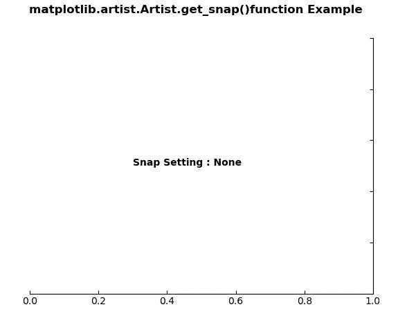
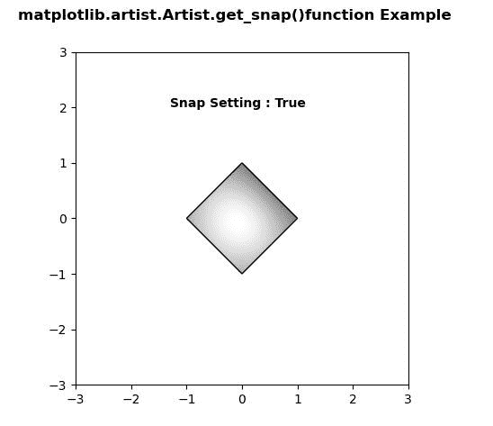

# Python 中的 matplotlib . artist . artist . get _ snap()

> 原文:[https://www . geesforgeks . org/matplotlib-artist-artist-get _ snap-in-python/](https://www.geeksforgeeks.org/matplotlib-artist-artist-get_snap-in-python/)

**[Matplotlib](https://www.geeksforgeeks.org/python-introduction-matplotlib/)** 是 Python 中的一个库，是 NumPy 库的数值-数学扩展。**艺术家类**包含抽象基类，用于渲染到图形画布中的对象。图形中所有可见的元素都是艺术家的子类。

## matplotlib . artist . artist . get _ snap()方法

matplotlib 库的 artist 模块中的 **get_snap()方法**用于获取 snap 设置。

> **语法:** Artist.get_snap(self)
> 
> **参数:**该方法不接受任何参数。
> 
> **返回:**该方法返回捕捉设置。

下面的例子说明了 matplotlib 中的 matplotlib . artist . get _ snap()函数:

**例 1:**

```py
# Implementation of matplotlib function
from matplotlib.artist import Artist  
import matplotlib.pyplot as plt 
from mpl_toolkits.axisartist.axislines import Subplot 

fig = plt.figure() 

ax = Subplot(fig, 111) 
fig.add_subplot(ax) 

ax.axis["left"].set_visible(False) 
ax.axis["top"].set_visible(False) 

ax.text(0.3, 0.5, "Snap Setting : "
        +str(Artist.get_snap(ax)),  
        fontweight ="bold") 

fig.suptitle('matplotlib.artist.Artist.get_snap()\
function Example', fontweight ="bold") 

plt.show()
```

**输出:**


**例 2:**

```py
# Implementation of matplotlib function
from matplotlib.artist import Artist  
import numpy as np 
import matplotlib.cm as cm 
import matplotlib.pyplot as plt 
import matplotlib.cbook as cbook 
from matplotlib.path import Path 
from matplotlib.patches import PathPatch 

delta = 0.025
x = y = np.arange(-3.0, 3.0, delta) 
X, Y = np.meshgrid(x, y) 

Z1 = np.exp(-X**2 - Y**2) 
Z2 = np.exp(-(X - 1)**2 - (Y - 1)**2) 
Z = (Z1 - Z2) * 2

path = Path([[0, 1], [1, 0], [0, -1],  
            [-1, 0], [0, 1]]) 
patch = PathPatch(path, facecolor ='none') 

fig, ax = plt.subplots() 
ax.add_patch(patch) 

im = ax.imshow(Z, interpolation ='bilinear', 
               cmap = cm.gray, 
               origin ='lower', 
               extent =[-3, 3, -3, 3], 
               clip_path = patch,  
               clip_on = True) 

im.set_clip_path(patch) 

Artist.set_snap(ax, True) 

ax.text(-1.3, 2, "Snap Setting : "
        + str(Artist.get_snap(ax)), 
        fontweight ="bold") 

fig.suptitle('matplotlib.artist.Artist.get_snap()\
function Example', fontweight ="bold") 

plt.show()
```

**输出:**
