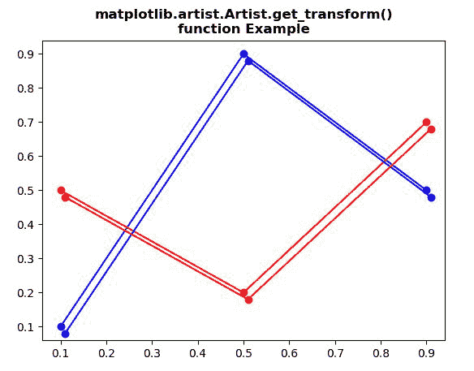
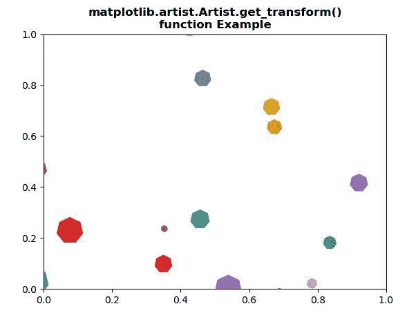

# Python 中的 matplotlib . artist . artist . get _ transform()

> 原文:[https://www . geesforgeks . org/matplotlib-artist-artist-get _ transform-in-python/](https://www.geeksforgeeks.org/matplotlib-artist-artist-get_transform-in-python/)

[**【Matplotlib】**](https://www.geeksforgeeks.org/python-introduction-matplotlib/)是 Python 中的一个库，它是 NumPy 库的数字-数学扩展。 **艺术家类** 包含将渲染到图形画布中的对象的抽象基类。图形中所有可见的元素都是艺术家的子类。

## matplotlib . artist . artist . get _ transform()方法

matplotlib 库的艺术家模块中的 **get_transform()方法**用于获取该艺术家使用的 **Transform** 实例

> ***句法:*** 艺术家。*get _ transform(self)*
> 
> ***参数:**此方法不接受任何参数。*
> 
> ***返回:**该方法返回该艺术家使用的变换实例*

以下示例说明了 matplotlib 中的 matplotlib . artist . artist . get _ transform()函数:

**例 1:**

```py
# Implementation of matplotlib function
from matplotlib.artist import Artist 
import numpy as np  
import matplotlib.pyplot as plt 
import matplotlib.transforms as mtransforms 

fig, ax = plt.subplots()  

l1, = ax.plot([0.1, 0.5, 0.9], 
              [0.1, 0.9, 0.5],
              "bo-") 

l2, = ax.plot([0.1, 0.5, 0.9],
              [0.5, 0.2, 0.7],
              "ro-") 

for l in [l1, l2]: 
    xx = l.get_xdata() 
    yy = l.get_ydata() 
    shadow, = ax.plot(xx, yy) 
    shadow.update_from(l) 

    ot = mtransforms.offset_copy(Artist.get_transform(l), 
                                 ax.figure, 
                                 x = 4.0, y =-6.0, 
                                 units ='points') 

    shadow.set_transform(ot) 

plt.title("""matplotlib.artist.Artist.get_transform()
function Example""", fontweight="bold")

plt.show()
```

**输出:**



**例 2:**

```py
# Implementation of matplotlib function
from matplotlib.artist import Artist 
import matplotlib.pyplot as plt 
from matplotlib import collections, colors, transforms 
import numpy as np 

nverts = 50
npts = 100

r = np.arange(nverts) 
theta = np.linspace(0, 2 * np.pi, nverts) 

xx = r * np.sin(theta) 
yy = r * np.cos(theta) 
spiral = np.column_stack([xx, yy]) 

rs = np.random.RandomState(19680801) 

xyo = rs.randn(npts, 2) 

colors = [colors.to_rgba(c) 
          for c in plt.rcParams['axes.prop_cycle'].by_key()['color']] 

fig, ax1 = plt.subplots() 

col = collections.RegularPolyCollection( 
    7, sizes = np.abs(xx) * 10.0,  
    offsets = xyo,  
    transOffset = ax1.transData) 

trans = transforms.Affine2D().scale(fig.dpi / 72.0) 
Artist.set_transform(col, trans)  

ax1.add_collection(col, autolim = True) 
col.set_color(colors)

plt.title("""matplotlib.artist.Artist.set_transform()
function Example""", fontweight="bold")

plt.show()
```

**输出:**



```py
Value Return by get_transform() :
 Affine2D(
    [[1.38888889 0\.         0\.        ]
     [0\.         1.38888889 0\.        ]
     [0\.         0\.         1\.        ]])

```