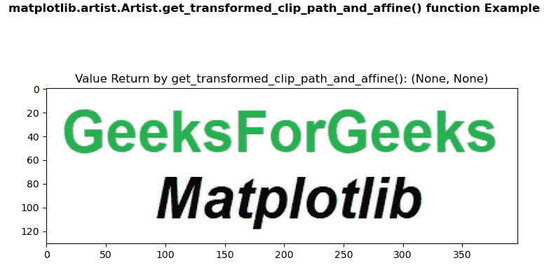
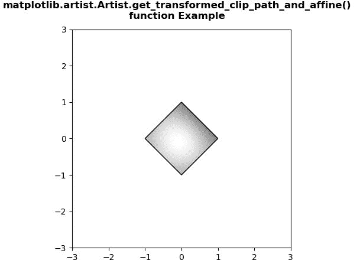

# Python 中的 matplotlib . artist . artist . get _ transformed _ clip _ path _ and _ 仿射()

> 原文:[https://www . geesforgeks . org/matplotlib-artist-artist-get _ transformed _ clip _ path _ and _ 仿射-in-python/](https://www.geeksforgeeks.org/matplotlib-artist-artist-get_transformed_clip_path_and_affine-in-python/)

[**【Matplotlib】**](https://www.geeksforgeeks.org/python-introduction-matplotlib/)是 Python 中的一个库，它是 NumPy 库的数字-数学扩展。 **艺术家类** 包含将渲染到图形画布中的对象的抽象基类。图形中所有可见的元素都是艺术家的子类。

## matplotlib . artist . artist . get _ transformed _ clip _ path _ and _ 仿射()方法

matplotlib 库的 artist 模块中的**get _ transformed _ clip _ path _ and _ affine()方法**用于获取应用了其变换的非仿射部分以及其变换的剩余仿射部分的剪辑路径。

> ***语法:***artist . get _ transformed _ clip _ path _ and _ 仿射 ( *self* )
> 
> ***参数:**此方法不接受任何参数。*
> 
> ***返回:*** *该方法返回应用了变换的非仿射部分和变换的剩余仿射部分的剪辑路径。*

以下示例说明了 matplotlib 中的 matplotlib . artist . artist .get _ transformed _ clip _ path _ and _ 仿射()函数:

**例 1:**

**使用的图像:**


```py
# Implementation of matplotlib function
from matplotlib.artist import Artist 
import matplotlib.pyplot as plt 
import matplotlib.patches as patches 
import matplotlib.cbook as cbook 

with cbook.get_sample_data('image.PNG') as image_file: 
    image = plt.imread(image_file) 

fig, ax = plt.subplots() 
im = ax.imshow(image) 
patch = patches.Rectangle((0, 0), 260, 200,  
                          transform = ax.transData) 

# use of get_transformed_clip_path_and_affine() method
val = Artist.get_transformed_clip_path_and_affine(im)
ax.set_title("Value Return by get_transformed_clip_path_and_affine(): " 
             + str(val))

fig.suptitle('matplotlib.artist.Artist.get_transformed_clip_path_and_affine() \
function Example', fontweight="bold")

plt.show()
```

**输出:**



**例 2:**

```py
# Implementation of matplotlib function
from matplotlib.artist import Artist 
import numpy as np 
import matplotlib.cm as cm 
import matplotlib.pyplot as plt 
from matplotlib.path import Path 
from matplotlib.patches import PathPatch 

delta = 0.025

x = y = np.arange(-3.0, 3.0, delta) 
X, Y = np.meshgrid(x, y) 

Z1 = np.exp(-X**2 - Y**2) 
Z2 = np.exp(-(X - 1)**2 - (Y - 1)**2) 
Z = (Z1 - Z2) * 2

path = Path([[0, 1], [1, 0], [0, -1], [-1, 0], [0, 1]]) 
patch = PathPatch(path, facecolor ='none') 

fig, ax = plt.subplots() 
ax.add_patch(patch) 
im = ax.imshow(Z, 
               interpolation ='bilinear',  
               cmap = cm.gray, 
               origin ='lower', 
               extent =[-3, 3, -3, 3], 
               clip_path = patch, 
               clip_on = True)

# use of get_transformed_clip_path_and_affine() method
val = Artist.get_transformed_clip_path_and_affine(im)
print("Value Return by get_transformed_clip_path_and_affine(): ")
for i in val: 
    print(i) 

fig.suptitle("""matplotlib.artist.Artist.get_transformed_clip_path_and_affine()
function Example""", fontweight="bold")

plt.show()
```

**输出:**



```py
Value Return by get_transformed_clip_path_and_affine(): 
Path(array([[ 0.,  1.],
       [ 1.,  0.],
       [ 0., -1.],
       [-1.,  0.],
       [ 0.,  1.]]), None)
Affine2D(
    [[ 82.66666667   0\.         328\.        ]
     [  0\.          61.6        237.6       ]
     [  0\.           0\.           1\.        ]])

```