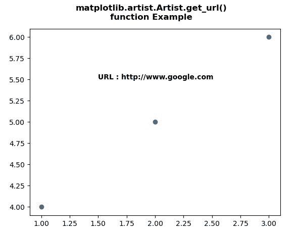
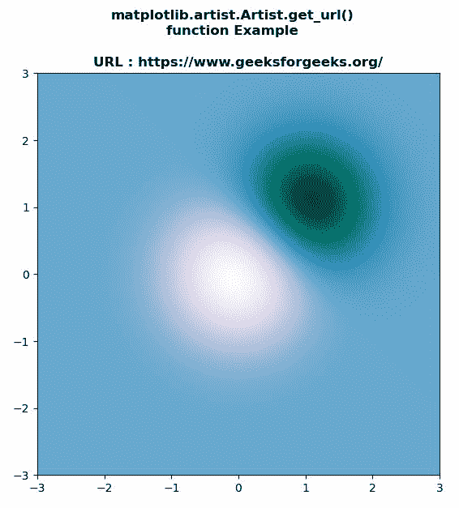

# Python 中的 matplotlib . artist . artist . get _ URL()

> 原文:[https://www . geesforgeks . org/matplotlib-artist-artist-get _ URL-in-python/](https://www.geeksforgeeks.org/matplotlib-artist-artist-get_url-in-python/)

[**【Matplotlib】**](https://www.geeksforgeeks.org/python-introduction-matplotlib/)是 Python 中的一个库，它是 NumPy 库的数字-数学扩展。 **艺术家类** 包含将渲染到图形画布中的对象的抽象基类。图形中所有可见的元素都是艺术家的子类。

## matplotlib . artist . artist . get _ URL()方法

matplotlib 库的艺术家模块中的 **get_url()方法**用于设置艺术家的 url。

> ***语法:*** 艺术家 g *et_url(self)*
> 
> ***参数:**此方法不接受任何参数。*
> 
> ***返回:**这个方法返回网址。*

下面的例子说明了 matplotlib 中的 matplotlib . artist . get _ URL()函数:

**例 1:**

```py
# Implementation of matplotlib function
from matplotlib.artist import Artist 
import matplotlib.pyplot as plt 

f, ax = plt.subplots() 
ax.scatter([1, 2, 3], [4, 5, 6]) 
ax.set_url('http://www.google.com') 
f.canvas.print_figure('scatter.svg') 

ax.text(1.5, 5.5, "URL : "
        + str( Artist.get_url(ax)),  
        fontweight ="bold") 

f.suptitle("""matplotlib.artist.Artist.get_url()
function Example""", fontweight ="bold")

plt.show()
```

**输出:**



**例 2:**

```py
# Implementation of matplotlib function
from matplotlib.artist import Artist 
import matplotlib.pyplot as plt
import numpy as np 

f, ax = plt.subplots() 
delta = 0.025

x = y = np.arange(-3.0, 3.0, delta) 
X, Y = np.meshgrid(x, y) 

Z1 = np.exp(-X**2 - Y**2) 
Z2 = np.exp(-(X - 1)**2 - (Y - 1)**2) 
Z = (Z1 - Z2) * 2

ax.imshow(Z, interpolation ='bilinear',  
          cmap = "PuBuGn_r", 
          origin ='lower', 
          extent =[-3, 3, -3, 3]) 

ax.set_url('https://www.geeksforgeeks.org/') 
f.savefig('image.svg') 

ax.set_title("URL : "+str(Artist.get_url(ax)), fontweight ="bold")

f.suptitle("""matplotlib.artist.Artist.get_url()
function Example""", fontweight ="bold")

plt.show()
```

**输出:**

