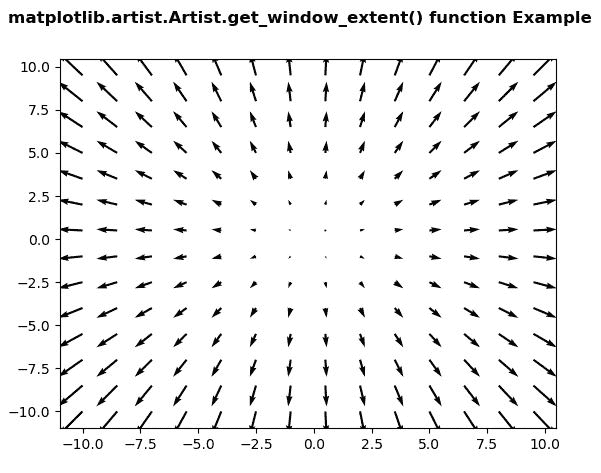
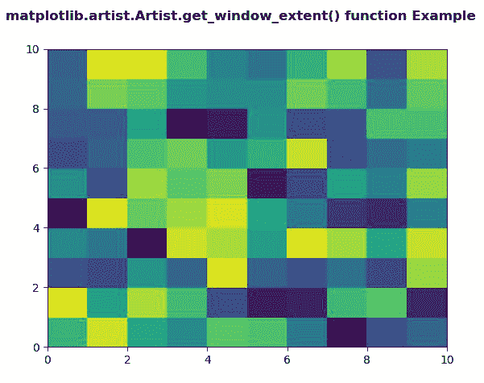

# Python 中的 matplotlib . artist . artist . get _ window _ extension()

> 原文:[https://www . geeksforgeeks . org/matplotlib-artist-artist-get _ window _ extend-in-python/](https://www.geeksforgeeks.org/matplotlib-artist-artist-get_window_extent-in-python/)

[**【Matplotlib】**](https://www.geeksforgeeks.org/python-introduction-matplotlib/)是 Python 中的一个库，它是 NumPy 库的数字-数学扩展。 **艺术家类** 包含将渲染到图形画布中的对象的抽象基类。图形中所有可见的元素都是艺术家的子类。

## matplotlib . artist . artist . get _ window _ extension()方法

matplotlib 库的 artist 模块中的 **get_window_extent()方法**用于返回显示空间中的轴边界框。

> ***句法:***artist . get _ window _ extension(*self*)
> 
> ***参数:**该方法接受以下参数。*
> 
> *   ***渲染器:**这个参数是 RendererBase 子类。*
> 
> ***返回:*** *该方法返回显示空间中的图形包围盒。*

以下示例说明了 matplotlib 中的 matplotlib . artist . artist . get _ window _ extent()函数:

**例 1:**

```py
# Implementation of matplotlib function
import matplotlib.pyplot as plt
import numpy as np
from matplotlib.artist import Artist 

X = np.arange(-10, 10, 1.5)
Y = np.arange(-10, 10, 1.5)
U, V = np.meshgrid(X, Y)

fig, ax = plt.subplots()

ax.quiver(X, Y, U, V)

fig.canvas.draw()  
renderer = fig.canvas.renderer

# use of get_window_extent() method
val = Artist.get_window_extent(ax, renderer)
print("Value Return by get_window_extent():")
print(val)

fig.suptitle('matplotlib.artist.Artist.get_window_extent() \
function Example', fontweight="bold")

plt.show()
```

**输出:**



```py
Value Return by get_window_extent():
Bbox(x0=0.0, y0=0.0, x1=0.0, y1=0.0)

```

**例 2:**

```py
# Implementation of matplotlib function
import matplotlib.pyplot as plt
import numpy as np
from matplotlib.artist import Artist 

xx = np.random.rand(10, 10)

fig, ax = plt.subplots()

m = ax.pcolor(xx)
m.set_zorder(-20)

fig.canvas.draw()  
renderer = fig.canvas.renderer

# use of get_window_extent() method
val = Artist.get_window_extent(ax, renderer)
print("Value Return by get_window_extent():")
print(val)

fig.suptitle('matplotlib.artist.Artist.get_window_extent() \
function Example', fontweight="bold")

plt.show()
```

**输出:**



```py
Value Return by get_window_extent():
Bbox(x0=0.0, y0=0.0, x1=0.0, y1=0.0)

```