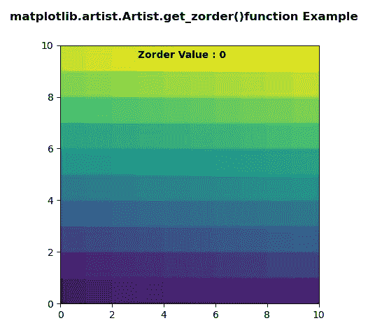
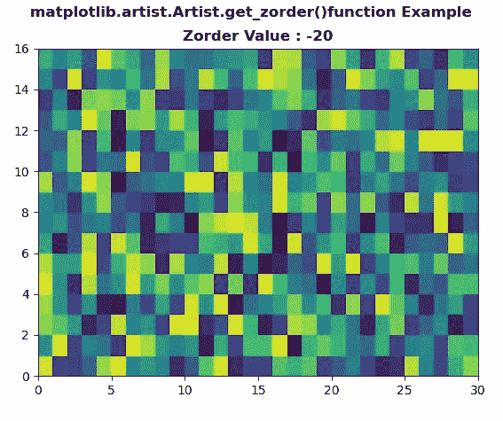

# Python 中的 matplotlib . artist . artist . get _ zorder()

> 原文:[https://www . geesforgeks . org/matplotlib-artist-artist-get _ zorder-in-python/](https://www.geeksforgeeks.org/matplotlib-artist-artist-get_zorder-in-python/)

**[Matplotlib](https://www.geeksforgeeks.org/python-introduction-matplotlib/)** 是 Python 中的一个库，是 NumPy 库的数值-数学扩展。**艺术家类**包含抽象基类，用于渲染到图形画布中的对象。图形中所有可见的元素都是艺术家的子类。

## matplotlib . artist . artist . get _ zorder()方法

matplotlib 库的 artist 模块中的 **get_zorder()方法**用于获取艺术家的 zorder。

> **语法:** Artist.get_zorder(self)
> 
> **参数:**该方法不接受任何参数。
> 
> **返回:**此方法返回艺术家的 zorder。

下面的例子说明了 matplotlib . artist . artist . get _ zorder()函数:

**例 1:**

```
# Implementation of matplotlib function
from matplotlib.artist import Artist  
import numpy as np 
import matplotlib.pyplot as plt 

d = np.arange(100).reshape(10, 10) 
xx, yy = np.meshgrid(np.arange(11), np.arange(11)) 

fig, ax = plt.subplots() 

ax.set_aspect(1) 
ax.pcolormesh(xx, yy, d) 

ax.text(3, 9.5, "Zorder Value : "
        + str(Artist.get_zorder(ax)), 
        fontweight ="bold") 

fig.suptitle('matplotlib.artist.Artist.get_zorder()\
function Example', fontweight ="bold") 

plt.show()
```

**输出:**


**例 2:**

```
# Implementation of matplotlib function
from matplotlib.artist import Artist  
import numpy as np 
import matplotlib.pyplot as plt 

xx = np.random.rand(16, 30) 

fig, ax = plt.subplots() 

ax.pcolor(xx) 
ax.set_zorder(-20) 

ax.set_title( "Zorder Value : "
        + str(Artist.get_zorder(ax)), 
        fontweight ="bold") 

fig.suptitle('matplotlib.artist.Artist.get_zorder()\
function Example', fontweight ="bold") 

plt.show()
```

**输出:**
