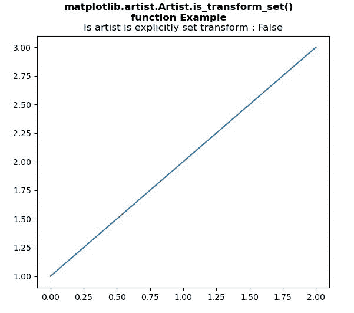
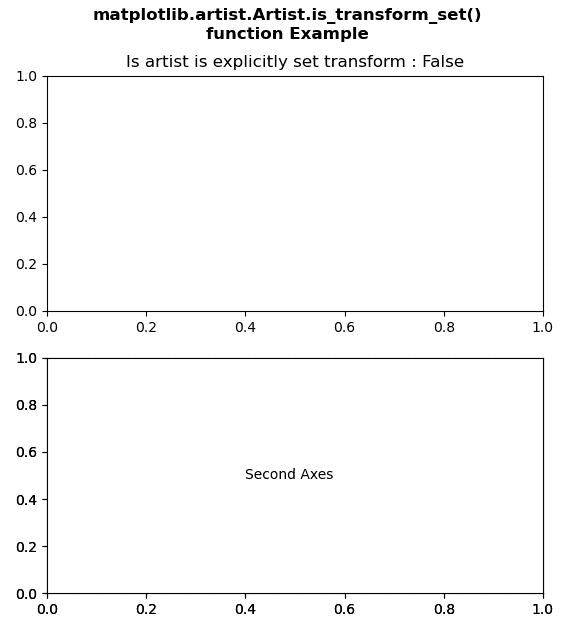

# Python 中的 matplotlib . artist . artist . is _ transform _ set()

> 原文:[https://www . geesforgeks . org/matplotlib-artist-artist-is _ transform _ set-in-python/](https://www.geeksforgeeks.org/matplotlib-artist-artist-is_transform_set-in-python/)

[**【Matplotlib】**](https://www.geeksforgeeks.org/python-introduction-matplotlib/)是 Python 中的一个库，它是 NumPy 库的数字-数学扩展。 **艺术家类** 包含将渲染到图形画布中的对象的抽象基类。图形中所有可见的元素都是艺术家的子类。

## matplotlib . artist . artist . is _ transform _ set()方法

matplotlib 库的 artist 模块中的 **is_transform_set()方法**用于获取 Artist 是否有显式设置的变换。

> ***语法:*** 艺术家 _ 变换 _ 设定 *(自我)*
> 
> ***参数:**此方法不接受任何参数。*
> 
> ***返回:**该方法返回艺术家是否有显式设置的变换。*

以下示例说明了 matplotlib 中的 matplotlib . artist . artist . is _ transform _ set()函数:

**例 1:**

```
# Implementation of matplotlib function
from matplotlib.artist import Artist 
import matplotlib.pyplot as plt 

fig, axs = plt.subplots() 
axs.plot([1, 2, 3]) 

axs.set_title("Is artist is explicitly set transform : "
              +str(Artist.is_transform_set(axs))) 

fig.suptitle("""matplotlib.artist.Artist.is_transform_set()
function Example""", fontweight="bold")

plt.show()
```

**输出:**



**例 2:**

```
# Implementation of matplotlib function
from matplotlib.artist import Artist 
import matplotlib.pyplot as plt 

fig, (axs, axs2) = plt.subplots(2, 1) 
gs = axs2.get_gridspec() 

axbig = fig.add_subplot(gs[1:, -1]) 

axbig.annotate("Second Axes", (0.4, 0.5), 
               xycoords ='axes fraction', 
               va ='center') 

axs.set_title("Is artist is explicitly set transform : "
              +str(Artist.is_transform_set(axs))) 

fig.suptitle("""matplotlib.artist.Artist.is_transform_set()
function Example""", fontweight="bold")

plt.show()
```

**输出:**

