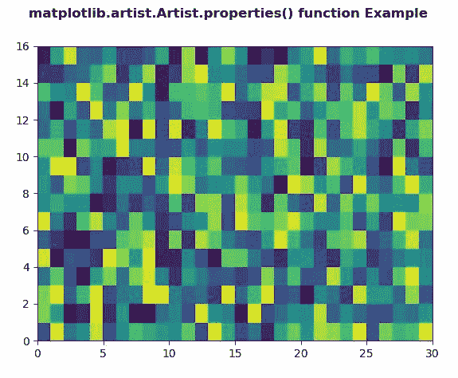
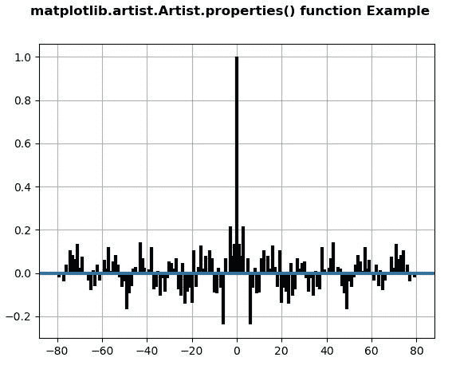

# Matplotlib.artist.Artist.properties() in Python

> 原文：[https://www.geeksforgeeks.org/matplotlib-artist-artist-properties-in-python/](https://www.geeksforgeeks.org/matplotlib-artist-artist-properties-in-python/)

**[Matplotlib](https://www.geeksforgeeks.org/python-introduction-matplotlib/)** is a library in Python and it is numerical – mathematical extension for NumPy library. The **Artist class** contains Abstract base class for objects that render into a FigureCanvas. All visible elements in a figure are subclasses of Artist.

## matplotlib.artist.Artist.properties() method

The **properties() method** in artist module of matplotlib library is used to get the dictionary of all the properties of the artist.

```
Syntax: Artist.properties(self)

Parameters: This method does not accepts any parameters.Returns: This method return dictionary of all the properties of the artist.
```

Below examples illustrate the matplotlib.artist.Artist.properties() function in matplotlib:

**Example 1:**

```
# Implementation of matplotlib function
from matplotlib.artist import Artist
import numpy as np  
import matplotlib.pyplot as plt  

xx = np.random.rand(16, 30)  

fig, ax = plt.subplots()  

m = ax.pcolor(xx)  
m.set_zorder(-20) 

w = Artist.properties(ax) 
print("Display all Properties\n") 
for i in w: 
    print(i, ":", w[i]) 

fig.suptitle('matplotlib.artist.Artist.properties() \
function Example', fontweight ="bold") 

plt.show()
```

**Output:**


```
Display all Propertiesadjustable : box
agg_filter : None
alpha : None
anchor : C
animated : False
aspect : auto
autoscale_on : True
autoscalex_on : True
autoscaley_on : True
axes_locator : None
axisbelow : line
children : [<matplotlib.collections.PolyCollection object at 0x0ABB8470>, <.spines.Spine object at 0x08221EF0>, <matplotlib.spines.Spine object at 0x08221F90>, <matplotlib.spines.Spine object at 0x08237050>, <matplotlib.spines.Spine object at 0x082370F0>, <matplotlib.axis.XAxis object at 0x08221E70>, <matplotlib.axis.YAxis object at 0x08237370>, Text(0.5, 1.0, ”), Text(0.0, 1.0, ”), Text(1.0, 1.0, ”), <matplotlib.patches.Rectangle object at 0x0824CD90>]
clip_box : None
clip_on : True
clip_path : None
contains : None
data_ratio : 0.5333333333333333
default_bbox_extra_artists : [<matplotlib.collections.PolyCollection object at 0x0ABB8470>, <matplotlib.spines.Spine object at 0x08221EF0>, <matplotlib.spines.Spine object at 0x08221F90>, <matplotlib.spines.Spine object at 0x08237050>, <matplotlib.spines.Spine object at 0x082370F0>, <matplotlib.axis.XAxis object at 0x08221E70>, <matplotlib.axis.YAxis object at 0x08237370>, Text(0.5, 1.0, ”), Text(0.0, 1.0, ”), Text(1.0, 1.0, ”), <matplotlib.patches.Rectangle object at 0x0824CD90>]
facecolor : (1.0, 1.0, 1.0, 1.0)
fc : (1.0, 1.0, 1.0, 1.0)
figure : Figure(640×480)
frame_on : True
geometry : (1, 1, 1)
gid : None
gridspec : GridSpec(1, 1)
images : <a list of 0 AxesImage objects>
in_layout : True
label :
legend : None
legend_handles_labels : ([], [])
lines : <a list of 0 Line2D objects>
navigate : True
navigate_mode : None
path_effects : []
picker : None
position : Bbox(x0=0.125, y0=0.10999999999999999, x1=0.9, y1=0.88)
rasterization_zorder : None
rasterized : None
renderer_cache : None
shared_x_axes :<matplotlib.cbook.Grouper object at 0x080ACD70>
shared_y_axes : <matplotlib.cbook.Grouper object at 0x080B8BB0>
sketch_params : None
snap : None
subplotspec : <matplotlib.gridspec.SubplotSpec object at 0x07428ED0>
title :
transform : IdentityTransform()
transformed_clip_path_and_affine : (None, None)
url : None
visible : True
window_extent : TransformedBbox(
Bbox(x0=0.125, y0=0.10999999999999999, x1=0.9, y1=0.88),
BboxTransformTo(
TransformedBbox(
Bbox(x0=0.0, y0=0.0, x1=6.4, y1=4.8),
Affine2D(
[[100\. 0\. 0.]
[ 0\. 100\. 0.]
[ 0\. 0\. 1.]]))))
xaxis : XAxis(80.0, 52.8)
xaxis_transform : BlendedGenericTransform(
CompositeGenericTransform(
TransformWrapper(
BlendedAffine2D(
IdentityTransform(),
IdentityTransform())),
CompositeGenericTransform(
BboxTransformFrom(
TransformedBbox(
Bbox(x0=0.0, y0=0.0, x1=30.0, y1=16.0),
TransformWrapper(
BlendedAffine2D(
IdentityTransform(),
IdentityTransform())))),
BboxTransformTo(
TransformedBbox(
Bbox(x0=0.125, y0=0.10999999999999999, x1=0.9, y1=0.88),
BboxTransformTo(
TransformedBbox(
Bbox(x0=0.0, y0=0.0, x1=6.4, y1=4.8),
Affine2D(
[[100\. 0\. 0.]
[ 0\. 100\. 0.]
[ 0\. 0\. 1.]]))))))),
BboxTransformTo(
TransformedBbox(
Bbox(x0=0.125, y0=0.10999999999999999, x1=0.9, y1=0.88),
BboxTransformTo(
TransformedBbox(
Bbox(x0=0.0, y0=0.0, x1=6.4, y1=4.8),
Affine2D(
[[100\. 0\. 0.]
[ 0\. 100\. 0.]
[ 0\. 0\. 1.]]))))))
xbound : (0.0, 30.0)
xgridlines : <a list of 7 Line2D gridline objects>
xlabel :
xlim : (0.0, 30.0)
xmajorticklabels : <a list of 7 Text major ticklabel objects>
xminorticklabels : <a list of 0 Text minor ticklabel objects>
xscale : linear
xticklabels : <a list of 7 Text major ticklabel objects>
xticklines : <a list of 14 Line2D ticklines objects>
xticks : [ 0\. 5\. 10\. 15\. 20\. 25\. 30.]
yaxis : YAxis(80.0, 52.8)
yaxis_transform : BlendedGenericTransform(
BboxTransformTo(
TransformedBbox(
Bbox(x0=0.125, y0=0.10999999999999999, x1=0.9, y1=0.88),
BboxTransformTo(
TransformedBbox(
Bbox(x0=0.0, y0=0.0, x1=6.4, y1=4.8),
Affine2D(
[[100\. 0\. 0.]
[ 0\. 100\. 0.]
[ 0\. 0\. 1.]]))))),
CompositeGenericTransform(
TransformWrapper(
BlendedAffine2D(
IdentityTransform(),
IdentityTransform())),
CompositeGenericTransform(
BboxTransformFrom(
TransformedBbox(
Bbox(x0=0.0, y0=0.0, x1=30.0, y1=16.0),
TransformWrapper(
BlendedAffine2D(
IdentityTransform(),
IdentityTransform())))),
BboxTransformTo(
TransformedBbox(
Bbox(x0=0.125, y0=0.10999999999999999, x1=0.9, y1=0.88),
BboxTransformTo(
TransformedBbox(
Bbox(x0=0.0, y0=0.0, x1=6.4, y1=4.8),
Affine2D(
[[100\. 0\. 0.]
[ 0\. 100\. 0.]
[ 0\. 0\. 1.]]))))))))
ybound : (0.0, 16.0)
ygridlines : <a list of 9 Line2D gridline objects>
ylabel :
ylim : (0.0, 16.0)
ymajorticklabels : <a list of 9 Text major ticklabel objects>
yminorticklabels : <a list of 0 Text minor ticklabel objects>
yscale : linear
yticklabels : <a list of 9 Text major ticklabel objects>
yticklines : <a list of 18 Line2D ticklines objects>
yticks : [ 0\. 2\. 4\. 6\. 8\. 10\. 12\. 14\. 16.]
zorder : 0
```

**Example 2:**

```
# Implementation of matplotlib function
from matplotlib.artist import Artist
import matplotlib.pyplot as plt 
import numpy as np 

np.random.seed(10**7) 
geeks = np.random.randn(100) 

fig, ax = plt.subplots() 
ax.acorr(geeks, usevlines = True, 
         normed = True, 
         maxlags = 80, lw = 3) 

ax.grid(True) 

w = Artist.properties(ax) 
print("Display all Properties\n") 
for i in w: 
    print(i, ":", w[i]) 

fig.suptitle('matplotlib.artist.Artist.properties() \
function Example', fontweight ="bold") 

plt.show()
```

**Output:**


```
Display all Propertiesadjustable : box
agg_filter : None
alpha : None
anchor : C
animated : False
aspect : auto
autoscale_on : True
autoscalex_on : True
autoscaley_on : True
axes_locator : None
axisbelow : line
children : [<matplotlib.collections.LineCollection object at 0x0AAE84F0>, <matplotlib.lines.Line2D object at 0x0AAE84D0>, <matplotlib.spines.Spine object at 0x08151F50>, <matplotlib.spines.Spine object at 0x08151FF0>, <matplotlib.spines.Spine object at 0x081670B0>, <matplotlib.spines.Spine object at 0x08167150>, <matplotlib.axis.XAxis object at 0x08151ED0>, <matplotlib.axis.YAxis object at 0x081673D0>, Text(0.5, 1.0, ”), Text(0.0, 1.0, ”), Text(1.0, 1.0, ”), <matplotlib.patches.Rectangle object at 0x0817CDF0>]
clip_box : None
clip_on : True
clip_path : None
contains : None
data_ratio : 0.007741698372824119
default_bbox_extra_artists : [<matplotlib.collections.LineCollection object at 0x0AAE84F0>, <matplotlib.lines.Line2D object at 0x0AAE84D0>, <matplotlib.spines.Spine object at 0x08151F50>, <matplotlib.spines.Spine object at 0x08151FF0>, <matplotlib.spines.Spine object at 0x081670B0>, <matplotlib.spines.Spine object at 0x08167150>, <matplotlib.axis.XAxis object at 0x08151ED0>, <matplotlib.axis.YAxis object at 0x081673D0>, Text(0.5, 1.0, ”), Text(0.0, 1.0, ”), Text(1.0, 1.0, ”), <matplotlib.patches.Rectangle object at 0x0817CDF0>]
facecolor : (1.0, 1.0, 1.0, 1.0)
fc : (1.0, 1.0, 1.0, 1.0)
figure : Figure(640×480)
frame_on : True
geometry : (1, 1, 1)
gid : None
gridspec : GridSpec(1, 1)
images : <a list of 0 AxesImage objects>
in_layout : True
label :
legend : None
legend_handles_labels : ([], [])
lines : <a list of 1 Line2D objects>
navigate : True
navigate_mode : None
path_effects : []
picker : None
position : Bbox(x0=0.125, y0=0.10999999999999999, x1=0.9, y1=0.88)
rasterization_zorder : None
rasterized : None
renderer_cache : None
shared_x_axes : <matplotlib.cbook.Grouper object at 0x07FDCDB0>
shared_y_axes : <matplotlib.cbook.Grouper object at 0x07FE8BF0>
sketch_params : None
snap : None
subplotspec : <matplotlib.gridspec.SubplotSpec object at 0x07358F70>
title :
transform : IdentityTransform()
transformed_clip_path_and_affine : (None, None)
url : None
visible : True
window_extent : TransformedBbox(
Bbox(x0=0.125, y0=0.10999999999999999, x1=0.9, y1=0.88),
BboxTransformTo(
TransformedBbox(
Bbox(x0=0.0, y0=0.0, x1=6.4, y1=4.8),
Affine2D(
[[100\. 0\. 0.]
[ 0\. 100\. 0.]
[ 0\. 0\. 1.]]))))
xaxis : XAxis(80.0, 52.8)
xaxis_transform : BlendedGenericTransform(
CompositeGenericTransform(
TransformWrapper(
BlendedAffine2D(
IdentityTransform(),
IdentityTransform())),
CompositeGenericTransform(
BboxTransformFrom(
TransformedBbox(
Bbox(x0=-88.0, y0=-0.300605326634452, x1=88.0, y1=1.061933586982593),
TransformWrapper(
BlendedAffine2D(
IdentityTransform(),
IdentityTransform())))),
BboxTransformTo(
TransformedBbox(
Bbox(x0=0.125, y0=0.10999999999999999, x1=0.9, y1=0.88),
BboxTransformTo(
TransformedBbox(
Bbox(x0=0.0, y0=0.0, x1=6.4, y1=4.8),
Affine2D(
[[100\. 0\. 0.]
[ 0\. 100\. 0.]
[ 0\. 0\. 1.]]))))))),
BboxTransformTo(
TransformedBbox(
Bbox(x0=0.125, y0=0.10999999999999999, x1=0.9, y1=0.88),
BboxTransformTo(
TransformedBbox(
Bbox(x0=0.0, y0=0.0, x1=6.4, y1=4.8),
Affine2D(
[[100\. 0\. 0.]
[ 0\. 100\. 0.]
[ 0\. 0\. 1.]]))))))
xbound : (-88.0, 88.0)
xgridlines : <a list of 11 Line2D gridline objects>
xlabel :
xlim : (-88.0, 88.0)
xmajorticklabels :<a list of 11 Text major ticklabel objects>
xminorticklabels : <a list of 0 Text minor ticklabel objects>
xscale : linear
xticklabels : <a list of 11 Text major ticklabel objects>
xticklines : <a list of 22 Line2D ticklines objects>
xticks : [-100\. -80\. -60\. -40\. -20\. 0\. 20\. 40\. 60\. 80\. 100.]
yaxis : YAxis(80.0, 52.8)
yaxis_transform : BlendedGenericTransform(
BboxTransformTo(
TransformedBbox(
Bbox(x0=0.125, y0=0.10999999999999999, x1=0.9, y1=0.88),
BboxTransformTo(
TransformedBbox(
Bbox(x0=0.0, y0=0.0, x1=6.4, y1=4.8),
Affine2D(
[[100\. 0\. 0.]
[ 0\. 100\. 0.]
[ 0\. 0\. 1.]]))))),
CompositeGenericTransform(
TransformWrapper(
BlendedAffine2D(
IdentityTransform(),
IdentityTransform())),
CompositeGenericTransform(
BboxTransformFrom(
TransformedBbox(
Bbox(x0=-88.0, y0=-0.300605326634452, x1=88.0, y1=1.061933586982593),
TransformWrapper(
BlendedAffine2D(
IdentityTransform(),
IdentityTransform())))),
BboxTransformTo(
TransformedBbox(
Bbox(x0=0.125, y0=0.10999999999999999, x1=0.9, y1=0.88),
BboxTransformTo(
TransformedBbox(
Bbox(x0=0.0, y0=0.0, x1=6.4, y1=4.8),
Affine2D(
[[100\. 0\. 0.]
[ 0\. 100\. 0.]
[ 0\. 0\. 1.]]))))))))
ybound : (-0.300605326634452, 1.061933586982593)
ygridlines : <a list of 9 Line2D gridline objects>
ylabel :
ylim : (-0.300605326634452, 1.061933586982593)
ymajorticklabels : <a list of 9 Text major ticklabel objects>
yminorticklabels : <a list of 0 Text minor ticklabel objects>
yscale : linear
yticklabels : <a list of 9 Text major ticklabel objects>
yticklines : <a list of 18 Line2D ticklines objects>
yticks : [-0.4 -0.2 0\. 0.2 0.4 0.6 0.8 1\. 1.2]
zorder : 0
```