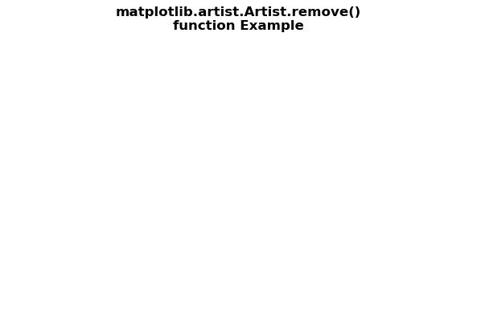
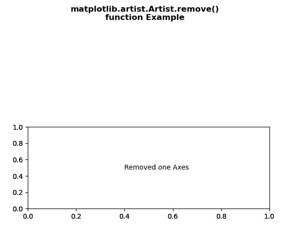

# Python 中的 matplotlib . artist . artist . remove()

> 原文:[https://www . geesforgeks . org/matplotlib-艺术家-艺术家-python 中的移除/](https://www.geeksforgeeks.org/matplotlib-artist-artist-remove-in-python/)

[**【Matplotlib】**](https://www.geeksforgeeks.org/python-introduction-matplotlib/)是 Python 中的一个库，它是 NumPy 库的数字-数学扩展。 **艺术家类** 包含将渲染到图形画布中的对象的抽象基类。图形中所有可见的元素都是艺术家的子类。

## matplotlib . artist . artist . remove()方法

matplotlib 库的艺术家模块中的**移除()方法**用于在可能的情况下从图形中移除艺术家。

> ***语法:*** 艺术家移除 ( *自我* )
> 
> ***参数:**此方法不接受任何参数。*
> 
> ***返回:*** *此法返回移除艺术家后的图。*

以下示例说明了 matplotlib 中的 matplotlib . artist . artist . remove()函数:

**例 1:**

```py
# Implementation of matplotlib function
from matplotlib.artist import Artist
import matplotlib.pyplot as plt

fig, axs = plt.subplots()
axs.plot([1, 2, 3])

# use of remove() method
Artist.remove(axs)

fig.suptitle("""matplotlib.artist.Artist.remove()
function Example""", fontweight="bold")

plt.show()
```

**输出:**



**例 2:**

```py
# Implementation of matplotlib function
from matplotlib.artist import Artist 
import matplotlib.pyplot as plt 

fig, (axs, axs2) = plt.subplots(2, 1) 
gs = axs2.get_gridspec()  

# use of remove() method
Artist.remove(axs)

axbig = fig.add_subplot(gs[1:, -1]) 
axbig.annotate("Removed one Axes", 
               (0.4, 0.5), 
               xycoords ='axes fraction', 
               va ='center') 

fig.suptitle("""matplotlib.artist.Artist.remove()
function Example""", fontweight="bold")

plt.show()
```

**输出:**

