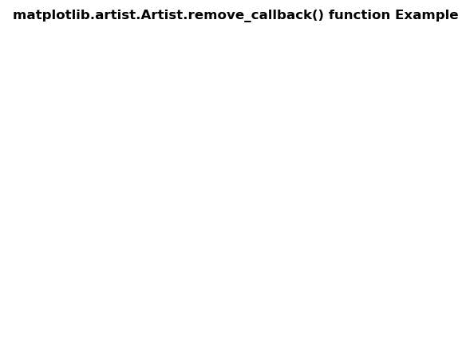
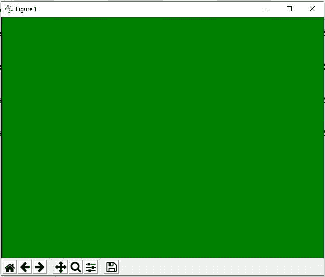

# Python 中的 matplotlib . artist . artist . remove _ callback()

> 原文:[https://www . geeksforgeeks . org/matplotlib-artist-artist-remove _ callback-in-python/](https://www.geeksforgeeks.org/matplotlib-artist-artist-remove_callback-in-python/)

**[Matplotlib](https://www.geeksforgeeks.org/python-introduction-matplotlib/)** 是 Python 中的一个库，是 NumPy 库的数值-数学扩展。**艺术家类**包含抽象基类，用于渲染到图形画布中的对象。图形中所有可见的元素都是艺术家的子类。

## matplotlib . artist . artist . remove _ callback()方法

matplotlib 库的 artist 模块中的 **remove_callback()方法**用于添加一个回调函数，每当 Artist 的某个属性发生变化时，就会调用该回调函数。

**语法:** Artist.remove_callback(self，oid)

**参数:**该方法接受以下参数。

*   **oid:** 这个参数是观察者 id。

**返回:**该方法根据观察器 id 返回 remove a 回调。

下面的例子说明了 matplotlib 中的 matplotlib . artist . artist . remove _ callback()函数:

**例 1:**

```py
# Implementation of matplotlib function
import matplotlib.pyplot as plt
import numpy as np
import time

def update():
    global timer
    plt.get_current_fig_manager().canvas.figure.patch.set_facecolor(str(np.random.random()))
    plt.draw()

def start_animation():
    global it
    timer = fig.canvas.new_timer(interval = 50)
    w = timer.add_callback(update)
    timer.start()
    timer.remove_callback(w)

it = 1
fig = plt.figure()
start_animation()

fig.suptitle('matplotlib.artist.Artist.remove_callback()\
 function Example', fontweight ="bold") 

plt.show()
```

**输出:**


**例 2:**

```py
# Implementation of matplotlib function  
from random import randint, choice 
import time 
import matplotlib.pyplot as plt 
import matplotlib.patches as patches 

back_color = "black"
colors = ['red', 'green', 'blue', 'purple'] 
width, height = 4, 4

fig = plt.figure() 
plt.xlim([0, width])
plt.ylim([0, height]) 

fig.canvas.draw() 

it = 1 
def update():
    global it
    x = randint(0, width - 1) 
    y = randint(0, height - 1) 

    arti = mpatches.Rectangle( 
        (x, y), 1, 1, 
        facecolor = choice(colors), 
        edgecolor = back_color 
    ) 

    fig.add_artist(arti)
    fig.draw_artist(arti)
    fig.canvas.blit(fig.bbox)

    if it > 100:
        timer.remove_callback(w)
    it += 1

timer = fig.canvas.new_timer(interval = 1) 
w = timer.add_callback(update) 
timer.start() 

fig.suptitle('matplotlib.artist.Artist.remove_callback() \
function Example', fontweight ="bold") 

plt.show()
```

**输出:**
