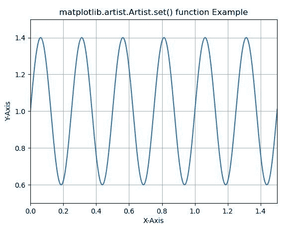
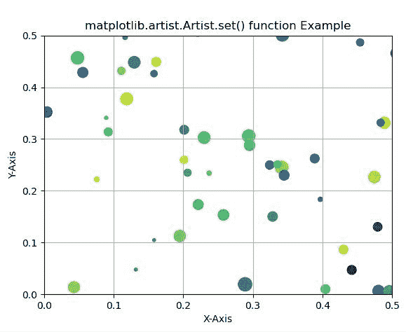

# Python 中的 Matplotlib.artist.Artist.set()

> 原文:[https://www . geesforgeks . org/matplotlib-artist-artist-set-in-python/](https://www.geeksforgeeks.org/matplotlib-artist-artist-set-in-python/)

**[Matplotlib](https://www.geeksforgeeks.org/python-introduction-matplotlib/)** 是 Python 中的一个库，是 NumPy 库的数值-数学扩展。**艺术家类**包含抽象基类，用于渲染到图形画布中的对象。图形中所有可见的元素都是艺术家的子类。

## matplotlib.artist.Artist.set()方法

matplotlib 库的 artist 模块中的 **set()方法**是一个属性批量设置器。传递 kwargs 以设置属性。

> **语法:**艺术家集(自我，**kwargs)
> 
> **参数:**此方法不接受除*** *夸脱以外的任何参数。**
> 
> **返回:**该方法不返回值。

下面的例子说明了 matplotlib 中的 matplotlib.artist.Artist.set()函数:

**例 1:**

```py
# Implementation of matplotlib function
from matplotlib.artist import Artist
import matplotlib 
import matplotlib.pyplot as plt 
import numpy as np 

t = np.arange(0.0, 2, 0.001) 
s = 1 + np.sin(8 * np.pi * t)*0.4

fig, ax = plt.subplots() 
ax.plot(t, s) 

Artist.set(ax, xlabel ='X-Axis', ylabel ='Y-Axis', 
    xlim =(0, 1.5), ylim =(0.5, 1.5), 
    title ='matplotlib.artist.Artist.set() function Example') 

ax.grid() 

plt.show()
```

**输出:**


**例 2:**

```py
# Implementation of matplotlib function
from matplotlib.artist import Artist
import numpy as np 
import matplotlib.pyplot as plt 
np.random.seed(19680801) 

fig, ax = plt.subplots() 

x, y, s, c = np.random.rand(4, 200) 
s *= 200

ax.scatter(x, y, s, c)

Artist.set(ax, xlabel ='X-Axis', ylabel ='Y-Axis', 
   xlim =(0, 0.5), ylim =(0, 0.5), 
   title ='matplotlib.artist.Artist.set() function Example') 

ax.grid() 

plt.show()
```

**输出:**
