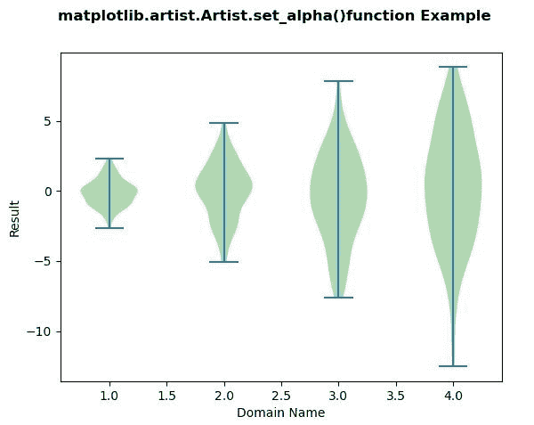
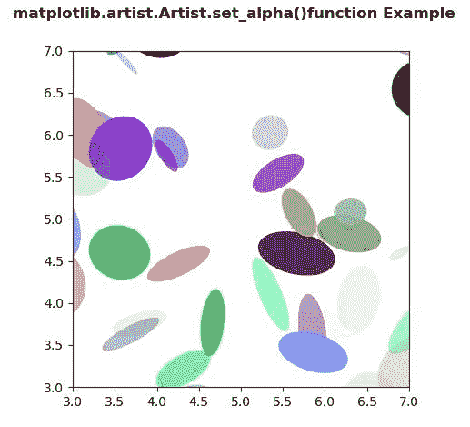

# Python 中的 matplotlib . artist . artist . set _ alpha()

> 原文:[https://www . geesforgeks . org/matplotlib-artist-artist-set _ alpha-in-python/](https://www.geeksforgeeks.org/matplotlib-artist-artist-set_alpha-in-python/)

**[Matplotlib](https://www.geeksforgeeks.org/python-introduction-matplotlib/)** 是 Python 中的一个库，是 NumPy 库的数值-数学扩展。**艺术家类**包含抽象基类，用于渲染到图形画布中的对象。图形中所有可见的元素都是艺术家的子类。

## matplotlib . artist . artist . set _ alpha()方法

matplotlib 库的 artist 模块中的 **set_alpha()方法**用于设置用于混合的 alpha 值。

> **语法:** Artist.set_alpha(self，alpha)
> 
> **参数:**该方法接受以下参数。
> 
> *   **alpha:** 此参数为包含浮点值或无。
> 
> **返回:**该方法不返回值。

以下示例说明了 matplotlib 中的 matplotlib . artist . artist . set _ alpha()函数:

**例 1:**

```py
# Implementation of matplotlib function
from matplotlib.artist import Artist  
import matplotlib.pyplot as plt 
import numpy as np 

# create test data 
np.random.seed(10**7) 
data = [sorted(np.random.normal(0, std, 100))  
       for std in range(1, 5)] 

fig, ax1 = plt.subplots() 
val = ax1.violinplot(data) 
ax1.set_ylabel('Result') 
ax1.set_xlabel('Domain Name') 

for i in val['bodies']: 
    i.set_facecolor('green') 
    Artist.set_alpha(i, 0.5)  

fig.suptitle('matplotlib.artist.Artist.set_alpha()\
function Example', fontweight ="bold") 

plt.show()
```

**输出:**


**例 2:**

```py
# Implementation of matplotlib function
from matplotlib.artist import Artist  
import matplotlib.pyplot as plt 
import numpy as np 
from matplotlib.patches import Ellipse 

NUM = 200

ells = [Ellipse(xy = np.random.rand(2) * 10, 
                width = np.random.rand(),  
                height = np.random.rand(), 
                angle = np.random.rand() * 360) 
        for i in range(NUM)] 

fig, ax = plt.subplots(subplot_kw ={'aspect': 'equal'}) 

for e in ells: 
    ax.add_artist(e) 
    e.set_clip_box(ax.bbox) 
    Artist.set_alpha(e, np.random.rand()) 
    e.set_facecolor(np.random.rand(4)) 

ax.set_xlim(3, 7) 
ax.set_ylim(3, 7) 

fig.suptitle('matplotlib.artist.Artist.set_alpha()\
function Example', fontweight ="bold") 

plt.show()
```

**输出:**
