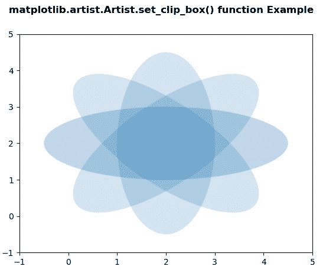

# Python 中的 matplotlib . artist . artist . set _ clip _ box()

> 原文:[https://www . geesforgeks . org/matplotlib-artist-artist-set _ clip _ box-in-python/](https://www.geeksforgeeks.org/matplotlib-artist-artist-set_clip_box-in-python/)

**[Matplotlib](https://www.geeksforgeeks.org/python-introduction-matplotlib/)** 是 Python 中的一个库，是 NumPy 库的数值-数学扩展。**艺术家类**包含抽象基类，用于渲染到图形画布中的对象。图形中所有可见的元素都是艺术家的子类。

## matplotlib . artist . artist . set _ clip _ box()方法

matplotlib 库的 artist 模块中的 **set_clip_box()方法**用于设置 artist 的剪辑 Bbox。

> **语法:** Artist.set_clip_box(self，clipbox)
> 
> **参数:**该方法只接受一个参数。
> 
> *   **剪贴簿:**这个参数是 Bbox。
> 
> **返回:**该方法不返回值。

以下示例说明了 matplotlib 中的 matplotlib . artist . artist . set _ clip _ box()函数:

**例 1:**

```py
# Implementation of matplotlib function
from matplotlib.artist import Artist
import matplotlib.pyplot as plt 
import numpy as np 
from matplotlib.patches import Ellipse 

delta = 45.0

angles = np.arange(0, 360 + delta, delta) 
ells = [Ellipse((2, 2), 5, 2, a) for a in angles] 

fig, ax = plt.subplots() 

for e in ells: 
    Artist.set_clip_box(e, ax.bbox) 
    e.set_alpha(0.1) 
    ax.add_artist(e) 

plt.xlim(-1, 5) 
plt.ylim(-1, 5) 

fig.suptitle('matplotlib.artist.Artist.set_clip_box() \
function Example', fontweight ="bold") 

plt.show()
```

**输出:**


**例 2:**

```py
# Implementation of matplotlib function
from matplotlib.artist import Artist
import matplotlib.pyplot as plt 
import numpy as np 
from matplotlib.patches import Ellipse 

NUM = 200

ells = [Ellipse(xy = np.random.rand(2) * 10, 
                width = np.random.rand(),  
                height = np.random.rand(), 
                angle = np.random.rand() * 360) 
        for i in range(NUM)] 

fig, ax = plt.subplots(subplot_kw ={'aspect': 'equal'}) 

for e in ells: 
    ax.add_artist(e)
    Artist.set_clip_box(e, ax.bbox) 
    e.set_clip_box(ax.bbox) 
    e.set_alpha(np.random.rand()) 
    e.set_facecolor(np.random.rand(4)) 

ax.set_xlim(3, 7) 
ax.set_ylim(3, 7) 

fig.suptitle('matplotlib.artist.Artist.set_clip_box()\
function Example', fontweight ="bold") 

plt.show()
```

**输出:**
