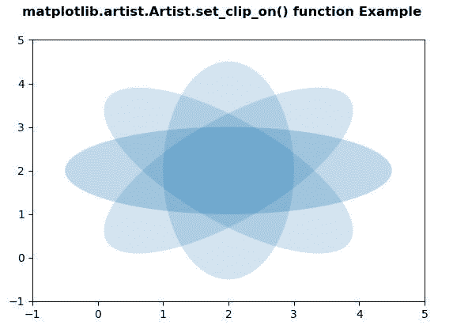
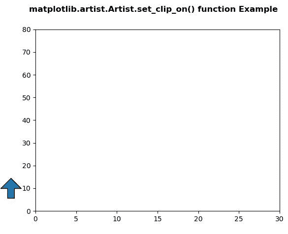

# Python 中的 matplotlib . artist . artist . set _ clip _ on()

> 原文:[https://www . geesforgeks . org/matplotlib-artist-artist-set _ clip _ on-in-python/](https://www.geeksforgeeks.org/matplotlib-artist-artist-set_clip_on-in-python/)

**[Matplotlib](https://www.geeksforgeeks.org/python-introduction-matplotlib/)** 是 Python 中的一个库，是 NumPy 库的数值-数学扩展。**艺术家类**包含抽象基类，用于渲染到图形画布中的对象。图形中所有可见的元素都是艺术家的子类。

## matplotlib . artist . artist . set _ clip _ on()方法

matplotlib 库的 artist 模块中的 **set_clip_on()方法**用于设置 artist 是否使用裁剪。

> **语法:** Artist.set_clip_on(self，b)
> 
> **参数:**该方法只接受一个参数。
> 
> *   **b:** 该参数包含布尔值。
> 
> **返回:**该方法不返回值。

以下示例说明了 matplotlib 中的 matplotlib . artist . artist . set _ clip _ on()函数:

**例 1:**

```
# Implementation of matplotlib function
from matplotlib.artist import Artist
import matplotlib.pyplot as plt 
import numpy as np 
from matplotlib.patches import Ellipse 

delta = 45.0

angles = np.arange(0, 360 + delta, delta) 
ells = [Ellipse((2, 2), 5, 2, a) for a in angles] 

fig, ax = plt.subplots() 

for e in ells: 
    e.set_alpha(0.1) 
    ax.add_artist(e) 

ax.set_xlim(-1, 5) 
ax.set_ylim(-1, 5) 
Artist.set_clip_on(ax, b = False)

fig.suptitle('matplotlib.artist.Artist.set_clip_on()\
function Example', fontweight ="bold") 

plt.show()
```

**输出:**


**例 2:**

```
# Implementation of matplotlib function
from matplotlib.artist import Artist
import matplotlib.pyplot as plt 
import matplotlib.patches as mpatches 
import matplotlib.transforms as mtransforms 

x0 = -0.1

arrow_style ="simple, head_length = 15, \
head_width = 30, tail_width = 10" 
rect_style ="simple, tail_width = 25"
line_style ="simple, tail_width = 1"

fig, ax = plt.subplots() 

trans = mtransforms.blended_transform_factory(ax.transAxes,
                                              ax.transData) 

y_tail = 5
y_head = 15
arrow1 = mpatches.FancyArrowPatch((x0, y_tail),  
                                  (x0, y_head), 
                                   arrowstyle = arrow_style, 
                                   transform = trans)

Artist.set_clip_on(arrow1, b = False)
ax.add_patch(arrow1) 

ax.set_xlim(0, 30) 
ax.set_ylim(0, 80)  

fig.suptitle('matplotlib.artist.Artist.set_clip_on()\
function Example', fontweight ="bold") 

plt.show()
```

**输出:**
