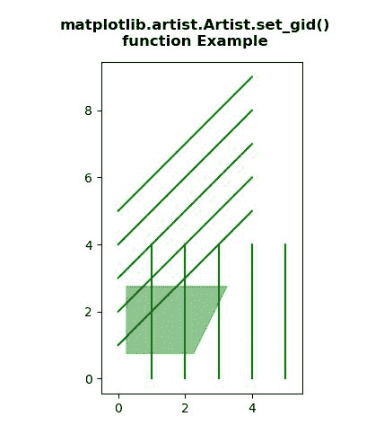
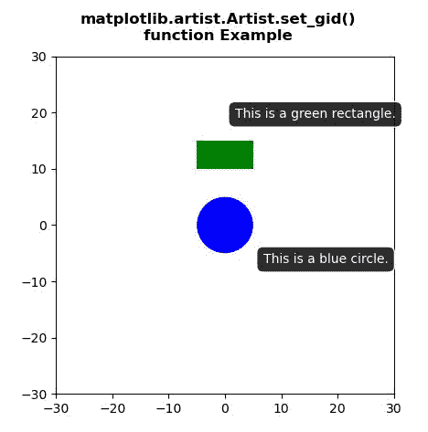

# Python 中的 matplotlib . artist . artist . set _ GID()

> 原文:[https://www . geesforgeks . org/matplotlib-artist-artist-set _ GID-in-python/](https://www.geeksforgeeks.org/matplotlib-artist-artist-set_gid-in-python/)

[**【Matplotlib】**](https://www.geeksforgeeks.org/python-introduction-matplotlib/)是 Python 中的一个库，它是 NumPy 库的数字-数学扩展。 **艺术家类** 包含将渲染到图形画布中的对象的抽象基类。图形中所有可见的元素都是艺术家的子类。

## matplotlib . artist . artist . set _ GID()方法

matplotlib 库的艺术家模块中的 **set_gid()方法**用于设置艺术家的(组)id。

> ***句法:*** 艺术家。 *set_gid(self，gid)*
> 
> ***参数:**此方法只接受一个参数。*
> 
> *   ***gid:** 这个参数是 gid 给出的字符串。*
> 
> ***返回:**该方法不返回值。*

以下示例说明了 matplotlib . artist . artist .set _ GID()在 matplotlib 中的功能:

**例 1:**

```py
# Implementation of matplotlib function
from matplotlib.artist import Artist
import numpy as np
import matplotlib.pyplot as plt

y, x = np.mgrid[:5, 1:6]
poly_coords = [
    (0.25, 2.75), (3.25, 2.75),
    (2.25, 0.75), (0.25, 0.75)
]

fig, ax = plt.subplots()

cells = ax.plot(x, y, x + y, color='green')
ax.add_patch(
    plt.Polygon(poly_coords,
                color='forestgreen',
                alpha=0.5)
)

ax.margins(x=0.1, y=0.05)
ax.set_aspect('equal')

for i, t in enumerate(ax.patches):
    Artist.set_gid(t, 'patch_% d' % i)

fig.suptitle("""matplotlib.artist.Artist.set_gid()
function Example""", fontweight="bold")

plt.show()
```

**输出:**



**例 2:**

```py
# Implementation of matplotlib function
from matplotlib.artist import Artist 
import numpy as np 
import matplotlib.pyplot as plt 

fig, ax = plt.subplots() 

circle = plt.Circle((0, 0), 5, fc ='blue') 
rect = plt.Rectangle((-5, 10), 10, 5, fc ='green') 

ax.add_patch(circle) 
ax.add_patch(rect) 

circle_tip = ax.annotate('This is a blue circle.', 
            xy =(0, 0), 
            xytext =(30, -30), 
            textcoords ='offset points', 
            color ='w', 
            ha ='left', 
            bbox = dict(boxstyle ='round, pad =.5',  
                        fc =(.1, .1, .1, .92), 
                        ec =(1., 1., 1.),  
                        lw = 1, 
                        zorder = 1), 
            ) 

rect_tip = ax.annotate('This is a green rectangle.', 
            xy =(-5, 10), 
            xytext =(30, 40), 
            textcoords ='offset points', 
            color ='w', 
            ha ='left', 
            bbox = dict(boxstyle ='round, pad =.5', 
                        fc =(.1, .1, .1, .92),  
                        ec =(1., 1., 1.),  
                        lw = 1, 
                        zorder = 1), 
            ) 

for i, t in enumerate(ax.patches): 
    Artist.set_gid(t, 'patch_% d'% i) 

for i, t in enumerate(ax.texts): 
    Artist.set_gid(t, 'tooltip_% d'% i) 

ax.set_xlim(-30, 30) 
ax.set_ylim(-30, 30) 
ax.set_aspect('equal') 

fig.suptitle("""matplotlib.artist.Artist.set_gid()
function Example""", fontweight="bold")

plt.show()
```

**输出:**

