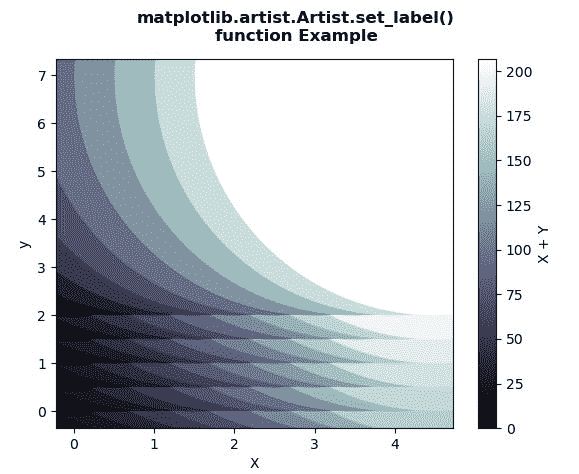
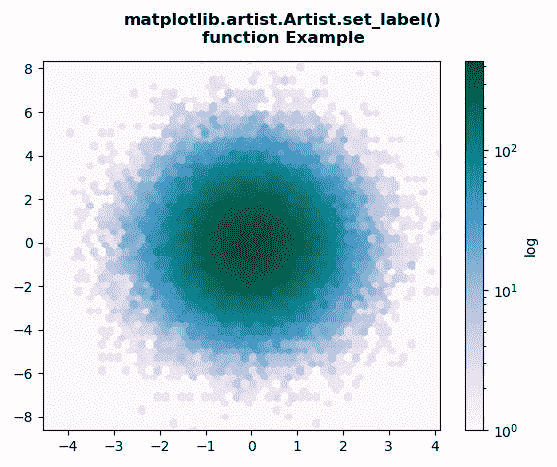

# Python 中的 matplotlib . artist . artist . set _ label()

> 原文:[https://www . geesforgeks . org/matplotlib-artist-artist-set _ label-in-python/](https://www.geeksforgeeks.org/matplotlib-artist-artist-set_label-in-python/)

[**【Matplotlib】**](https://www.geeksforgeeks.org/python-introduction-matplotlib/)是 Python 中的一个库，它是 NumPy 库的数字-数学扩展。 **艺术家类** 包含将渲染到图形画布中的对象的抽象基类。图形中所有可见的元素都是艺术家的子类。

## matplotlib . artist . artist . set _ label()方法

matplotlib 库的艺术家模块中的 **set_label()方法**用于设置将在图例中显示的标签。

> ***句法:*** 艺术家。 *set_label(self，s)*T7】
> 
> ***参数:**此方法只接受一个参数。*
> 
> *   ***s:** 此参数通过调用 str 转换为字符串。*
> 
> ***返回:**该方法不返回值。*

以下示例说明了 matplotlib 中的 matplotlib . artist . artist . set _ label()函数:

**例 1:**

```
# Implementation of matplotlib function
from matplotlib.artist import Artist 
import matplotlib.pyplot as plt 
import numpy as np 
from matplotlib.collections import EllipseCollection 

x = np.arange(10) 
y = np.arange(15) 
X, Y = np.meshgrid(x, y) 

XY = np.column_stack((X.ravel(), Y.ravel())) 

fig, ax = plt.subplots() 

ec = EllipseCollection(10, 10, 5, units ='y', 
                       offsets = XY * 0.5, 
                       transOffset = ax.transData, 
                       cmap ="bone") 

ec.set_array((X * Y + X * X).ravel()) 

ax.add_collection(ec) 
ax.autoscale_view() 

ax.set_xlabel('X') 
ax.set_ylabel('y') 

cbar = plt.colorbar(ec) 
cbar.set_label('X + Y')  

fig.suptitle("""matplotlib.artist.Artist.set_label()
function Example""", fontweight="bold")

plt.show()
```

**输出:**



**例 2:**

```
# Implementation of matplotlib function
from matplotlib.artist import Artist 
import matplotlib.pyplot as plt 
import numpy as np 

np.random.seed(19680801) 

n = 100000
x = np.random.standard_normal(n) 
y = 2 * np.random.standard_normal(n) 
z =[1, 2, 3, 4] 

xmin = x.min() 
xmax = x.max() 
ymin = y.min() 
ymax = y.max() 

fig, ax = plt.subplots() 
hb = ax.hexbin(x, y,
               gridsize = 50,
               bins ='log',
               cmap ='PuBuGn') 

ax.set(xlim =(xmin, xmax), ylim =(ymin, ymax)) 

cb = fig.colorbar(hb, ax = ax) 
cb.set_label('log')  

fig.suptitle("""matplotlib.artist.Artist.set_label()
function Example""", fontweight="bold")

plt.show()
```

**输出:**

