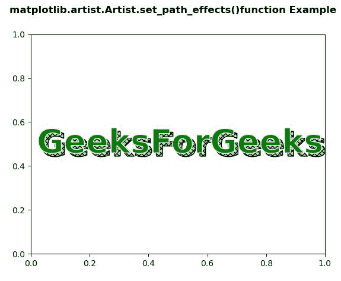
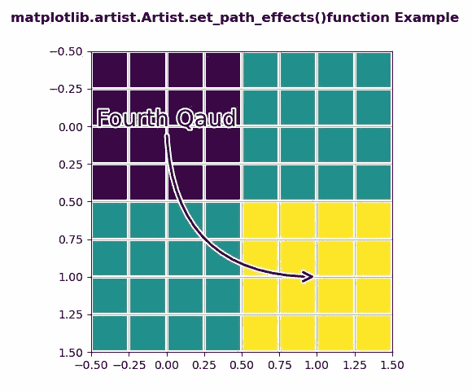

# Python 中的 matplotlib . artist . artist . set _ path _ effects()

> 原文:[https://www . geesforgeks . org/matplotlib-artist-artist-set _ path _ effects-in-python/](https://www.geeksforgeeks.org/matplotlib-artist-artist-set_path_effects-in-python/)

**[Matplotlib](https://www.geeksforgeeks.org/python-introduction-matplotlib/)** 是 Python 中的一个库，是 NumPy 库的数值-数学扩展。**艺术家类**包含抽象基类，用于渲染到图形画布中的对象。图形中所有可见的元素都是艺术家的子类。

## matplotlib . artist . artist . set _ path _ effects()方法

matplotlib 库的 artist 模块中的 **set_path_effects()方法**用于设置路径效果。

> **语法:**artist . set _ path_effects(self，path _ effects)
> 
> **参数:**该方法接受以下参数。
> 
> *   **path_effects :** 此参数是抽象路径效果..
> 
> **返回:**该方法不返回值。

下面的例子说明了 matplotlib 中的 matplotlib . artist . artist . set _ path _ effects()函数:

**例 1:**

```
# Implementation of matplotlib function
from matplotlib.artist import Artist  
import matplotlib.pyplot as plt 
import numpy as np 
import matplotlib.patheffects as path_effects 

fig, ax = plt.subplots() 
t = ax.text(0.02, 0.5, 
            'GeeksForGeeks', 
            fontsize = 40,  
            weight = 1000,  
            va ='center') 

Artist.set_path_effects(t, [path_effects.PathPatchEffect(offset =(4, -4), 
                                                 hatch ='xxxx', 
                                                 facecolor ='lightgreen'), 
                    path_effects.PathPatchEffect(edgecolor ='white',  
                                                 linewidth = 1.1, 
                                                 facecolor ='green')])

fig.suptitle('matplotlib.artist.Artist.set_path_effects()\
function Example', fontweight ="bold") 

plt.show()
```

**输出:**


**例 2:**

```
# Implementation of matplotlib function
from matplotlib.artist import Artist  
import matplotlib.pyplot as plt 
import matplotlib.patheffects as PathEffects 
import numpy as np 

fig, ax1 = plt.subplots() 
ax1.imshow([[1, 2], [2, 3]]) 

txt = ax1.annotate("Fourth Qaud", 
                   (1., 1.), 
                   (0., 0), 
                   arrowprops = dict(arrowstyle ="->", 
                                     connectionstyle ="angle3", 
                                     lw = 2), 
                   size = 20, ha ="center", 
                   path_effects =[PathEffects.withStroke(linewidth = 3, 
                                                         foreground ="w")]) 

Artist.set_path_effects(txt.arrow_patch, [ 
    PathEffects.Stroke(linewidth = 5,  
                       foreground ="w"), 
    PathEffects.Normal()]) 

ax1.grid(True, linestyle ="-") 

pe = [PathEffects.withStroke(linewidth = 3, 
                             foreground ="w")] 

for l in ax1.get_xgridlines() + ax1.get_ygridlines(): 
    Artist.set_path_effects(l, pe)

fig.suptitle('matplotlib.artist.Artist.set_path_effects()\
function Example', fontweight ="bold") 

plt.show()
```

**输出:**
