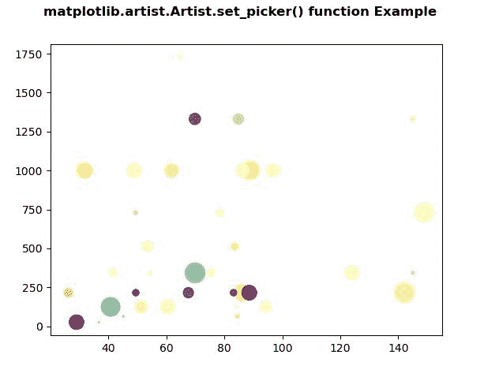
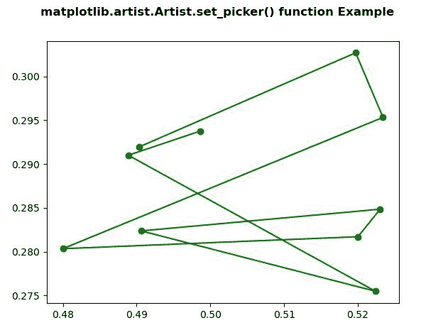

# Python 中的 matplotlib . artist . artist . set _ picker()

> 原文:[https://www . geesforgeks . org/matplotlib-artist-artist-set _ picker-in-python/](https://www.geeksforgeeks.org/matplotlib-artist-artist-set_picker-in-python/)

**[Matplotlib](https://www.geeksforgeeks.org/python-introduction-matplotlib/)** 是 Python 中的一个库，是 NumPy 库的数值-数学扩展。**艺术家类**包含抽象基类，用于渲染到图形画布中的对象。图形中所有可见的元素都是艺术家的子类。

## matplotlib . artist . artist . set _ picker()方法

matplotlib 库的 artist 模块中的 **set_picker()方法**用于定义艺术家的拾取行为。

> **语法:** Artist.set_picker(self，picker)
> 
> **参数:**该方法接受以下参数，如下所述:
> 
> *   **拣货员:**此参数用于设置拣货行为。这可以是无、布尔、浮点或函数。
> 
> **返回:**此方法返回艺术家的采摘行为。

下面的例子说明了 matplotlib 中的 matplotlib . artist . artist . set _ picker()函数:

**例 1:**

```
# Implementation of matplotlib function
from matplotlib.artist import Artist
import numpy as np 
import matplotlib.pyplot as plt 

np.random.seed(19680801) 

volume = np.random.rayleigh(27, size = 40) 
amount = np.random.poisson(7, size = 40) 
ranking = np.random.normal(size = 40) 
price = np.random.uniform(1, 7, size = 40) 

fig, ax = plt.subplots() 

scatter = ax.scatter(volume * 2,  
                     amount**3, 
                     c = ranking**3, 
                     s = price**3, 
                     vmin = -3, 
                     vmax = 3, 
                     cmap ="Spectral") 

Artist.set_picker(ax, picker = 4) 

fig.suptitle('matplotlib.artist.Artist.set_picker()\
function Example', fontweight ="bold") 

plt.show()
```

**输出:**


**例 2:**

```
# Implementation of matplotlib function
from matplotlib.artist import Artist
import numpy as np 
import matplotlib.pyplot as plt 

X = np.random.rand(10, 200) 
xs = np.mean(X, axis = 1) 
ys = np.std(X, axis = 1) 

fig = plt.figure() 
ax = fig.add_subplot(111) 
line, = ax.plot(xs, ys, 'go-') 

Artist.set_picker(ax, picker = True) 

fig.suptitle('matplotlib.artist.Artist.set_picker()\
 function Example', fontweight ="bold") 

plt.show()
```

**输出:**
