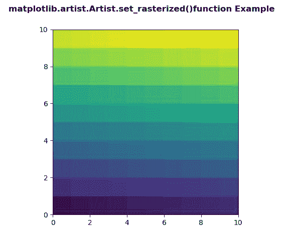
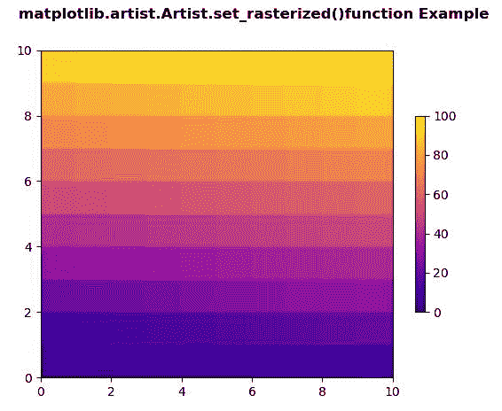

# Python 中的 matplotlib . artist . artist . set _ 栅格化()

> 原文:[https://www . geesforgeks . org/matplotlib-artist-artist-set _ 栅格化-in-python/](https://www.geeksforgeeks.org/matplotlib-artist-artist-set_rasterized-in-python/)

**[Matplotlib](https://www.geeksforgeeks.org/python-introduction-matplotlib/)** 是 Python 中的一个库，是 NumPy 库的数值-数学扩展。**艺术家类**包含抽象基类，用于渲染到图形画布中的对象。图形中所有可见的元素都是艺术家的子类。

## matplotlib . artist . artist . set _ 栅格化()方法

matplotlib 库的 artist 模块中的**set _ 栅格化()方法**用于在矢量后端输出中强制栅格化(位图)绘制。

> **语法:**artist . set _ 栅格化(自身，栅格化)
> 
> **参数:**该方法接受以下参数。
> 
> *   **栅格化:**该参数为布尔值。
> 
> **返回:**该方法不返回值。

以下示例说明了 matplotlib 中的 matplotlib . artist . artist . set _ 栅格化()函数:

**例 1:**

```py
# Implementation of matplotlib function
from matplotlib.artist import Artist  
import numpy as np 
import matplotlib.pyplot as plt 

d = np.arange(100).reshape(10, 10) 
xx, yy = np.meshgrid(np.arange(11), np.arange(11)) 

fig, ax = plt.subplots() 

ax.set_aspect(1) 
m = ax.pcolormesh(xx, yy, d) 
Artist.set_rasterized(m, True) 

fig.suptitle('matplotlib.artist.Artist.set_rasterized()\
function Example', fontweight ="bold") 

plt.show()
```

**输出:**


**例 2:**

```py
# Implementation of matplotlib function
from matplotlib.artist import Artist  
import matplotlib.pyplot as plt 
import matplotlib.colors as mcolors 
import matplotlib.gridspec as gridspec 
import numpy as np 

arr = np.arange(100).reshape((10, 10)) 
norm = mcolors.Normalize(vmin = 0., vmax = 100.) 

pc_kwargs = {'cmap': 'plasma', 'norm': norm} 

fig, ax = plt.subplots( ) 

im = ax.pcolormesh(arr, **pc_kwargs) 
fig.colorbar(im, ax = ax, shrink = 0.6) 
Artist.set_rasterized(im, False) 

fig.suptitle('matplotlib.artist.Artist.set_rasterized()\
function Example', fontweight ="bold") 

plt.show()
```

**输出:**
