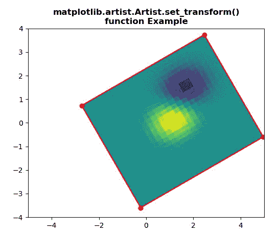
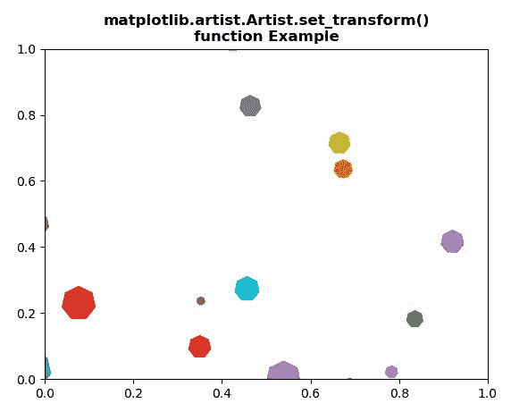

# Python 中的 matplotlib . artist . artist . set _ transform()

> 原文:[https://www . geesforgeks . org/matplotlib-artist-artist-set _ transform-in-python/](https://www.geeksforgeeks.org/matplotlib-artist-artist-set_transform-in-python/)

[**【Matplotlib】**](https://www.geeksforgeeks.org/python-introduction-matplotlib/)是 Python 中的一个库，它是 NumPy 库的数字-数学扩展。 **艺术家类** 包含将渲染到图形画布中的对象的抽象基类。图形中所有可见的元素都是艺术家的子类。

## matplotlib . artist . artist . set _ transform()方法

matplotlib 库的艺术家模块中的 **set_transform()方法**用于设置艺术家变换。

> ***句法:*** 艺术家。 *set_transform(self，t)*
> 
> ***参数:**此方法只接受一个参数。*
> 
> *   ***t :** 这个参数就是变换。*
> 
> ***返回:**该方法不返回值。*

以下示例说明了 matplotlib . artist . artist .set _ transform()函数在 matplotlib 中的作用:

**例 1:**

```
# Implementation of matplotlib function
from matplotlib.artist import Artist 
import numpy as np 
import matplotlib.pyplot as plt 
import matplotlib.transforms as mtransforms 

delta = 0.25

x = y = np.arange(-3.0, 3.0, delta) 
X, Y = np.meshgrid(x, y) 

Z1 = np.exp(-X**2 - Y**2) 
Z2 = np.exp(-(X - 1)**2 - (Y - 1)**2) 
Z = (Z1 - Z2) 

transform = mtransforms.Affine2D().rotate_deg(30) 
fig, ax = plt.subplots() 

im = ax.imshow(Z, interpolation ='none', 
               origin ='lower', 
               extent =[-2, 4, -3, 2],  
               clip_on = True) 

trans_data = transform + ax.transData 
Artist.set_transform(im, trans_data) 

x1, x2, y1, y2 = im.get_extent() 
ax.plot([x1, x2, x2, x1, x1],  
        [y1, y1, y2, y2, y1], 
        "ro-", 
        transform = trans_data) 

ax.set_xlim(-5, 5) 
ax.set_ylim(-4, 4) 

plt.title("""matplotlib.artist.Artist.set_transform()
function Example""", fontweight="bold")

plt.show()
```

**输出:**



**例 2:**

```
# Implementation of matplotlib function
from matplotlib.artist import Artist 
import matplotlib.pyplot as plt 
from matplotlib import collections, colors, transforms 
import numpy as np 

nverts = 50
npts = 100

r = np.arange(nverts) 
theta = np.linspace(0, 2 * np.pi, nverts) 

xx = r * np.sin(theta) 
yy = r * np.cos(theta) 

spiral = np.column_stack([xx, yy]) 

rs = np.random.RandomState(19680801) 

xyo = rs.randn(npts, 2) 

colors = [colors.to_rgba(c) 
          for c in plt.rcParams['axes.prop_cycle'].by_key()['color']] 

fig, ax1 = plt.subplots() 

col = collections.RegularPolyCollection( 
    7, sizes = np.abs(xx) * 10.0,  
    offsets = xyo,  
    transOffset = ax1.transData) 

trans = transforms.Affine2D().scale(fig.dpi / 72.0) 
Artist.set_transform(col, trans)  

ax1.add_collection(col, autolim = True) 
col.set_color(colors)

plt.title("""matplotlib.artist.Artist.set_transform()
function Example""", fontweight="bold")

plt.show()
```

**输出:**

