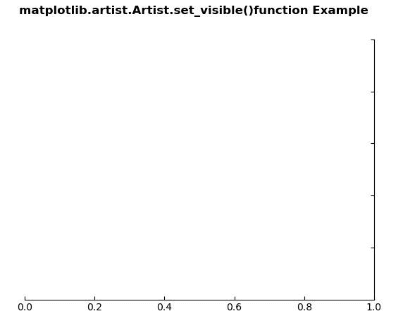
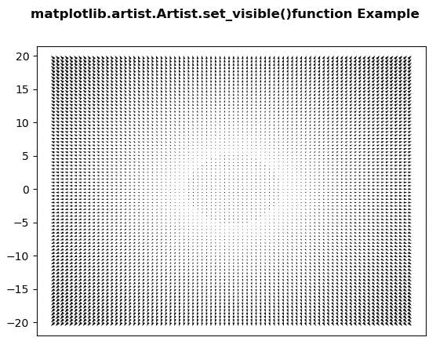

# Python 中的 matplotlib . artist . artist . set _ visible()

> 原文:[https://www . geesforgeks . org/matplotlib-artist-artist-set _ visible-in-python/](https://www.geeksforgeeks.org/matplotlib-artist-artist-set_visible-in-python/)

**[Matplotlib](https://www.geeksforgeeks.org/python-introduction-matplotlib/)** 是 Python 中的一个库，是 NumPy 库的数值-数学扩展。**艺术家类**包含抽象基类，用于渲染到图形画布中的对象。图形中所有可见的元素都是艺术家的子类。

## matplotlib . artist . artist . set _ visible()方法

matplotlib 库的 artist 模块中的 **set_visible()方法**用于设置 artist 的可见性。

> **语法:** Artist.set_visible(self，b)
> 
> **参数:**该方法接受以下参数。
> 
> *   **b:** 该参数为布尔值。
> 
> **返回:**该方法不返回值。

以下示例说明了 matplotlib 中的 matplotlib . artist . artist . set _ visible()函数:

**例 1:**

```py
# Implementation of matplotlib function
from matplotlib.artist import Artist  
import matplotlib.pyplot as plt 
from mpl_toolkits.axisartist.axislines import Subplot 

fig = plt.figure() 

ax = Subplot(fig, 111) 
fig.add_subplot(ax) 

Artist.set_visible(ax.axis["left"], False) 
Artist.set_visible(ax.axis["top"], False) 

fig.suptitle('matplotlib.artist.Artist.set_visible()\
function Example', fontweight ="bold") 

plt.show()
```

**输出:**


**例 2:**

```py
# Implementation of matplotlib function
from matplotlib.artist import Artist  
import matplotlib.pyplot as plt 
import numpy as np

X = np.arange(-20, 20, 0.5) 
Y = np.arange(-20, 20, 0.5) 
U, V = np.meshgrid(X, Y) 

fig, ax = plt.subplots() 
ax.quiver(X, Y, U, V) 
w = ax.get_xaxis()

Artist.set_visible(w, False)

fig.suptitle('matplotlib.artist.Artist.set_visible()\
function Example', fontweight ="bold") 

plt.show()
```

**输出:**
