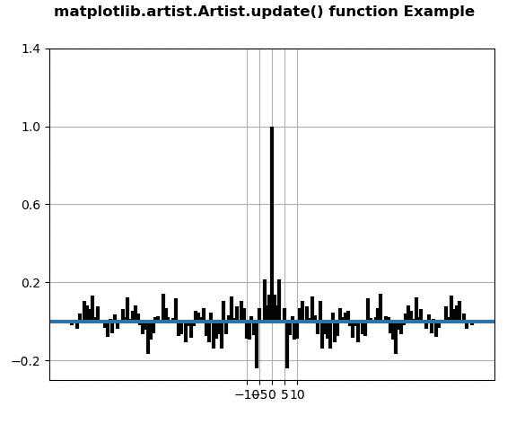
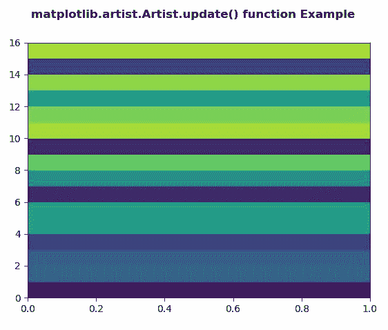

# Python 中的 matplotlib . artist . artist . update()

> 原文:[https://www . geesforgeks . org/matplotlib-艺术家-艺术家-python 中的更新/](https://www.geeksforgeeks.org/matplotlib-artist-artist-update-in-python/)

**[Matplotlib](https://www.geeksforgeeks.org/python-introduction-matplotlib/)** 是 Python 中的一个库，是 NumPy 库的数值-数学扩展。**艺术家类**包含抽象基类，用于渲染到图形画布中的对象。图形中所有可见的元素都是艺术家的子类。

## matplotlib . artist . artist . update()方法

matplotlib 库的 artist 模块中的**更新()方法**用于从字典道具中更新该 artist 的属性。

> **语法:**艺术家.更新(自我，道具)
> 
> **参数:**该方法接受以下参数。
> 
> *   **道具:**这个参数是属性的字典。
> 
> **返回:**该方法不返回值。

以下示例说明了 matplotlib 中的 matplotlib . artist . artist . update()函数:

**例 1:**

```
# Implementation of matplotlib function
from matplotlib.artist import Artist
import matplotlib.pyplot as plt 
import numpy as np 

np.random.seed(10**7) 
geeks = np.random.randn(100) 

fig, ax = plt.subplots() 
ax.acorr(geeks, usevlines = True, 
         normed = True, 
         maxlags = 80, lw = 3) 

ax.grid(True) 

prop = {'xticks': np.array([-10., -5.,
                            0., 5., 10.]), 
        'yticks': np.array([-0.2,  0.2, 
                            0.6, 1., 1.4]), 
        'ylabel': None, 'xlabel': None} 

Artist.update(ax, prop) 

fig.suptitle('matplotlib.artist.Artist.update()\
 function Example', fontweight ="bold") 

plt.show()
```

**输出:**


**例 2:**

```
# Implementation of matplotlib function
from matplotlib.artist import Artist
import numpy as np  
import matplotlib.pyplot as plt  

xx = np.random.rand(16, 30)  

fig, ax = plt.subplots()  

m = ax.pcolor(xx)  
m.set_zorder(-20) 
prop = {'autoscalex_on': False}

Artist.update(ax, prop) 

fig.suptitle('matplotlib.artist.Artist.update() \
function Example', fontweight ="bold") 

plt.show()
```

**输出:**
