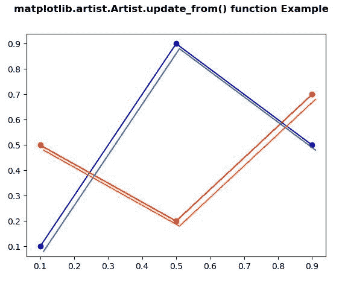

# Python 中的 matplotlib . artist . artist . update _ from()

> 原文:[https://www . geeksforgeeks . org/matplotlib-artist-artist-update _ from-in-python/](https://www.geeksforgeeks.org/matplotlib-artist-artist-update_from-in-python/)

**[Matplotlib](https://www.geeksforgeeks.org/python-introduction-matplotlib/)** 是 Python 中的一个库，是 NumPy 库的数值-数学扩展。**艺术家类**包含抽象基类，用于渲染到图形画布中的对象。图形中所有可见的元素都是艺术家的子类。

## matplotlib . artist . artist . update _ from()方法

matplotlib 库的 artist 模块中的 **update_from()方法**用于将属性从他人复制到自己。

> **语法:** Artist.update_from(self，other)
> 
> **参数:**该方法接受以下参数。
> 
> *   **其他:**该参数是需要更新的属性。
> 
> **返回:**此方法返回艺术家所有属性的字典。

下面的例子说明了 matplotlib 中的 matplotlib . artist . update _ from()函数:

**例 1:**

```py
# Implementation of matplotlib function
from matplotlib.artist import Artist
import numpy as np 
import matplotlib.pyplot as plt 
from matplotlib.legend_handler import HandlerLine2D 

x = np.linspace(0, 3 * np.pi) 
y1 = np.sin(x) 
y2 = np.cos(x) 

fig = plt.figure() 

ax = fig.add_subplot(111) 
ax.plot(x, y1, c ='b', label ='y1', linewidth = 1.0) 
ax.plot(x, y2, c ='g', label ='y2') 

linewidth = 7

def update(prop1, prop2): 
    Artist.update_from(prop1, prop2) 
    prop1.set_linewidth(7) 

plt.legend(handler_map ={plt.Line2D : HandlerLine2D(update_func = update)}) 

fig.suptitle('matplotlib.artist.Artist.update()\
 function Example', fontweight ="bold") 

plt.show()
```

**输出:**


**例 2:**

```py
# Implementation of matplotlib function
from matplotlib.artist import Artist
import numpy as np  
import matplotlib.pyplot as plt 
import matplotlib.transforms as mtransforms 

fig, ax = plt.subplots()  
l1, = ax.plot([0.1, 0.5, 0.9],  
              [0.1, 0.9, 0.5],  
              "bo-") 
l2, = ax.plot([0.1, 0.5, 0.9], 
              [0.5, 0.2, 0.7],  
              "ro-") 

for l in [l1, l2]: 

    xx = l.get_xdata() 
    yy = l.get_ydata() 

    shadow, = ax.plot(xx, yy) 
    Artist.update_from(shadow, l) 

    ot = mtransforms.offset_copy(l.get_transform(), 
                                 ax.figure, 
                                 x = 4.0,  
                                 y =-6.0,  
                                 units ='points') 

    shadow.set_transform(ot)

fig.suptitle('matplotlib.artist.Artist.update_from()\
function Example', fontweight ="bold") 

plt.show()
```

**输出:**
