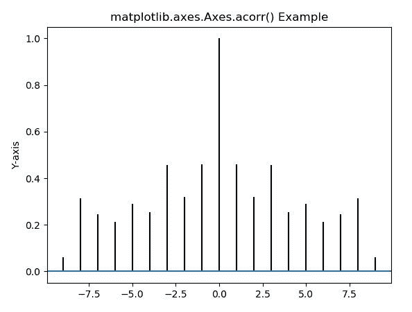
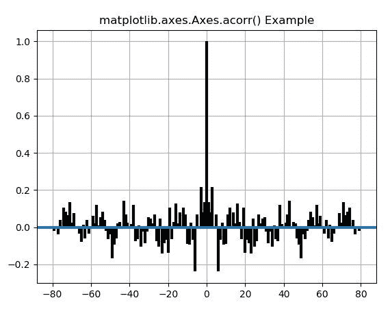

# matplotlib . axes . acorr()中的 Python

> 哎哎哎:# t0]https://www . geeksforgeeks . org/matplot lib-axes-acorr-in-python/

**[Matplotlib](https://www.geeksforgeeks.org/python-introduction-matplotlib/)** 是 Python 中的一个库，是 NumPy 库的数值-数学扩展。**轴类**包含了大部分的图形元素:轴、刻度、线二维、文本、多边形等。，并设置坐标系。Axes 的实例通过回调属性支持回调。

## matplotlib . axes . axes()函数

matplotlib 库的 Axes 模块中的 **Axes.acorr()函数**用于绘制 x 的自相关。

> **语法:** Axes.acorr(self，x，*，data=None，**kwargs)
> 
> **参数:**该方法接受以下描述的参数:
> 
> *   **x:** 这个参数是标量的序列。
> *   **去趋势:**此参数为可选参数。其默认值为 *mlab.detrend_none*
> *   **赋范:**该参数也是可选参数，包含 bool 值。其默认值为*真*
> *   **usev line:**该参数也是可选参数，包含 bool 值。其默认值为*真*
> *   **maxlags:** 此参数也是可选参数，包含整数值。其默认值为 *10*
> *   **线型:**该参数也是可选参数，用于绘制数据点，仅当 usevlines 为 False 时使用。
> *   **标记:**该参数也是可选参数，包含字符串。其默认值为
> 
> ***返回:**该方法返回以下内容:*
> 
> *   ***滞后:**该方法返回滞后向量*
> *   ***c:** 该方法返回自相关向量。*
> *   ***行:**加**行集合**如果 usevlines 为真，否则加**行 2D** 。*
> *   ***b:** 如果 usevlines 为 True，则该方法返回 0 处的水平线，否则返回 None。*
> 
> *结果是**(滞后，c，线，b)** 。*

*下面的例子说明了 matplotlib.axes.Axes.acorr()函数在 matplotlib.axes 中的作用:*

***例 1:***

```
*# Implementation of matplotlib function

import matplotlib.pyplot as plt
import numpy as np

# Time series data
geeks = np.array([24.40, 110.25, 20.05,
                  22.00, 61.90, 7.80, 
                  15.00, 22.80, 34.90, 
                  57.30])

# Plot autocorrelation
fig, ax = plt.subplots()
ax.acorr(geeks, maxlags = 9)

# Add labels to autocorrelation
# plotax.xlabel('X-axis')
ax.set_ylabel('Y-axis')

ax.set_title('matplotlib.axes.Axes.acorr() Example')

plt.show()*
```

***输出:**
*

***例 2:***

```
*# Implementation of matplotlib function
import matplotlib.pyplot as plt
import numpy as np

# Fixing random state for reproducibility
np.random.seed(10**7)
geeks = np.random.randn(100)

fig, ax = plt.subplots()
ax.acorr(geeks, usevlines = True, normed = True,
         maxlags = 80, lw = 3)
ax.grid(True)

ax.set_title('matplotlib.axes.Axes.acorr() Example')

plt.show()*
```

***输出:**
*