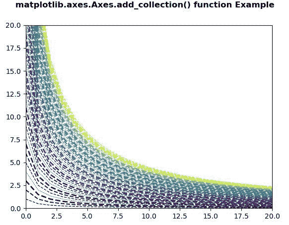

# Python 中的 matplotlib . axes . axes . add _ collection()

> 原文:[https://www . geeksforgeeks . org/matplotlib-axes-axes-add _ collection-in-python/](https://www.geeksforgeeks.org/matplotlib-axes-axes-add_collection-in-python/)

**[Matplotlib](https://www.geeksforgeeks.org/python-introduction-matplotlib/)** 是 Python 中的一个库，是 NumPy 库的数值-数学扩展。**轴类**包含了大部分的图形元素:轴、刻度、线二维、文本、多边形等。，并设置坐标系。Axes 的实例通过回调属性支持回调。

## matplotlib . axes . axes . add _ collection()函数

matplotlib 库的 Axes 模块中的 **Axes.add_collection()函数**用于给 axes 的集合添加一个 Collection；归还收藏。

> **语法:** Axes.add_collection(self，collection，autolim=True)
> 
> **参数:**该方法接受以下参数。
> 
> *   **采集:**此参数为**采集**，由采集()功能产生。
> 
> **返回值:**此方法返回集合。

下面的例子说明了 matplotlib.axes 中的`matplotlib.axes.Axes.add_collection()`函数:

**例 1:**

```
# Implementation of matplotlib function
import matplotlib.pyplot as plt
from matplotlib.collections import EventCollection
import numpy as np

np.random.seed(19680801)
xvalue = np.random.random([2, 10])
xvalue1 = xvalue[0, :]
xvalue2 = xvalue[1, :]
xvalue1.sort()
xvalue2.sort()

yvalue1 = xvalue1 ** 4
yvalue2 = 1 - xvalue2 ** 6

fig = plt.figure()
ax = fig.add_subplot(1, 1, 1)
ax.plot(xvalue1, yvalue1, color ='tab:blue')
ax.plot(xvalue2, yvalue2, color ='tab:green')

xresult1 = EventCollection(xvalue1, color ='tab:blue')
xresult2 = EventCollection(xvalue2, color ='tab:green')
yresult1 = EventCollection(yvalue1, color ='tab:blue',
                           orientation ='vertical')
yresult2 = EventCollection(yvalue2, color ='tab:green',
                           orientation ='vertical')
ax.add_collection(xresult1)
ax.add_collection(xresult2)
ax.add_collection(yresult1)
ax.add_collection(yresult2)

ax.set_xlim([0, 1])
ax.set_ylim([0, 1])

fig.suptitle('matplotlib.axes.Axes.add_collection() \
function Example\n\n', fontweight ="bold")
plt.show()
```

**输出:**


**例 2:**

```
# Implementation of matplotlib function
import matplotlib.pyplot as plt
from matplotlib.collections import LineCollection
from matplotlib import colors as mcolors
import numpy as np

N = 50
x = np.arange(N)

ys = [i/(x + 1) for i in x]

fig, ax = plt.subplots()
ax.set_xlim(0, 20)
ax.set_ylim(0, 20)

line_segments = LineCollection([np.column_stack([x, y]) for y in ys],
                               linewidths =(0.5, 1, 1.5, 2),
                               linestyles ='dashed', 
                               color ="# eeffdd")
line_segments.set_array(x**2)
ax.add_collection(line_segments)

fig.suptitle('matplotlib.axes.Axes.add_collection()\
 function Example\n\n', fontweight ="bold")
plt.show()
```

**输出:**
