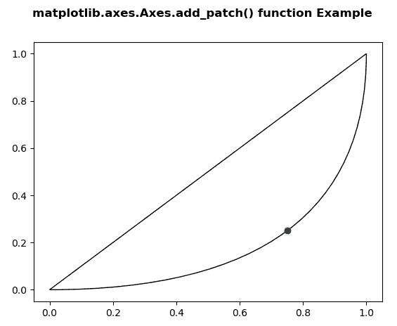

# Python 中的 Matplotlib.axes.Axes.add_patch()

> 原文:[https://www . geeksforgeeks . org/matplotlib-axes-axes-add _ patch-in-python/](https://www.geeksforgeeks.org/matplotlib-axes-axes-add_patch-in-python/)

**[Matplotlib](https://www.geeksforgeeks.org/python-introduction-matplotlib/)** 是 Python 中的一个库，是 NumPy 库的数值-数学扩展。**轴类**包含了大部分的图形元素:轴、刻度、线二维、文本、多边形等。，并设置坐标系。Axes 的实例通过回调属性支持回调。

## matplotlib.axes.Axes.add_patch()函数

matplotlib 库的 Axes 模块中的 **Axes.add_patch()函数**用于给轴的面片添加一个面片；归还补丁。

> **语法:** Axes.add_patch(self，p)
> 
> **参数:**该方法接受以下参数。
> 
> *   **线:**该参数是轴面片的面片。
> 
> **返回值:**该方法返回补丁。

下面的例子说明了 matplotlib.axes.Axes.add_patch()函数在 matplotlib.axes 中的作用:

**例 1:**

```py
# Implementation of matplotlib function
import numpy as np
import matplotlib.pyplot as plt

y, x = np.mgrid[:5, 1:6]
poly_coords = [
    (0.25, 2.75), (3.25, 2.75),
    (2.25, 0.75), (0.25, 0.75)
]
fig, ax = plt.subplots()

cells = ax.plot(x, y, x + y, color ='green')
ax.add_patch(
    plt.Polygon(poly_coords, color ='forestgreen',
                alpha = 0.5)
    )
ax.margins(x = 0.1, y = 0.05)
ax.set_aspect('equal')

fig.suptitle('matplotlib.axes.Axes.add_patch() \
function Example\n\n', fontweight ="bold")
plt.show()
```

**输出:**


**例 2:**

```py
# Implementation of matplotlib function
import matplotlib.path as mpath
import matplotlib.patches as mpatches
import matplotlib.pyplot as plt

Path = mpath.Path

fig, ax = plt.subplots()
pp1 = mpatches.PathPatch(
    Path([(0, 0), (1, 0), (1, 1), (0, 0)],
         [Path.MOVETO, Path.CURVE3, 
          Path.CURVE3, Path.CLOSEPOLY]),
    fc ="none", transform = ax.transData)

ax.add_patch(pp1)
ax.plot([0.75], [0.25], "go-")

fig.suptitle('matplotlib.axes.Axes.add_patch() \
function Example\n\n', fontweight ="bold")
plt.show()
```

**输出:**
