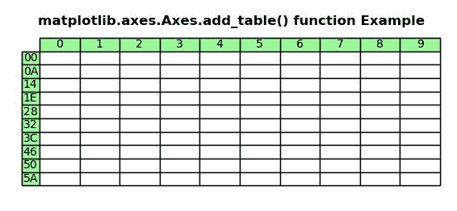
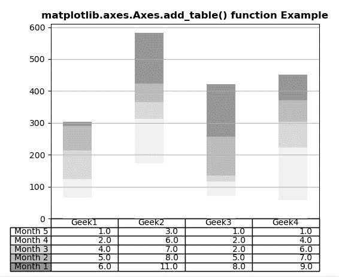

# Python 中的 Matplotlib.axes.Axes.add_table()

> 原文:[https://www . geeksforgeeks . org/matplotlib-axes-axes-add _ table-in-python/](https://www.geeksforgeeks.org/matplotlib-axes-axes-add_table-in-python/)

**[Matplotlib](https://www.geeksforgeeks.org/python-introduction-matplotlib/)** 是 Python 中的一个库，是 NumPy 库的数值-数学扩展。**轴类**包含了大部分的图形元素:轴、刻度、线二维、文本、多边形等。，并设置坐标系。Axes 的实例通过回调属性支持回调。

## matplotlib.axes.Axes.add_table()函数

matplotlib 库的 Axes 模块中的 **Axes.add_table()函数**也用来给 axes 的表添加一个 table，并返回该表。

> **语法:** Axes.add_table(self，tab)
> 
> **参数:**该方法接受以下描述的参数:
> 
> *   **选项卡:**此参数是要添加的表实例。
> 
> **返回:**这将返回以下内容:
> 
> *   **表:**此方法返回创建的表。

下面的例子说明了 matplotlib.axes.Axes.add_table()函数在 matplotlib.axes 中的作用:

**例 1:**

```
# Implementation of matplotlib function
import matplotlib.pyplot as plt
import matplotlib.table as tbl

val1 = ["{:X}".format(i) for i in range(10)]
val2 = ["{:02X}".format(10 * i) for i in range(10)]
val3 = [["" for c in range(10)] for r in range(10)]

fig, ax = plt.subplots()
ax.set_axis_off()
table = tbl.table(
    ax,
    cellText = val3,
    rowLabels = val2,
    colLabels = val1,
    rowColours = ["palegreen"] * 10,
    colColours =["palegreen"] * 10,
    cellLoc ='center', 
    loc ='upper left')

ax.add_table(table)

ax.set_title('matplotlib.axes.Axes.add_table()\
function Example', fontweight ="bold")

plt.show()
```

**输出:**


**例 2:**

```
# Implementation of matplotlib function
import matplotlib.pyplot as plt
import matplotlib.table as tbl
import numpy as np  

data = [[ 66, 174,  71, 58],
        [ 58, 139,  45, 164],
        [ 89,  52, 18, 81],
        [ 78,  58, 123,  68],
        [13, 159, 164, 80]]

val1 = ('Geek1', 'Geek2', 'Geek3', 'Geek4')
val2 = ['Month % d' % x for x in (5, 4, 3, 2, 1)]
val3 = np.arange(0, 2500, 500)
val4 = 1000
val5 = plt.cm.Greys(np.linspace(0, 0.5, len(val2)))
val6 = len(data)
val7 = np.arange(len(val1)) + 0.3
val8 = 0.4
val9 = np.zeros(len(val1))

lista = []

fig, ax = plt.subplots()

for row in range(val6):

    ax.bar(val7, data[row], val8, 
           bottom = val9,
           color = val5[row])
    val9 = val9 + data[row]

    lista.append([(x // 50) for x in val9])

table = tbl.table(ax, cellText = lista,
                      rowLabels = val2,
                      rowColours = val5,
                      colLabels = val1,
                      loc ='bottom')
ax.add_table(table)

plt.subplots_adjust(left = 0.2, bottom = 0.2)

ax.set_xticks([])

ax.set_title('matplotlib.axes.Axes.add_table() \
function Example', fontweight ="bold")

plt.grid()
plt.show()
```

**输出:**
