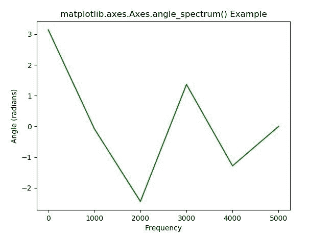
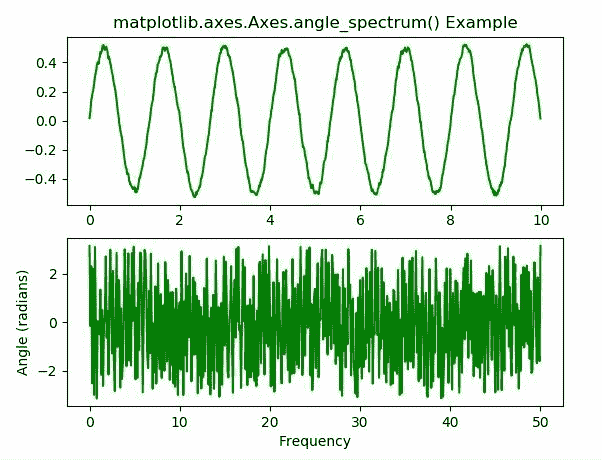

# Python 中的 matplotlib . axes . axes . angle _ spectrum()

> 原文:[https://www . geeksforgeeks . org/matplotlib-axes-axes-angle _ spectrum-in-python/](https://www.geeksforgeeks.org/matplotlib-axes-axes-angle_spectrum-in-python/)

**[Matplotlib](https://www.geeksforgeeks.org/python-introduction-matplotlib/)** 是 Python 中的一个库，是 NumPy 库的数值-数学扩展。**轴类**包含了大部分的图形元素:轴、刻度、线二维、文本、多边形等。，并设置坐标系。Axes 的实例通过回调属性支持回调。

## matplotlib . axes . axes . angle _ spectrum()函数

matplotlib 库的 Axes 模块中的 **Axes.angle_spectrum()函数**用于绘制角度谱。

> **语法:** Axes.angle_spectrum(self，x，Fs=None，Fc=None，window=None，pad_to=None，sides=None，* data = None，* * * kwargs)
> 
> **参数:**该方法接受以下描述的参数:
> 
> *   **x:** 这个参数是一个数据序列。
> *   **Fs :** 此参数为标量。它的默认值是 2。
> *   **窗口:**该参数以一个数据段为自变量，返回该段的窗口版本。其默认值为 *window_hanning()*
> *   **边:**此参数指定要返回光谱的哪些边。这可以有以下值:“默认值”、“单侧”和“双侧”。
> *   **pad_to :** 此参数包含数据段填充到的整数值。
> *   **Fc:** 该参数还包含偏移绘图 x 范围的整数值，以反映频率范围。其默认值为 *0*
> 
> **返回:**这将返回以下内容:
> 
> *   **光谱:**以弧度为单位返回角度光谱。
> *   **频率:**返回频谱中元素对应的频率。
> *   **行:**返回该函数创建的行。

结果是**(光谱，频率，线)**

下面的例子说明了 matplotlib.axes.Axes.xcorr()函数在 matplotlib.axes 中的作用:

**示例-1:**

```
# Implementation of matplotlib function
import matplotlib.pyplot as plt
import numpy as np

np.random.seed(10**5)

dt = 0.0001
Fs = 1 / dt
geeks = np.array([22.00, 61.90, 
                  7.80, 24.40, 
                  110.25, 20.05, 
                  15.00, 22.80, 
                  34.90, 57.30])

nse = np.random.randn(len(geeks))
r = np.exp(-geeks / 0.05)

s = 0.5 * np.sin(1.5 * np.pi * geeks) + nse

# plot angle_spectrum
fig, ax = plt.subplots()
ax.angle_spectrum(s, Fs = Fs, color ="green")

ax.set_title('matplotlib.axes.Axes.angle_spectrum() Example')

plt.show()
```

**输出:**


**示例-2:**

```
# Implementation of matplotlib function
import matplotlib.pyplot as plt
import numpy as np

np.random.seed(0)

dt = 0.01
Fs = 1 / dt
t = np.arange(0, 10, dt)
res = np.random.randn(len(t))
r = np.exp(-t / 0.05)

cres = np.convolve(res, r)*dt
cres = cres[:len(t)]
s = 0.5 * np.sin(1.5 * np.pi * t) + cres

# plot simple spectrum
fig, (ax1, ax2) = plt.subplots(2, 1)
ax1.plot(t, s, color ="green")

# plot angle_spectrum
ax2.angle_spectrum(s, Fs = Fs, color ="green")

ax1.set_title('matplotlib.axes.Axes.angle_spectrum() Example')

plt.show()
```

**输出:**
