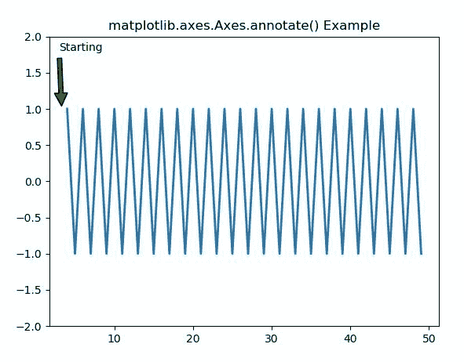
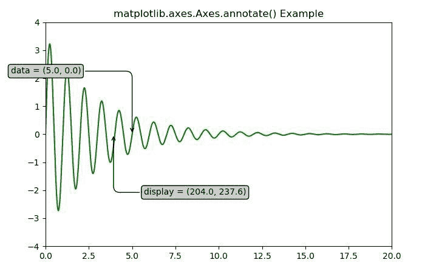

# matplot lib . axes . axes . annotate()用 Python

表示

> 原文:[https://www . geeksforgeeks . org/matplotlib-axes-axes-annotation-in-python/](https://www.geeksforgeeks.org/matplotlib-axes-axes-annotate-in-python/)

**[Matplotlib](https://www.geeksforgeeks.org/python-introduction-matplotlib/)** 是 Python 中的一个库，是 NumPy 库的数值-数学扩展。**轴类**包含了大部分的图形元素:轴、刻度、线二维、文本、多边形等。，并设置坐标系。Axes 的实例通过回调属性支持回调。

## matplotlib . axes . axes . annotation()函数

matplotlib 库的 Axes 模块中的**axes . annotation()函数**也用于给点 xy 标注文字文本。换句话说，我过去常常把文本放在 xy。

> **语法:**
> 
> ```py
> Axes.annotate(self, s, xy, *args, **kwargs)
> ```
> 
> **参数:**该方法接受以下描述的参数:
> 
> *   **s:** 这个参数是标注的文本。
> *   **xy:** 此参数是要标注的点(x，y)。
> *   **xytext:** 此参数为可选参数。它是放置文本的位置(x，y)。
> *   **xycoords:** 该参数也是可选参数，包含字符串值。
> *   **textcoords:** 此参数包含字符串值。给定 xytext 的坐标系，它可能不同于用于 xy 的坐标系
> *   **箭头道具:**该参数也是可选参数，包含 dict 类型。其默认值为“无”。
> *   **annotation_clip :** 此参数也是可选参数，包含布尔值。其默认值为“无”，表现为“真”。
> 
> **返回:**该方法返回**标注**。

下面的例子说明了 matplotlib.axes . axes . annotation()函数在 matplotlib . axes 中的作用:

**示例-1:**

```py
# Implementation of matplotlib function
import matplotlib.pyplot as plt
import numpy as np

fig, ax1 = plt.subplots()

t = np.arange(4, 50., 1)
s = np.cos(np.pi * t)**3- np.sin(3 * np.pi * t)**2

ax1.plot(t, s, lw = 2)
ax1.annotate('Starting', xy =(3.3, 1),
             xytext =(3, 1.8),
             arrowprops = dict(facecolor ='green',
                               shrink = 0.05),   )

ax1.set_ylim(-2, 2)
ax1.set_title('matplotlib.axes.Axes.annotate() Example')
plt.show()
```

**输出:**


**示例-2:**

```py
# Implementation of matplotlib function
import numpy as np
import matplotlib.pyplot as plt

x = np.arange(0, 20, 0.005)
y = 3.5 * np.exp(-x / 3.) * np.sin(2 * np.pi * x)

fig, ax = plt.subplots()
ax.plot(x, y, color ="green")
ax.set_xlim(0, 20)
ax.set_ylim(-4, 4)

xdata, ydata = 5, 0
xdisplay, ydisplay = ax.transData.transform((xdata, 
                                             ydata))

bbox = dict(boxstyle ="round", fc ="0.8")
arrowprops = dict(
    arrowstyle = "->",
    connectionstyle = "angle, angleA = 0, \
    angleB = 90, rad = 10")

offset = 72

# Annotation
ax.annotate('data = (%.1f, %.1f)'%(xdata, ydata),
            (xdata, ydata), xytext =(-2 * offset,
                                     offset), 
            textcoords ='offset points',
            bbox = bbox, arrowprops = arrowprops)

ax.annotate('display = (%.1f, %.1f)'%(xdisplay, ydisplay),
            (xdisplay, ydisplay), xytext =(0.5 * offset,
                                           -offset),
            xycoords ='figure pixels',
            textcoords ='offset points',
            bbox = bbox, arrowprops = arrowprops)

ax.set_title('matplotlib.axes.Axes.annotate() Example')
plt.show()
```

**输出:**
