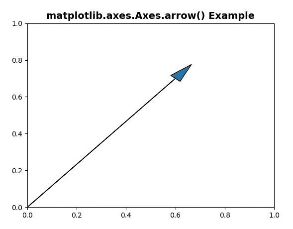
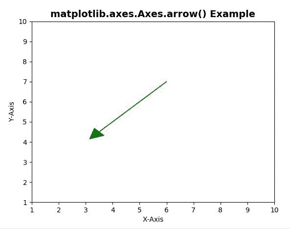

# Matplotlib.axes.Axes.arrow()中的 Python

> 哎哎哎:# t0]https://www . geeksforgeeks . org/matplot lib-axes-axes-arrow-in-python/

**[Matplotlib](https://www.geeksforgeeks.org/python-introduction-matplotlib/)** 是 Python 中的一个库，是 NumPy 库的数值-数学扩展。**轴类**包含了大部分的图形元素:轴、刻度、线二维、文本、多边形等。，并设置坐标系。Axes 的实例通过回调属性支持回调。

## matplotlib.axes.Axes.arrow()函数

matplotlib 库的 Axes 模块中的 **Axes.arrow()函数**也用于给轴添加一个箭头。该函数用于绘制从(x，y)到(x+dx，y+dy)的箭头

> **语法:**
> 
> ```
> Axes.arrow(self, x, y, dx, dy, **kwargs)
> 
> ```
> 
> **参数:**该方法接受以下描述的参数:
> 
> *   **x，y:** 这些参数是箭头底座的 x 和 y 坐标。
> *   **dx，dy:** 这些参数是箭头沿 x 和 y 方向的长度。
> 
> **返回:**该方法返回**箭头**，这是一个创建的 FancyArrow 对象。

下面的例子说明了 matplotlib.axes.Axes.arrow()函数在 matplotlib.axes 中的作用:

**示例-1:**

```
# Implementation of matplotlib function
import matplotlib.pyplot as plt

ax = plt.axes()
ax.arrow(0, 0, 0.6, 0.7, head_width = 0.05, 
         head_length = 0.1)

ax.set_title('matplotlib.axes.Axes.arrow() Example', 
             fontsize = 14, fontweight ='bold')

plt.show()
```

**输出:**


**示例-2:**

```
# Implementation of matplotlib function
import matplotlib.pyplot as plt

ax = plt.axes()
ax.arrow(6, 7, -2.5, -2.5, head_width = 0.5,
         head_length = 0.5, fc ='g', ec ='g')
ax.set_title('matplotlib.axes.Axes.arrow() Example',
              fontsize = 14, fontweight ='bold')

ax.set(xlim =(1, 10), ylim =(1, 10))
ax.set_xlabel("X-Axis")
ax.set_ylabel("Y-Axis")

plt.show()
```

**输出:**
