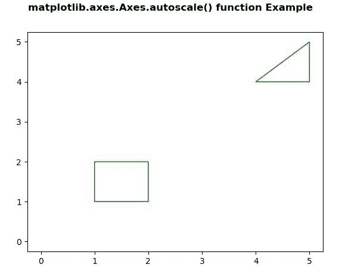
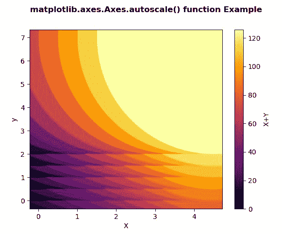

# matplotlib . axes . auto scale()用 Python

表示

> 哎哎哎:# t0]https://www . geeksforgeeks . org/matplot lib-axes-auto scale-in-python/

**[Matplotlib](https://www.geeksforgeeks.org/python-introduction-matplotlib/)** 是 Python 中的一个库，是 NumPy 库的数值-数学扩展。**轴类**包含了大部分的图形元素:轴、刻度、线二维、文本、多边形等。，并设置坐标系。Axes 的实例通过回调属性支持回调。

## matplotlib.axes.Axes.autoscale()函数

matplotlib 库的 Axes 模块中的 **Axes.autoscale()函数**用于将轴视图自动缩放到数据(切换)。

> **语法:** Axes.autoscale(self，enable=True，axis='both '，紧密=None)
> 
> **参数:**该方法接受以下参数。
> 
> *   **启用:**如果该参数为真(默认)，则自动缩放打开，否则关闭。
> *   **轴:**该参数用于操作哪个轴。{“both”、“x”、“y”}
> *   **紧密:**该参数被转发到 autoscale_view。
> 
> **返回值:**此方法不返回值。

下面的例子说明了 matplotlib.axes.Axes.autoscale()函数在 matplotlib.axes 中的作用:

**例 1:**

```
# Implementation of matplotlib function  
import numpy as np
from matplotlib.path import Path
from matplotlib.patches import PathPatch
import matplotlib.pyplot as plt

vertices = []
codes = []

codes = [Path.MOVETO] + [Path.LINETO]*3 + [Path.CLOSEPOLY]
vertices = [(1, 1), (1, 2), (2, 2), 
            (2, 1), (0, 0)]

codes += [Path.MOVETO] + [Path.LINETO]*2 + [Path.CLOSEPOLY]
vertices += [(4, 4), (5, 5), (5, 4), 
             (0, 0)]

vertices = np.array(vertices, float)
path = Path(vertices, codes)

pathpatch = PathPatch(path, facecolor ='None',
                      edgecolor ='green')

fig, ax = plt.subplots()
ax.add_patch(pathpatch)
ax.autoscale()

fig.suptitle('matplotlib.axes.Axes.autoscale() \
function Example\n', fontweight ="bold")
fig.canvas.draw()
plt.show()
```

**输出:**


**例 2:**

```
# Implementation of matplotlib function  
import matplotlib.pyplot as plt
import numpy as np
from matplotlib.collections import EllipseCollection

x = np.arange(10)
y = np.arange(15)
X, Y = np.meshgrid(x, y)

XY = np.column_stack((X.ravel(), Y.ravel()))

fig, ax = plt.subplots()

ec = EllipseCollection(10, 10, 5, units ='y',
                       offsets = XY * 0.5,
                       transOffset = ax.transData,
                       cmap ="inferno")

ec.set_array((X * Y).ravel())
ax.add_collection(ec)
ax.autoscale_view()
ax.set_xlabel('X')
ax.set_ylabel('y')
cbar = plt.colorbar(ec)
cbar.set_label('X + Y')

fig.suptitle('matplotlib.axes.Axes.autoscale() function \
Example\n', fontweight ="bold")
fig.canvas.draw()
plt.show()
```

**输出:**
