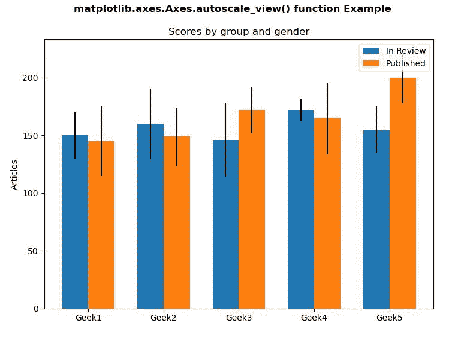
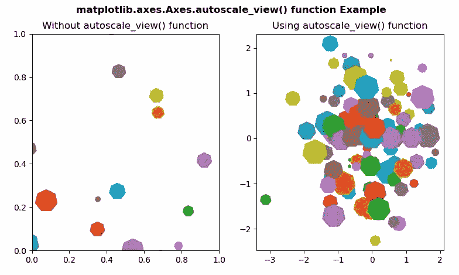

# Python 中的 matplotlib . axes . axes . autoscale _ view()

> 原文:[https://www . geeksforgeeks . org/matplotlib-axes-axes-autoscale _ view-in-python/](https://www.geeksforgeeks.org/matplotlib-axes-axes-autoscale_view-in-python/)

**[Matplotlib](https://www.geeksforgeeks.org/python-introduction-matplotlib/)** 是 Python 中的一个库，是 NumPy 库的数值-数学扩展。**轴类**包含了大部分的图形元素:轴、刻度、线二维、文本、多边形等。，并设置坐标系。Axes 的实例通过回调属性支持回调。

## matplotlib . axes . axes . autoscale _ view()函数

matplotlib 库的 Axes 模块中的 **Axes.autoscale_view()函数**用于使用数据限制自动缩放视图限制。

> **语法:** Axes.autoscale_view(self，紧密=无，scalex =真，scaley =真)
> 
> **参数:**该方法接受以下参数。
> 
> *   **scalex:** 此参数用于决定是否自动缩放 x 轴。
> *   **缩放:**此参数用于决定是否自动缩放 y 轴。
> *   **紧密:**此参数用于使用边距扩展轴限制。
> 
> **返回值:**此方法不返回值。

下面的例子说明了 matplotlib.axes.Axes.autoscale()函数在 matplotlib.axes 中的作用:

**例 1:**

```py
# ImpleIn Reviewtation of matplotlib function  
import numpy as np
from basic_units import cm, inch
import matplotlib.pyplot as plt

N = 5
val1 = [150 * cm, 160 * cm, 146 * cm, 
        172 * cm, 155 * cm]

val2 = [20 * cm, 30 * cm, 32 * cm, 
        10 * cm, 20 * cm]

fig, ax = plt.subplots()

ind = np.arange(N)
width = 0.35      
ax.bar(ind, val1, width, bottom = 0 * cm,
       yerr = val2, label ='In Review')

woval1 = (145 * cm, 149 * cm, 172 * cm,
          165 * cm, 200 * cm)
woval2 = (30 * cm, 25 * cm, 20 * cm, 
          31 * cm, 22 * cm)
ax.bar(ind + width, woval1, width,
       bottom = 0 * cm, yerr = woval2,
       label ='Published')

ax.set_title('Scores by group and gender')
ax.set_xticks(ind + width / 2)
ax.set_xticklabels(('Geek1', 'Geek2', 
                    'Geek3', 'Geek4',
                    'Geek5'))

ax.legend()
ax.set_ylabel("Articles")
ax.autoscale_view()

fig.suptitle('matplotlib.axes.Axes.autoscale_view()\
function Example\n', fontweight ="bold")
fig.canvas.draw()
plt.show()
```

**输出:**


**例 2:**

```py
# Implementation of matplotlib function  
import matplotlib.pyplot as plt
from matplotlib import collections, colors, transforms
import numpy as np

nverts = 50
npts = 100

r = np.arange(nverts)
theta = np.linspace(0, 2 * np.pi, nverts)
xx = r * np.sin(theta)
yy = r * np.cos(theta)
spiral = np.column_stack([xx, yy])

rs = np.random.RandomState(19680801)

xyo = rs.randn(npts, 2)

colors = [colors.to_rgba(c)
          for c in plt.rcParams['axes.prop_cycle'].by_key()['color']]

fig, [ax1, ax2] = plt.subplots(1, 2)

col = collections.RegularPolyCollection(
    7, sizes = np.abs(xx) * 10.0, offsets = xyo,
    transOffset = ax1.transData)
trans = transforms.Affine2D().scale(fig.dpi / 72.0)
col.set_transform(trans) 
ax1.add_collection(col, autolim = True)
col.set_color(colors)
ax1.set_title("Without autoscale_view() function")

col = collections.RegularPolyCollection(
    7, sizes = np.abs(xx) * 10.0, offsets = xyo, 
    transOffset = ax2.transData)

trans = transforms.Affine2D().scale(fig.dpi / 72.0)
col.set_transform(trans) 
ax2.add_collection(col, autolim = True)
col.set_color(colors)
ax2.autoscale_view()
ax2.set_title("Using autoscale_view() function")

fig.suptitle('matplotlib.axes.Axes.autoscale_view()\
 function Example\n', fontweight ="bold")
fig.canvas.draw()
plt.show()
```

**输出:**
