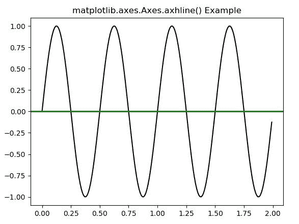
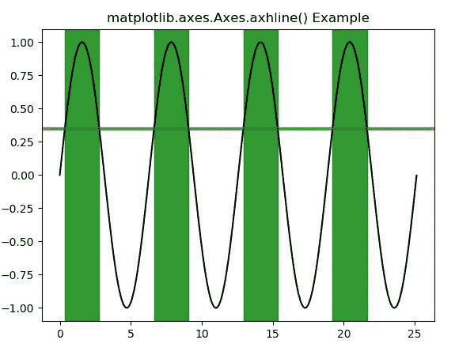

# matplotlib . axes . axhline()在 Python

中

> 哎哎哎:# t0]https://www . geeksforgeeks . org/matplotlib-axes-axhline-in-python/

**[Matplotlib](https://www.geeksforgeeks.org/python-introduction-matplotlib/)** 是 Python 中的一个库，是 NumPy 库的数值-数学扩展。**轴类**包含了大部分的图形元素:轴、刻度、线二维、文本、多边形等。，并设置坐标系。Axes 的实例通过回调属性支持回调。

## matplotlib.axes.Axes.axhline()函数

matplotlib 库的 Axes 模块中的 **Axes.axhline()函数**用于添加一条横过轴的水平线。

> **语法:**
> 
> ```
> Axes.axhline(self, y=0, xmin=0, xmax=1, **kwargs)
> ```
> 
> **参数:**该方法接受以下描述的参数:
> 
> *   **y:** 此参数为水平线数据坐标中的 y 位置，默认值为 0。
> *   **xmin:** 这个参数应该在 0 到 1 之间，0 是图的最左边，1 是图的最右边。其默认值为 0。
> *   **xmax:** 这个参数应该在 0 到 1 之间，0 是图的最左边，1 是图的最右边。其默认值为 1。
> 
> **返回:**这将返回以下内容:
> 
> *   **线:**这将返回表示打印数据的线 2D 对象列表。

下面的例子说明了 matplotlib.axes.Axes.axhline()函数在 matplotlib.axes 中的作用:

**示例-1:**

```
# Implementation of matplotlib function
import matplotlib.pyplot as plt
import numpy as np
import matplotlib.collections as collections

t = np.arange(0.0, 2, 0.01)
s1 = np.sin(4 * np.pi * t)
s2 = 0.75 * np.sin(8 * np.pi * t)

fig, ax = plt.subplots()

ax.plot(t, s1, color ='black')
ax.axhline(0, color ='green', lw = 2)
ax.set_title('matplotlib.axes.Axes.axhline() Example')
plt.show()
```

**输出:**


**示例-2:**

```
# Implementation of matplotlib function
import matplotlib.pyplot as plt
import matplotlib.tri as mtri
import numpy as np

fig, ax = plt.subplots()
x = np.arange(0, 8 * np.pi, 0.01)
y = np.sin(x)
ax.plot(x, y, color ='black')

threshold = 0.35
ax.axhline(threshold, color ='green',
           lw = 3, alpha = 0.7)

ax.fill_between(x, 0, 1, where = y > threshold,
                color ='green', alpha = 0.8, 
                transform = ax.get_xaxis_transform())

ax.set_title('matplotlib.axes.Axes.axhline() Example')
plt.show()
```

**输出:**
