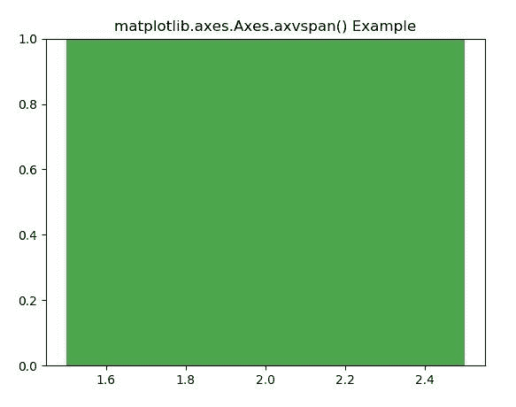
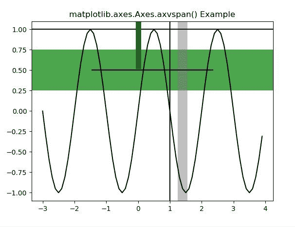

# matplotlib . axes . axvspan()用 Python

表示

> 哎哎哎:# t0]https://www . geeksforgeeks . org/matplotlib-axes-axvspan-in-python/

**[Matplotlib](https://www.geeksforgeeks.org/python-introduction-matplotlib/)** 是 Python 中的一个库，是 NumPy 库的数值-数学扩展。**轴类**包含了大部分的图形元素:轴、刻度、线二维、文本、多边形等。，并设置坐标系。Axes 的实例通过回调属性支持回调。

## matplotlib.axes.Axes.axvspan()函数

matplotlib 库的 Axes 模块中的 **Axes.axvspan()函数**用于添加一个跨轴的垂直跨度(矩形)。

> **语法:**
> 
> ```
> Axes.axvspan(self, xmin, xmax, ymin=0, ymax=1, **kwargs)
> ```
> 
> **参数:**该方法接受以下描述的参数:
> 
> *   **xmin:** 此参数以数据单位表示垂直跨度矩形的第一个 X 轴坐标。
> *   **xmax:** 此参数以数据单位表示垂直跨度矩形的第二个 X 轴坐标。
> *   **ymin:** 此参数以相对 Y 轴单位表示垂直跨度矩形的第一个 Y 轴坐标。
> *   **ymax:** 此参数以相对 Y 轴单位表示垂直跨度矩形的第二个 Y 轴坐标。
> 
> **返回:**返回从(xmin，ymin)到(xmax，ymax)的垂直跨度(矩形)。

下面的例子说明了 matplotlib.axes . axes pan()函数在 matplotlib . axes 中的作用:

**示例-1:**

```
# Implementation of matplotlib function
import matplotlib.pyplot as plt
import numpy as np

fig, ax = plt.subplots()

ax.axvspan(1.5, 2.5, facecolor ='g', alpha = 0.7)

ax.set_title('matplotlib.axes.Axes.axvspan() Example')

plt.show()
```

**输出:**


**示例-2:**

```
# Implementation of matplotlib function
import numpy as np
import matplotlib.pyplot as plt

t = np.arange(-3, 4, .1)
s = np.sin(np.pi * t)

fig, ax = plt.subplots()
ax.plot(t, s, color ='black')
ax.axhline(y = 1, color ='black')
ax.axvline(x = 1, color ='black')
ax.axvline(x = 0, ymin = 0.75, linewidth = 8,
           color ='green')
ax.axhline(y =.5, xmin = 0.25, xmax = 0.75,
           color ='black')

ax.axhspan(0.25, 0.75, facecolor ='green', alpha = 0.7)
ax.axvspan(1.25, 1.55, facecolor ='0.5', alpha = 0.5)

ax.set_title('matplotlib.axes.Axes.axvspan() Example')

plt.show()
```

**输出:**
